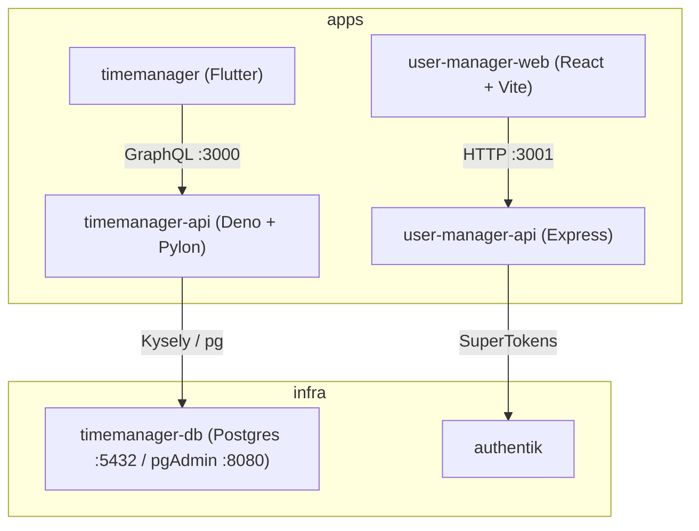

# Architecture

This monorepo hosts two loosely related product areas — **timemanager** (a Flutter app + GraphQL API) and **user-manager** (a React web app + Express API) — plus shared dockerized infrastructure.

## System diagram

## Components

- **`apps/timemanager` (Flutter/Dart):** cross-platform client. Talks to the GraphQL API over HTTP (`http` package) via `lib/services/graphql_client.dart`; endpoint configured in `lib/config/api_config.dart` (`:3000`). Feature code split into `models/`, `screens/`, `services/`.
- **`apps/timemanager-api` (Deno + Pylon):** GraphQL API on `:3000`. Resolvers/schema under `src/graphql/`; persistence via Kysely over Postgres (`pg`) under `src/db/` (with `migrations/` and `seed.ts`).
- **`apps/user-manager-web` (React + Vite):** auth demo UI using SuperTokens; routes `/`, `/auth`, `/dashboard`. Calls the Express API at `:3001`.
- **`apps/user-manager-api` (Express):** SuperTokens backend on `:3001`; brokers all auth between the frontend and the SuperTokens Core.
- **`infra/timemanager-db`:** Postgres 15 + pgAdmin via docker-compose; backing store for `timemanager-api`.
- **`infra/authentik`:** Authentik auth stack (independent; not yet wired into the apps — see [`decisions.md`](decisions.md)).

## Ports at a glance

| Service | Port |
|---------|------|
| `timemanager-api` GraphQL | `:3000` |
| `user-manager-web` dev server | `:3000` (Vite) |
| `user-manager-api` | `:3001` |
| Postgres | `:5432` |
| pgAdmin | `:8080` |

> Note: `timemanager-api` and `user-manager-web` both default to `:3000`. They belong to different product areas and are not normally run together, but be aware of the clash if you do.
