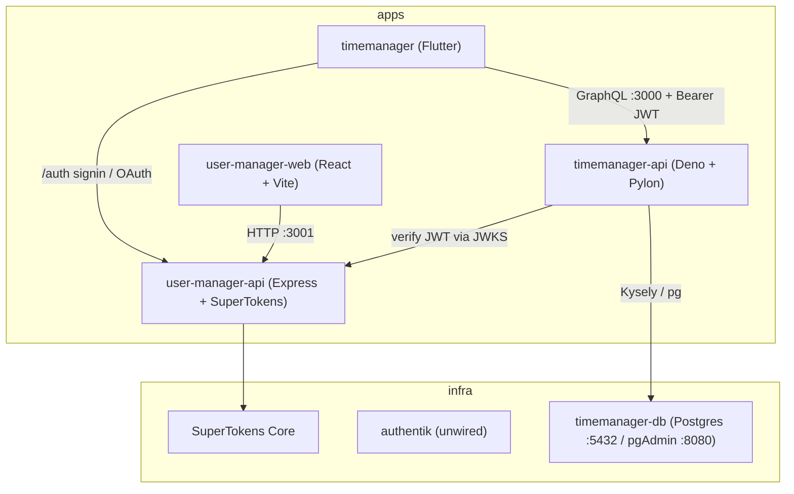

# Architecture

This monorepo hosts two product areas — **timemanager** (Flutter app + GraphQL API) and **user-manager** (React web app + Express SuperTokens API) — plus dockerized infrastructure. SuperTokens (`user-manager-api`) is the shared SSO hub for Flutter and future apps.

## System diagram

## Components

- **`apps/timemanager` (Flutter/Dart):** cross-platform client with login (email/password + OAuth). Session tokens are header-based (`Authorization: Bearer`). Talks to GraphQL on `:3000` and auth on `:3001`. Feature code under `models/`, `screens/`, `services/`, `widgets/`.
- **`apps/timemanager-api` (Deno + Pylon):** GraphQL API on `:3000`. Middleware verifies SuperTokens session JWTs (JWKS from `:3001`), maps `auth_user_id` → local `users.id`, and scopes activities by that user. Resolvers under `src/graphql/`; persistence via Kysely under `src/db/`.
- **`apps/user-manager-web` (React + Vite):** SuperTokens demo UI; routes `/`, `/auth`, `/dashboard`. Cookie-based sessions against `:3001`.
- **`apps/user-manager-api` (Express):** Shared SuperTokens SSO backend on `:3001` (`/auth/*`). Brokers auth to SuperTokens Core; issues JWTs for Flutter and cookies for React.
- **`infra/timemanager-db`:** Postgres 15 + pgAdmin via docker-compose; backing store for `timemanager-api`.
- **`infra/authentik`:** Authentik stack (independent; not wired — see [`decisions.md`](decisions.md)).

## Auth flow (timemanager)

1. Flutter signs up / signs in via `user-manager-api` FDI (`/auth/signup`, `/auth/signin`, OAuth).
2. Access + refresh tokens are stored locally; GraphQL requests send `Authorization: Bearer <access>`.
3. `timemanager-api` verifies the JWT against `http://localhost:3001/auth/jwt/jwks.json`, upserts `users.auth_user_id`, and scopes queries to that local user id.

## Ports at a glance

| Service | Port |
|---------|------|
| `timemanager-api` GraphQL | `:3000` |
| `user-manager-web` dev server | `:3000` (Vite) |
| `user-manager-api` | `:3001` |
| Postgres | `:5432` |
| pgAdmin | `:8080` |

> Note: `timemanager-api` and `user-manager-web` both default to `:3000`. They belong to different product areas and are not normally run together, but be aware of the clash if you do.
