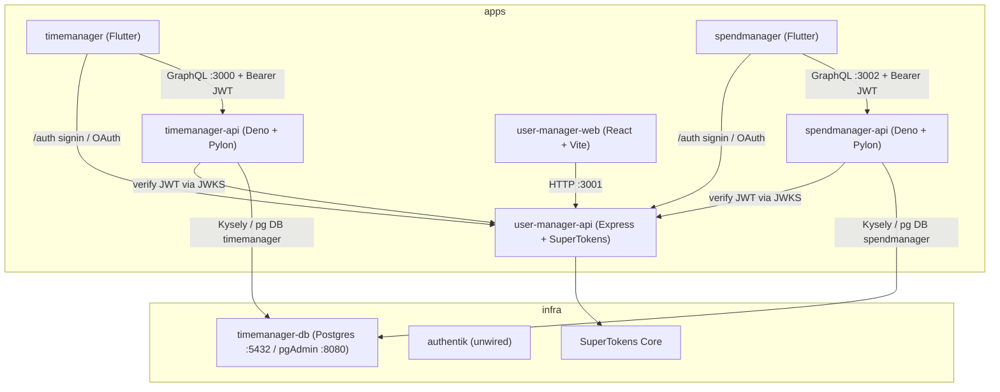

# Architecture

This monorepo hosts product areas — **timemanager** and **spendmanager** (Flutter + GraphQL APIs) and **user-manager** (React web app + Express SuperTokens API) — plus dockerized infrastructure. SuperTokens (`user-manager-api`) is the shared SSO hub for Flutter and future apps.

## System diagram

## Components

- **`apps/timemanager` (Flutter/Dart):** cross-platform client with login (email/password + OAuth). Session tokens are header-based (`Authorization: Bearer`). Talks to GraphQL on `:3000` and auth on `:3001`. Feature code under `models/`, `screens/`, `services/`, `widgets/`.
- **`apps/timemanager-api` (Deno + Pylon):** GraphQL API on `:3000`. Middleware verifies SuperTokens session JWTs (JWKS from `:3001`), maps `auth_user_id` → local `users.id`, and scopes activities by that user. Resolvers under `src/graphql/`; persistence via Kysely under `src/db/`. Database name: `timemanager`.
- **`apps/spendmanager` (Flutter/Dart):** spending tracker client (expenses + categories). Same SuperTokens FDI auth pattern as timemanager. Talks to GraphQL on `:3002` and auth on `:3001`. Chrome web port `:4445`.
- **`apps/spendmanager-api` (Deno + Pylon):** GraphQL API on `:3002`. Same JWKS auth as timemanager-api; scopes categories/expenses per local user. Shares the Postgres instance with a separate database `spendmanager`.
- **`apps/user-manager-web` (React + Vite):** SuperTokens demo UI; routes `/`, `/auth`, `/dashboard`. Cookie-based sessions against `:3001`.
- **`apps/user-manager-api` (Express):** Shared SuperTokens SSO backend on `:3001` (`/auth/*`). Brokers auth to SuperTokens Core; issues JWTs for Flutter and cookies for React.
- **`infra/timemanager-db`:** Postgres 15 + pgAdmin via docker-compose; hosts both `timemanager` and `spendmanager` databases. Init script creates `spendmanager` on fresh volumes; API migrate also ensures the DB exists.
- **`infra/authentik`:** Authentik stack (independent; not wired — see [`decisions.md`](decisions.md)).

## Auth flow (Flutter apps)

1. Flutter signs up / signs in via `user-manager-api` FDI (`/auth/signup`, `/auth/signin`, OAuth).
2. Access + refresh tokens are stored locally; GraphQL requests send `Authorization: Bearer <access>`.
3. Product APIs verify the JWT against `http://localhost:3001/auth/jwt/jwks.json`, upsert `users.auth_user_id`, and scope queries to that local user id.

## Ports at a glance

| Service | Port |
|---------|------|
| `timemanager-api` GraphQL | `:3000` |
| `user-manager-web` dev server | `:3000` (Vite) |
| `user-manager-api` | `:3001` |
| `spendmanager-api` GraphQL | `:3002` |
| Postgres | `:5432` |
| pgAdmin | `:8080` |
| `timemanager` Flutter web | `:4444` |
| `spendmanager` Flutter web | `:4445` |

> Note: `timemanager-api` and `user-manager-web` both default to `:3000`. They belong to different product areas and are not normally run together, but be aware of the clash if you do.

## Cloud (AWS)

Staging/production packaging is documented in [`.ai/deploy-aws.md`](deploy-aws.md): ECS Fargate for the two APIs, RDS for Postgres, S3 + CloudFront for Flutter web and `user-manager-web`, with hostnames `auth.` / `api.` / `app.` / `account.` under one apex domain.

Full vs simplified (API-only) layouts, networking tradeoffs, and cost comparison: [`aws-architecture.md`](aws-architecture.md).
