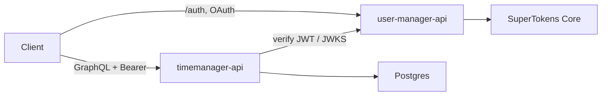
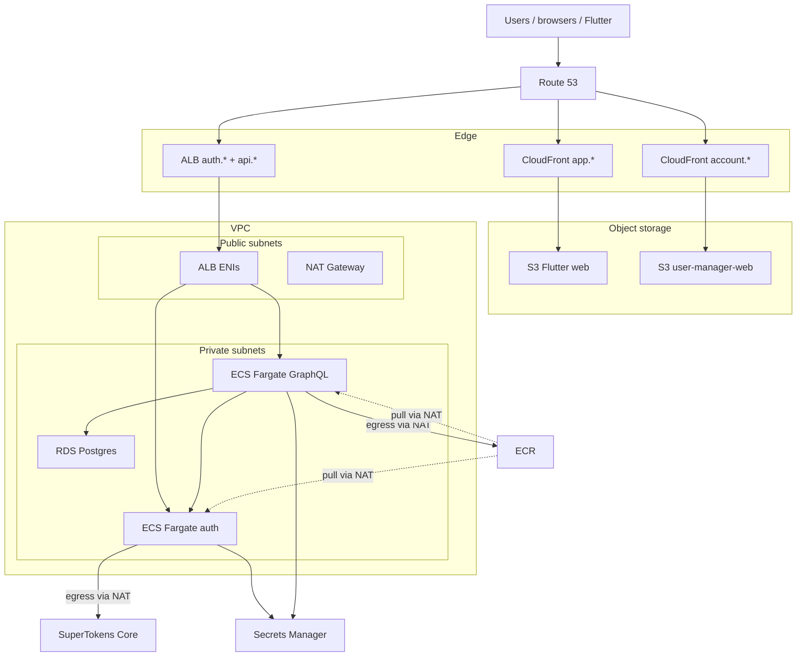
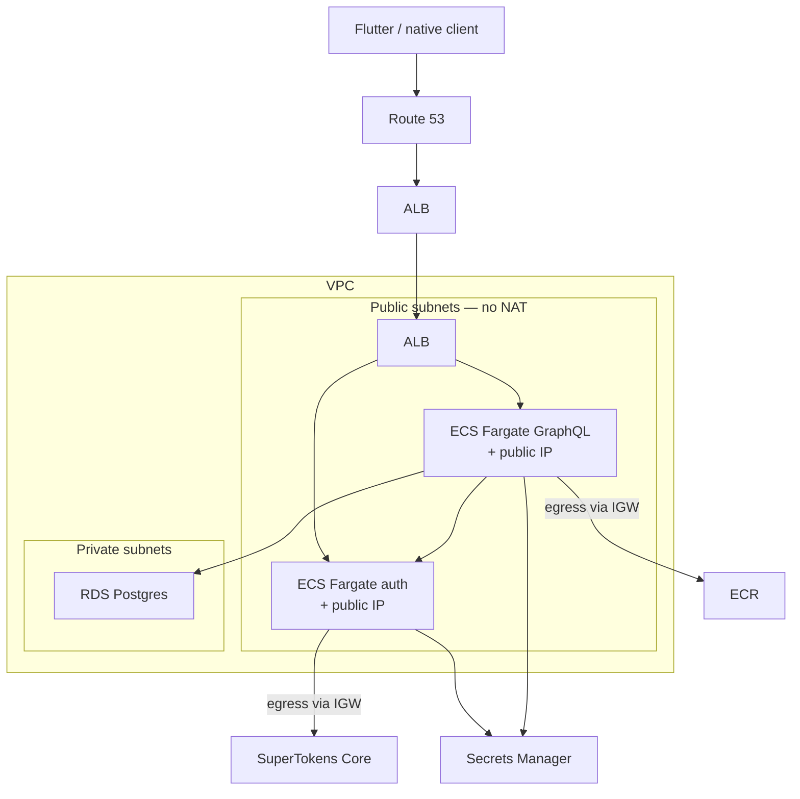

# AWS architectures

This document explains two AWS layouts for this monorepo:

1. **Full stack** — what [`infra/aws`](../infra/aws/) implements today (APIs + web frontends + private Fargate + NAT)
2. **Simplified API-only** — a cheaper staging shape (APIs only, public-subnet Fargate, no NAT)

Infra code lives under [`infra/aws/`](../infra/aws/). Operational steps are in [`deploy-aws.md`](deploy-aws.md). Local system design (how Flutter, auth, and GraphQL relate) is in [`architecture.md`](architecture.md). Concept glossary (Route 53, ALB, ECS, IAM vs SuperTokens, etc.): [`aws-concepts.md`](aws-concepts.md).

Diagrams:

- Full-style reference: [`docs/timemanager-aws-architecture.drawio`](../docs/timemanager-aws-architecture.drawio)
- Simplified APIs: [`docs/timemanager-aws-apis-simplified.drawio`](../docs/timemanager-aws-apis-simplified.drawio)

Cost estimates below are approximate **us-east-1 list prices** for a handful of test users, always-on (~730 hours/month), mid-2026. Confirm in the [AWS Pricing Calculator](https://calculator.aws/) before budgeting.

---

## Shared product model

Both architectures host the same two backends:

| Service | Runtime | Port | Role |
|---------|---------|------|------|
| `user-manager-api` | Node / Express + SuperTokens | 3001 | Sign-up, sign-in, OAuth, JWTs / sessions |
| `timemanager-api` | Deno / Pylon GraphQL | 3000 | App data; verifies JWT; talks to Postgres |

Locally, Flutter authenticates against `:3001` and calls GraphQL on `:3000` with `Authorization: Bearer <access>`. In the cloud, that becomes two HTTPS hostnames (and, in the full stack, two more for web UIs).



---

## Full stack architecture

This is the layout encoded in Terraform today: **four hostnames**, **private Fargate**, **NAT Gateway**, and **S3 + CloudFront** for web.

### Hostnames

| Host | Service |
|------|---------|
| `auth.<domain>` | `user-manager-api` (SuperTokens) |
| `api.<domain>` | `timemanager-api` (GraphQL) |
| `app.<domain>` | Flutter web (S3 + CloudFront) |
| `account.<domain>` | `user-manager-web` (S3 + CloudFront) |

### High-level diagram



### Components in detail

#### Route 53 and ACM

- Apex domain is assumed to already have a hosted zone.
- Records point `auth` / `api` at the ALB, and `app` / `account` at their CloudFront distributions.
- ACM certificates (API region for ALB; typically `us-east-1` for CloudFront) are DNS-validated via Route 53.

#### Application Load Balancer

- Internet-facing, in **public** subnets across **two AZs**.
- HTTPS on 443 (TLS terminated at the ALB); HTTP 80 redirects to HTTPS.
- Host-based listener rules:
  - `auth.<domain>` → auth target group (container port 3001, health `/hello`)
  - `api.<domain>` → api target group (container port 3000, health `/health`)
- Target type `ip` (Fargate `awsvpc`).
- Inside the VPC, ALB → tasks is HTTP; clients only see HTTPS.

#### ECS Fargate (private)

- One cluster, two services, images from ECR.
- Defaults: **0.25 vCPU / 512 MB** per task.
- Tasks run in **private** subnets with `assign_public_ip = false`.
- They cannot reach the internet directly; outbound goes through the **NAT Gateway**.

#### NAT Gateway

- Single NAT in one public subnet (cost-conscious, not multi-AZ HA).
- Required so private tasks can:
  - Pull images from ECR
  - Call SuperTokens Core (`SUPERTOKENS_CONNECTION_URI`, default `https://try.supertokens.com`)
  - Reach Secrets Manager / other AWS APIs over the public endpoints
  - Allow GraphQL to fetch JWKS from the auth hostname
- **Largest fixed monthly cost** in this design (~\$33/mo hourly charge alone in us-east-1).

#### RDS Postgres

- `db.t4g.micro`, Postgres 15, Single-AZ for staging, encrypted gp3 storage.
- In **private** subnets; `publicly_accessible = false`.
- Security group allows **5432 only from the ECS security group**.
- Credentials / `DATABASE_URL` live in Secrets Manager and are injected into the GraphQL task.

#### S3 + CloudFront (web)

- Two private S3 buckets (Flutter web + `user-manager-web`).
- CloudFront with Origin Access Control (OAC); buckets are not public.
- SPA fallbacks (`403`/`404` → `/index.html`) configured in Terraform.
- Deployed via `deploy-web.sh` (build + sync + invalidation).

#### Secrets Manager, ECR, IAM, logs

- App secrets (DB, OAuth client IDs/secrets, etc.) in Secrets Manager.
- ECS execution role: pull images, write CloudWatch logs, read secrets.
- Two ECR repos; `deploy-apis.sh` builds/pushes, runs migrate task, then scales services.

### Security groups (full stack)

| SG | Ingress | Egress |
|----|---------|--------|
| ALB | 80/443 from internet | All (to tasks) |
| ECS | All TCP from ALB SG only | All (via NAT to internet) |
| RDS | 5432 from ECS SG only | All |

Private tasks never accept direct internet connections. The NAT is for **outbound** only.

### Request flows (full stack)

**Auth (API client or web):**

1. Client → `https://auth.<domain>/auth/...`
2. Route 53 → ALB → auth Fargate task (private)
3. Auth API ↔ SuperTokens Core (egress via NAT)
4. OAuth callbacks registered as `https://auth.<domain>/auth/callback/...`

**GraphQL:**

1. Client → `https://api.<domain>/graphql` with Bearer token
2. ALB → GraphQL Fargate task
3. JWT verified via JWKS on auth host; user scoped; queries hit RDS privately

**Flutter web / account web:**

1. Browser → `https://app.<domain>` or `https://account.<domain>`
2. CloudFront → S3 object
3. Browser JS then calls auth/API hostnames as above (CORS / `ALLOWED_ORIGINS` include web origins)

### Rough cost (full stack, always-on staging)

| Line item | ~\$/mo |
|-----------|--------|
| NAT Gateway | ~33 |
| ALB | ~17 |
| Fargate ×2 | ~18 |
| RDS `db.t4g.micro` + 20 GB | ~14 |
| Public IPv4 (NAT EIP + ALB ×2 AZs) | ~11 |
| Web (S3/CF) + Secrets + Route 53 + logs + ECR | ~5 |
| **Total** | **~\$95–110** |

Setting `desired_count = 0` saves Fargate (~\$18) but **not** NAT/ALB/RDS.

---

## Simplified API-only architecture

Goal: **same auth + GraphQL contract**, cheaper for early testing with a handful of users. No hosted web UIs.

### Hostnames

| Host | Service |
|------|---------|
| `auth.<domain>` | `user-manager-api` |
| `api.<domain>` | `timemanager-api` |

No `app.*` or `account.*`. Clients are Flutter (or other) apps configured with cloud API base URLs.

### High-level diagram



### What changes vs full stack

1. **Drop web** — No CloudFront, no S3 web buckets, no `app` / `account` DNS, no `deploy-web.sh` for staging.
2. **Drop NAT** — `create_nat_gateway = false`.
3. **Move Fargate to public subnets** — `assign_public_ip = true` so tasks egress via the Internet Gateway (ECR pulls, SuperTokens, Secrets, JWKS) without NAT.
4. **Keep private RDS** — Database still not internet-reachable; SG still ECS-only on 5432.

### Is public-subnet Fargate insecure?

A **public IP does not mean open ports**. Security groups still allow **ingress to tasks only from the ALB security group**. The internet cannot connect directly to 3000/3001; only the ALB can. The public IP is primarily so **outbound** traffic (and return path) works without NAT.

RDS remains private with no public accessibility.

### Request flows (simplified)

Same as the API paths in the full stack:

1. Login / OAuth → `https://auth.<domain>`
2. GraphQL → `https://api.<domain>` with Bearer JWT
3. GraphQL → RDS over the private network
4. Auth → SuperTokens Core over the internet (task public IP → IGW)

No browser → CloudFront → S3 path.

### Terraform knobs (conceptual)

```hcl
create_nat_gateway = false
# ECS network_configuration:
#   subnets          = public
#   assign_public_ip = true
# Omit or skip static.tf / app + account Route 53 records
```

Most of `infra/aws` already matches; simplified mode is mainly networking flags and skipping web resources.

### Rough cost (simplified, always-on staging)

| Line item | ~\$/mo |
|-----------|--------|
| ALB | ~17 |
| Fargate ×2 | ~18 |
| RDS `db.t4g.micro` + 20 GB | ~14 |
| Public IPv4 (ALB ×2 + task ENIs ×2) | ~15 |
| Secrets + Route 53 + logs + ECR | ~4 |
| NAT | 0 |
| Web (S3/CF) | 0 |
| **Total** | **~\$65–70** |

---

## Comparison

### Side-by-side

| Dimension | Full stack | Simplified API-only |
|-----------|------------|---------------------|
| **Purpose** | Full cloud product surface | Cheap API staging / early testers |
| **Hostnames** | `auth`, `api`, `app`, `account` | `auth`, `api` only |
| **Web UIs** | Flutter web + user-manager-web via CloudFront/S3 | None (use native/Flutter pointing at APIs) |
| **Fargate placement** | Private subnets | Public subnets |
| **Task public IP** | No | Yes |
| **NAT Gateway** | Yes (required for egress) | No |
| **RDS** | Private | Private (same idea) |
| **ALB** | Yes (auth + api) | Yes (auth + api) |
| **ECR / Secrets / ACM** | Yes | Yes |
| **Deploy APIs** | `deploy-apis.sh` | Same |
| **Deploy web** | `deploy-web.sh` | N/A |
| **Est. always-on \$/mo** | ~95–110 | ~65–70 |
| **Biggest cost driver** | NAT (~\$33) | ALB + RDS + IPv4 |
| **Security posture** | Stronger isolation (no task public IPs) | ALB-only ingress via SG; tasks have public IPs |
| **Ops complexity** | Higher (web + NAT + four hosts) | Lower |
| **Best when** | You need hosted web + production-like private compute | You only need HTTPS APIs for a few testers |

### What stays the same

- Two ECS services, same images and ports
- Host-based ALB routing for auth vs GraphQL
- JWT auth flow (Flutter → auth API → Bearer → GraphQL → JWKS verify → RDS)
- Private Postgres with ECS-only access
- Secrets Manager for credentials
- SuperTokens Core URI (hosted try endpoint by default)

### What you gain by simplifying

- ~\$30/mo less (mainly removing NAT; web hosting is cheap but adds surface area)
- Fewer DNS names, certificates concerns, and deploy scripts for staging
- Faster mental model: “two API URLs”

### What you give up

- No `https://app.<domain>` / `https://account.<domain>` until you add web back
- Tasks are not in private subnets (mitigate with tight SGs; do not open app ports to `0.0.0.0/0`)
- Still pay ALB + RDS even at near-zero traffic — destroy infra between test weeks if you need ~\$0 burn

### Cost comparison chart (approximate)

```text
Full stack     ████████████████████████████████████  ~$100
Simplified     ████████████████████████              ~$67
               |         |         |         |
               0        25        50        75   $/mo
```

| Category | Full | Simplified |
|----------|------|------------|
| Networking (NAT + ALB + IPv4) | ~\$61 | ~\$32 (ALB + IPv4 only) |
| Compute (Fargate ×2) | ~\$18 | ~\$18 |
| Database | ~\$14 | ~\$14 |
| Web + other | ~\$5–7 | ~\$4 |

### Recommendation

| Situation | Prefer |
|-----------|--------|
| Occasional API testing with Flutter/desktop | **Simplified**, or destroy between sessions |
| Demo with browser login UI (`account`) or Flutter web (`app`) | **Full stack** |
| Production / compliance needing private compute + HA NAT | **Full stack** evolved (multi-AZ NAT, etc.), not the simplified staging shape |

---

## Related docs

- [`architecture.md`](architecture.md) — local monorepo data flow
- [`deploy-aws.md`](deploy-aws.md) — Terraform apply, deploy scripts, smoke checks
- [`docs/timemanager-aws-architecture.drawio`](../docs/timemanager-aws-architecture.drawio)
- [`docs/timemanager-aws-apis-simplified.drawio`](../docs/timemanager-aws-apis-simplified.drawio)
