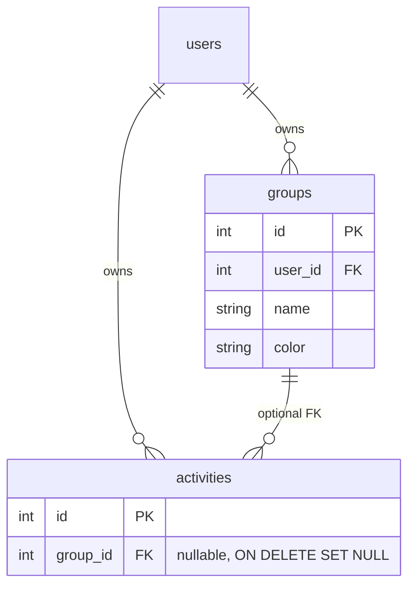

# Activity groups with color

## Model

One optional group per activity. Groups are user-scoped and carry a display color.

**Defaults locked in:**
- Color is a hex string `#RRGGBB` chosen from a **fixed preset palette** (not free-form / color wheel).
- Group is **optional** on activities (`group_id` nullable).
- Deleting a group **ungroups** its activities (`ON DELETE SET NULL`), does not cascade-delete activities.
- Groups screen is reached from the **AppBar** (icon next to Settings), not a 4th bottom tab — keeps Overview / Activities / Calendar as the primary time views.

## Backend (`apps/timemanager-api`)

1. **Migration** — new file next to existing ones under [`apps/timemanager-api/src/db/migrations/`](apps/timemanager-api/src/db/migrations/):
   - Create `groups` (`id`, `user_id` → `users.id` cascade, `name` varchar(255), `color` varchar(7), timestamps).
   - Index `groups_user_id_index`.
   - Add nullable `activities.group_id` → `groups.id` with `ON DELETE SET NULL`.

2. **Kysely types** — update [`apps/timemanager-api/src/db/types/schema.ts`](apps/timemanager-api/src/db/types/schema.ts): add `GroupsTable`, extend `ActivitiesTable` with `group_id: number | null`.

3. **GraphQL / Pylon** (schema is derived from resolver exports, same pattern as activities in [`resolvers.ts`](apps/timemanager-api/src/graphql/resolvers/resolvers.ts)):
   - Types/inputs in [`types.ts`](apps/timemanager-api/src/graphql/types.ts): `CreateGroupInput`, `UpdateGroupInput`; add optional `groupId` to create/update activity inputs.
   - Queries: `groups`, `group(id)`.
   - Mutations: `createGroup`, `updateGroup`, `deleteGroup`.
   - Activity responses: include `group_id` and a nested `group` lazy property (same inline-resolver pattern as `recurrencePattern` via `withRecurrencePattern`).
   - On create/update activity: if `groupId` set, verify the group belongs to the same user; allow `null` on update to clear.
   - Validate color against `#RRGGBB` + allowlist of palette hex values (shared constant).

4. **Tests** — extend [`validation.test.ts`](apps/timemanager-api/src/graphql/validation.test.ts) (or small colocated helpers) for color allowlist / hex validation and group-ownership assignment rules.

Also keep [`schema.ts`](apps/timemanager-api/src/graphql/schema.ts) in sync if it is still treated as documentation (Pylon runtime schema comes from resolvers).

## Flutter (`apps/timemanager`)

1. **Model + palette**
   - [`lib/models/group.dart`](apps/timemanager/lib/models/group.dart) — `id`, `userId`, `name`, `color` (hex), timestamps; `fromJson`.
   - Shared preset palette constant (same hex list as API), plus a small `Color parseGroupColor(String hex)` helper.
   - Extend [`lib/models/activity.dart`](apps/timemanager/lib/models/activity.dart) with `groupId` / nested `Group?`.

2. **Repository**
   - New [`lib/services/group_repository.dart`](apps/timemanager/lib/services/group_repository.dart) — `fetchGroups`, `createGroup`, `updateGroup`, `deleteGroup` (snake_case fields + Pylon `args:` wrapping, matching [`activity_repository.dart`](apps/timemanager/lib/services/activity_repository.dart)).
   - Extend activity repository create/update + field selection to include `group_id` and nested `group { id name color ... }`.

3. **Groups UI**
   - [`lib/screens/groups_screen.dart`](apps/timemanager/lib/screens/groups_screen.dart) — list with color swatch, edit/delete menu, FAB → form; reuse `EmptyState` / `ErrorState` / `LoadingView` / `AppCard` patterns from Activities.
   - [`lib/screens/group_form_screen.dart`](apps/timemanager/lib/screens/group_form_screen.dart) — name field + preset color chip picker; create/edit via `group != null`.
   - Wire AppBar action on [`home_screen.dart`](apps/timemanager/lib/screens/home_screen.dart) to push Groups (pass shared `GraphQLClient` / repos). After group changes that affect activity colors, call existing `_reloadAll()`.

4. **Assign on activity form**
   - In [`activity_form_screen.dart`](apps/timemanager/lib/screens/activity_form_screen.dart): load groups; optional dropdown (None + groups with color indicators); pass `groupId` on save.

5. **Color in surfaces**
   - [`activity_list_tile.dart`](apps/timemanager/lib/widgets/activity_list_tile.dart): leading bar uses **group color when set**, else keep current primary/tertiary (one-off vs recurring).
   - [`calendar_event_mapper.dart`](apps/timemanager/lib/utils/calendar_event_mapper.dart): same rule for event fill color.
   - Update calendar mapper tests accordingly.

6. **i18n** — add strings to [`app_en.arb`](apps/timemanager/lib/l10n/app_en.arb) / `app_es.arb` (nav/title, empty states, form labels, delete confirm, “No group”).

## Out of scope

- Multi-group assignment, free-form color pickers, filtering/grouping the Activities list by group, or seeding sample groups.
