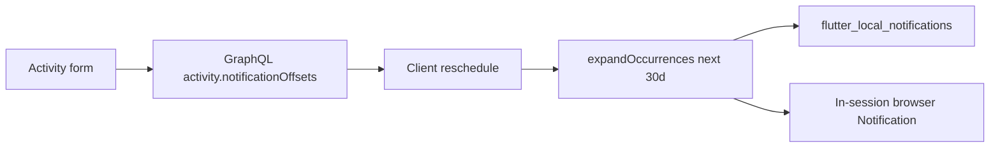

# Activity notification system (local-first)

## Approach

- **Config lives in the API** (syncs across devices; ready for push later).
- **Delivery is local**: OS-scheduled notifications on macOS/iOS/Android; on **web** (primary Chrome launch target), fire while the app tab is open via the browser Notification API (true background scheduling on web requires push/service workers — out of scope).
- Each reminder is an **offset in minutes before `start_time`**; `0` means “at the moment it begins.” Multiple offsets per activity are allowed.

## Data model (API)

Add nullable Postgres `integer[]` column on `activities`:

- Column: `notification_offsets integer[] not null default '{}'`
- Semantics: minutes before start; `0` = at start; empty = no reminders
- Constraints (app-level validation + CHECK): each value `>= 0` and `<= 10080` (7 days); unique per activity; max **8** offsets

Migration: new file under [`apps/timemanager-api/src/db/migrations/`](apps/timemanager-api/src/db/migrations/) (timestamp after existing rewards migration), update [`schema.ts`](apps/timemanager-api/src/db/types/schema.ts).

GraphQL (Pylon types + resolvers):

- Expose `notificationOffsets: number[]` on Activity (map from `notification_offsets`)
- Add optional `notificationOffsets?: number[] | null` to [`CreateActivityInput` / `UpdateActivityInput`](apps/timemanager-api/src/graphql/types.ts)
- Validate in create/update (sort + dedupe; reject invalid ranges / too many)
- Include field in activity select/return paths in [`resolvers.ts`](apps/timemanager-api/src/graphql/resolvers/resolvers.ts)

No separate reminders table for v1 — an int array is enough and keeps create/update simple. Push later can still read the same field.

## Flutter model + repository

- Extend [`Activity`](apps/timemanager/lib/models/activity.dart) with `List<int> notificationOffsets` (default `[]`)
- Wire GraphQL field `notification_offsets` in [`activity_repository.dart`](apps/timemanager/lib/services/activity_repository.dart) fetch/create/update
- Pass offsets through form save

## Activity form UI

In [`activity_form_screen.dart`](apps/timemanager/lib/screens/activity_form_screen.dart), add an optional **Notifications** section:

- Multi-select chips for presets: At start (`0`), 5m, 15m, 30m, 1h, 1d
- “Add custom…” for other minute values (clamped to validation rules)
- Empty selection = no notifications
- Copy via ARB ([`app_en.arb`](apps/timemanager/lib/l10n/app_en.arb) / [`app_es.arb`](apps/timemanager/lib/l10n/app_es.arb))

## Local scheduling service

New packages in [`pubspec.yaml`](apps/timemanager/pubspec.yaml): `flutter_local_notifications`, `timezone`, and `flutter_timezone` (for local TZ init).

New service layer (e.g. `lib/services/activity_notification_scheduler.dart` + pure helper `lib/utils/activity_notification_plan.dart`):

1. Take all activities + now
2. `expandOccurrences(from: today, to: today+30d)` (reuse [`occurrence_expander.dart`](apps/timemanager/lib/utils/occurrence_expander.dart))
3. For each occurrence × each offset: `fireAt = combineDateAndTime(date, startTime) - Duration(minutes: offset)`
4. Skip past `fireAt`
5. Stable notification id derived from `(activityId, occurrenceDate, offset)` (fit into plugin’s int id space)
6. Title = activity title; body = localized “starts now” / “starts in X”

**Reschedule triggers** (cancel + rebuild pending set, or cancel-by-activity then reschedule):

- After successful create / update / delete
- After login / initial activities load
- On `AppLifecycleState.resumed` (refresh window for recurring)
- Android: `RECEIVE_BOOT_COMPLETED` → reschedule from cached/fetched activities

**Platform config** (required for real delivery):

- Android: `POST_NOTIFICATIONS`, `RECEIVE_BOOT_COMPLETED`, `SCHEDULE_EXACT_ALARM` / `USE_EXACT_ALARM` as needed; boot receiver per plugin docs
- iOS/macOS: request permission at first reminder save or settings; macOS entitlement/category setup for local notifications
- Web: conditional implementation — request `Notification` permission; poll/check due reminders while the tab is open (no OS schedule when closed)

Init timezone + plugin once from [`main.dart`](apps/timemanager/lib/main.dart) (or a small bootstrap called after auth).

## Tests

- **API**: validation unit tests for offset normalize/reject (colocate next to validation or a small `notification_offsets` helper)
- **Flutter**: pure unit tests for planning fire times from activities + offsets + occurrence expansion (one-off, recurring weekly, skip past, multiple offsets) — no plugin mocking required
- Skip flaky OS/plugin integration tests

## Explicit non-goals (v1)

- Server push / FCM / device tokens
- Per-occurrence reminder overrides
- Notifications for goals/rewards
- Guaranteed web delivery when the tab is closed
