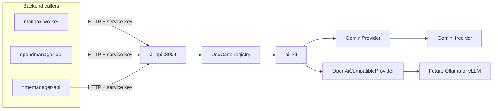

# AI-API (Gemini now, self-host later)

## Goals

- One internal **AI gateway** other Deno backends can call.
- **v1 provider:** Google Gemini free tier (API key from AI Studio).
- **Future provider:** self-hosted OpenAI-compatible endpoint (Ollama / vLLM / etc.) without rewriting use cases.
- **Use cases** are hand-written TypeScript handlers registered in code (no dynamic prompt DB).
- **Callers:** backends only for now (no Flutter / user JWT surface).
- **Out of scope for this pass:** AWS/ECS deploy, GPU/self-host infra, Flutter clients, streaming UI.

## Architecture



Mirror the [`mailbox_kit` / `MailboxProvider`](libs/mailbox_kit/provider.ts) split:

| Piece | Role |
|-------|------|
| [`libs/ai_kit`](libs/ai_kit) | Provider interface, Gemini impl, OpenAI-compatible impl (ready for self-host), shared types |
| [`apps/ai-api`](apps/ai-api) | Thin Deno HTTP server, service-key auth, use-case registry, env wiring |

This is **shared infra**, not a product GraphQL app: `scope:shared`, `type:api`, `runtime:deno`. No Postgres/users table in v1 (auth is a shared service secret, not SuperTokens JWKS).

## Provider abstraction (`libs/ai_kit`)

```ts
// Conceptual shape
interface AiProvider {
  readonly name: string
  complete(request: CompletionRequest): Promise<CompletionResult>
}

type CompletionRequest = {
  model?: string
  system?: string
  messages: { role: 'user' | 'assistant'; content: string }[]
  temperature?: number
  jsonSchemaHint?: string // optional structured-output nudge
}
```

Implementations:

1. **`GeminiProvider`** — `fetch` to Gemini REST (`generativelanguage.googleapis.com`), API key from env. Default model e.g. `gemini-2.0-flash` (adjust to current free-tier model id at implement time). Map rate-limit / quota errors to a typed `AiProviderError`.
2. **`OpenAiCompatibleProvider`** — same interface against `{baseUrl}/chat/completions` + bearer key. Used later for self-host; implemented and unit-tested with a fixture/mock now so the swap is real, not aspirational.

Factory (env-driven), same idea as mailbox’s provider factory:

- `AI_PROVIDER=gemini | openai_compatible`
- Gemini: `GEMINI_API_KEY`, optional `GEMINI_MODEL`
- Compatible: `AI_BASE_URL`, `AI_API_KEY` (provider key), optional `AI_MODEL`

Use cases only depend on `AiProvider`, never on Gemini SDKs.

## Use cases (code registry in `ai-api`)

Each use case is a small module:

```ts
type UseCase<TIn, TOut> = {
  id: string
  parseInput(raw: unknown): TIn  // validate / throw
  run(input: TIn, provider: AiProvider): Promise<TOut>
}
```

Registry: `Map<id, UseCase>` assembled in one file. Adding a use case = new file + one registry line.

Ship **one example** use case (e.g. `summarize_text`) so the path is tested end-to-end; no product wiring (mailbox/spend) in this pass unless you ask for it later.

## HTTP API (`apps/ai-api`, port `:3004`)

Minimal surface (REST, not Pylon GraphQL — backends-only, no user context):

| Method | Path | Purpose |
|--------|------|---------|
| `GET` | `/health` | Liveness |
| `GET` | `/v1/use-cases` | List registered ids (ops/debug) |
| `POST` | `/v1/use-cases/:id/run` | `{ input: ... }` → `{ output: ... }` |

Auth: require header `Authorization: Bearer <AI_SERVICE_KEY>` (or `X-AI-Service-Key`) matching env `AI_SERVICE_KEY`. Reject missing/wrong key with `401`. Local callers put the same key in their `.env`.

No DB, no `user-manager-api` dependency on `serve`.

## Monorepo glue

- Nx: [`apps/ai-api/project.json`](apps/ai-api/project.json) + [`libs/ai_kit/project.json`](libs/ai_kit/project.json); targets `serve`, `test` via `deno`.
- Root script: `"ai": "nx serve ai-api"` in [`package.json`](package.json).
- Env examples: `apps/ai-api/.env.example` (`PORT=3004`, `AI_SERVICE_KEY`, `AI_PROVIDER`, Gemini vars).
- Docs: [AGENTS.md](AGENTS.md), [.ai/architecture.md](.ai/architecture.md), [.ai/workflows.md](.ai/workflows.md), [.ai/decisions.md](.ai/decisions.md), new [.ai/ai-api.md](.ai/ai-api.md), Cursor overview rules for port `:3004` / `scope:shared`.
- Setup: add `ai-api` to env bootstrap lists in [`scripts/lib/setup-common.sh`](scripts/lib/setup-common.sh) / [.ai/local-setup.md](.ai/local-setup.md).

## Tests

- `ai_kit`: Gemini request mapping + OpenAI-compatible mapping with mocked `fetch`; provider factory env selection.
- `ai-api`: auth reject/accept; unknown use case `404`; `summarize_text` with a fake provider (no live Gemini in CI).

## Self-host later (documented, not built)

When you outgrow Gemini free tier:

1. Run Ollama/vLLM (or other OpenAI-compatible server) wherever you choose — **not** on the current tiny Fargate tasks ([AWS constraints](.ai/aws-architecture.md)).
2. Set `AI_PROVIDER=openai_compatible`, `AI_BASE_URL=...`, model id.
3. Use cases unchanged.

AWS packaging of `ai-api` itself can follow the existing ECS/ALB pattern later; keep secrets (`GEMINI_API_KEY` / `AI_SERVICE_KEY`) out of git.

## Explicit non-goals (v1)

- Flutter / browser callers and SuperTokens JWKS on this service
- GraphQL schema for AI
- Usage metering DB / billing
- Streaming responses (can add later on the same provider interface)
- Wiring mailbox extractors or spendmanager to live Gemini calls
