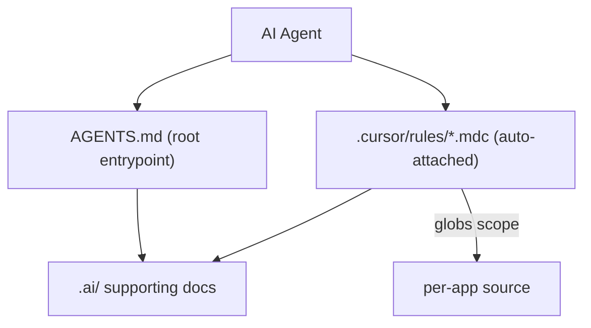

# AI Handbook for the Time Management Monorepo

## Goal
Give AI agents a reliable, auto-discovered map of this Nx + pnpm monorepo and its mixed stack (Flutter, Deno/Pylon GraphQL, React/Vite, Express, docker infra). Cursor-native format: a root `AGENTS.md` + scoped `.cursor/rules/*.mdc`, with `.ai/` holding deeper reference docs that the rules point to.

## Source documentation
This handbook is grounded in the already-executed migration plan [`.cursor/plans/nx_monorepo_migration_4a2c1740.plan.md`](.cursor/plans/nx_monorepo_migration_4a2c1740.plan.md), which converted three sibling projects (`timemanager`, `timemanager-be`, `user-manager`) into this flat Nx app-centric monorepo. Facts sourced from it and reused below:
- **Origin:** apps came from `timemanager/`, `timemanager-be/` (split into `timemanager-api` + `infra/timemanager-db` + `infra/authentik`), and `user-manager/{frontend,backend}`.
- **Ports / data flow:** Flutter -> GraphQL at `:3000`; `user-manager-web` -> `user-manager-api` at `:3001`; Postgres `:5432`, pgAdmin `:8080`.
- **Locked-in decisions:** pnpm at root for Node apps only; Deno keeps `deno.json`/`deno.lock`; Flutter keeps `pubspec.yaml`; Deno & Flutter targets are `nx:run-commands` wrappers (no `@nx/deno` plugin); git initialized at monorepo root.
- **Out of scope (future direction to note, not build):** shared libs / GraphQL codegen, wiring Authentik into SuperTokens/Flutter auth, CI / Nx Cloud, renaming the `flutter` workspace folder.

## How it fits together

- `.cursor/rules/*.mdc`: short, always/glob-scoped guidance loaded automatically by Cursor.
- `AGENTS.md`: human+agent entrypoint, monorepo map, golden rules, links into `.ai/`.
- `.ai/*.md`: longer-form reference (architecture, data flow, conventions) linked from the rules so context stays lean.

## 1. Root `AGENTS.md` (new)
Entrypoint covering: one-line project description, the monorepo map (below), golden rules (use `nx`/`pnpm` from root; each app has its own runtime; never hand-edit generated Nx/Flutter build dirs), and links to `.ai/` docs and per-app rules.

Monorepo map to document (with runtime, Nx tags, and ports from the migration plan):
- `apps/timemanager` — Flutter (Dart) client; `lib/{config,models,screens,services}`; talks to GraphQL at `:3000` via `http`. Tags `scope:timemanager, type:app, runtime:flutter`. Targets: `serve/test/analyze/pub-get` (run-commands wrapping `flutter`).
- `apps/timemanager-api` — Deno + Pylon GraphQL at `:3000`; Kysely + Postgres (`pg`); `src/{graphql,db}`; `deno task dev|build|seed`. Tags `scope:timemanager, type:api, runtime:deno`. `serve` `dependsOn` `timemanager-db:up`.
- `apps/user-manager-web` — React + Vite + SuperTokens. Tags `scope:user-manager, type:app, runtime:node`.
- `apps/user-manager-api` — Express + SuperTokens (Node, `.nvmrc` = 20) at `:3001`. Tags `scope:user-manager, type:api, runtime:node`.
- `infra/timemanager-db` — Postgres (`:5432`) + pgAdmin (`:8080`) via docker-compose (`nx run timemanager-db:up`). Tags `type:infra`; targets `up/down/logs`.
- `infra/authentik` — Authentik auth via docker-compose (independent stack; `.env` gitignored, `.env.example` provided).
- `libs/` — currently empty (`.gitkeep`); reserved for future shared code / GraphQL codegen.

## 2. Root `.cursor/rules/*.mdc` (new)
Small, focused rules with correct frontmatter (`description`, `globs`, `alwaysApply`):
- `00-project-overview.mdc` (`alwaysApply: true`) — condensed monorepo map + pointer to `AGENTS.md` and `.ai/architecture.md`.
- `monorepo-workflows.mdc` (`alwaysApply: true`) — canonical commands: `pnpm timemanager`, `pnpm user-manager`, `pnpm db:up`/`db:down`, `nx run-many`, tags convention (`scope:*`, `type:*`, `runtime:*` from `project.json`).
- `timemanager-flutter.mdc` (globs `apps/timemanager/**`) — Dart/Flutter conventions, API config location, `flutter run`, don't touch `build/`, `.dart_tool/`, platform dirs.
- `timemanager-api-deno.mdc` (globs `apps/timemanager-api/**`) — Deno + Pylon + Kysely; migrations/seed workflow; `deno task` commands; DB from `infra/timemanager-db`.
- `frontend-supertokens.mdc` (globs `apps/user-manager-web/**`) — React/Vite/SuperTokens flow.
- `backend-supertokens.mdc` (globs `apps/user-manager-api/**`) — Express/SuperTokens config.
- `infra.mdc` (globs `infra/**`) — docker-compose services, ports (Postgres 5432, pgAdmin 8080), env handling.

## 3. `.ai/` supporting docs (new)
- `.ai/architecture.md` — system/data-flow diagram reusing the migration plan's mermaid graph (Flutter `:3000` -> Pylon GraphQL -> Postgres; `user-manager-web` `:3001` -> Express; auth via Authentik/SuperTokens), how apps relate and their ports.
- `.ai/conventions.md` — per-runtime package-manager rules (pnpm for Node apps only; Deno via `deno.json`; Flutter via `pubspec.yaml`), Nx tag taxonomy (`scope/type/runtime`), code style, testing, migrations.
- `.ai/workflows.md` — day-to-day: run each app, DB up/down + seed, add a migration, common Nx `run-many` tasks, smoke-check commands from the migration plan's Phase 5.
- `.ai/decisions.md` — condensed origin/history + locked-in decisions and the explicit out-of-scope/future-direction list, sourced from the migration plan so agents don't re-litigate settled choices or attempt out-of-scope work.
- `.ai/README.md` — index of `.ai/` contents and how the handbook is wired.

## 4. Fix the conflicting Bun rule
`apps/timemanager-api/.cursor/rules/use-bun-instead-of-node-vite-npm-pnpm.mdc` currently instructs agents to use Bun, but that app runs on Deno + Pylon and the repo uses pnpm/Nx. Plan: delete it (recommended) and fold any still-valid guidance into the accurate `timemanager-api-deno.mdc` rule, so agents aren't told to run `bun install` in a Deno project.

## Notes / assumptions
- Rules are intentionally short; depth lives in `.ai/` and is linked, keeping agent context lean.
- Content is derived from actual repo files (`nx.json`, `package.json`, `project.json`, `deno.json`, `pubspec.yaml`, docker-compose) and the executed migration plan [`nx_monorepo_migration_4a2c1740.plan.md`](.cursor/plans/nx_monorepo_migration_4a2c1740.plan.md), not assumptions.
- No application code changes; docs + rules only.