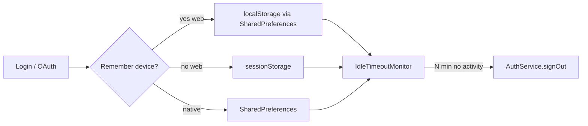

# Auth session improvements (Flutter web + idle timeout)

## Feasibility with the current stack

| Requirement | Verdict | Notes |
|-------------|---------|--------|
| Idle timeout (configurable) | **Possible** | SuperTokens has **no idle-timeout recipe setting**. Enforce in the Flutter client: track activity → call existing [`AuthService.signOut()`](apps/timemanager/lib/services/auth_service.dart) (revokes via `/auth/signout` + clears tokens). |
| Remember device / expire on browser close | **Possible on Flutter web** | Tokens today always go to `SharedPreferences` → **localStorage** on web, so sessions survive restarts. Use **sessionStorage** when remember is off. Native apps keep current persistent prefs (no browser-close concept). |
| Password show/hide | **Already done** | [`login_screen.dart`](apps/timemanager/lib/screens/login_screen.dart) + tests in [`login_screen_test.dart`](apps/timemanager/test/screens/login_screen_test.dart). No UI work. |

Out of scope (per your choices): React `user-manager-web`, absolute refresh-token lifetime in SuperTokens Core.

**Security caveat:** Idle logout is client-enforced. Until `signOut` runs, a stolen refresh token remains valid until Core’s refresh lifetime (~100d default on `try.supertokens.com`). That matches typical SPA idle-timeout patterns; tightening Core `refresh_token_validity` is a separate Core/ops change.

---

## 1. Configurable idle timeout

**Config:** Add to [`ApiConfig`](apps/timemanager/lib/config/api_config.dart) (same dart-define pattern as API URLs):

- `IDLE_SESSION_TIMEOUT_MINUTES` via `String.fromEnvironment`, default **`30`**
- Expose `Duration get idleSessionTimeout`
- Document in [`.ai/workflows.md`](.ai/workflows.md) / cloud dart-defines example alongside existing defines

**Monitor:** New small helper (e.g. `lib/services/idle_session_monitor.dart`):

- Starts when signed in; stops on sign-out
- Resets a timer on user activity (pointer/keyboard) and on `AppLifecycleState.resumed`
- On fire: invoke sign-out callback (wired to `AuthController`)
- Disable when timeout is `0` (escape hatch for local/dev)

**Wiring:** [`TimeManagerApp`](apps/timemanager/lib/main.dart) already uses `WidgetsBindingObserver` — extend that (or wrap the signed-in tree) so activity + lifecycle reset the monitor; call into [`AuthController`](apps/timemanager/lib/router/auth_controller.dart) for logout + router redirect.

Activity signals: root `Listener` / `Focus` callbacks for pointer + key events (enough for web and desktop; mobile also gets lifecycle resume).

---

## 2. Remember this device (Flutter web only)

**UI:** On [`LoginScreen`](apps/timemanager/lib/screens/login_screen.dart), when `kIsWeb`, show a checkbox (l10n: e.g. `loginRememberDevice`), default **unchecked** (session dies when the browser closes).

**Storage split in `AuthService`:**

- Introduce a tiny token-store abstraction used only for access/refresh/front tokens:
  - **Persistent:** existing `SharedPreferences` (localStorage on web; prefs on native)
  - **Session (web + remember off):** `window.sessionStorage` via conditional import (`stub` for VM/tests + `web` implementation)
- Persist the **remember preference itself** in `SharedPreferences` so OAuth round-trips still know which store to use after redirect
- `signIn` / `signUp` / OAuth complete / refresh / clear all read/write through the active store
- On web bootstrap: if remember is false, read tokens from sessionStorage only (do not resurrect localStorage tokens from a prior “remembered” session unless remember is true — clear the other store on login to avoid dual-copy confusion)

**Native:** Ignore the toggle; always use SharedPreferences (current behavior). Idle timeout still applies.

**OAuth:** Before `startOAuth`, save remember preference; after `completeOAuthFromCurrentUri`, persist tokens into the store selected by that preference.

---

## 3. Password visibility

No change. Keep existing suffix `IconButton` + l10n tooltips.

---

## 4. Tests

- **Idle monitor:** unit test with injectable `Timer`/clock — activity resets; expiry calls logout once
- **Token store / AuthService:** remember on → prefs; remember off (fake session store) → session store; clear removes from both when signing out
- **Login screen:** checkbox visible only when web is forced/faked if practical; otherwise test the remember flag plumbing via AuthService API
- Extend [`api_config_test.dart`](apps/timemanager/test/config/api_config_test.dart) for default idle timeout parsing
- Run `nx test timemanager`

---

## Key files

- [`apps/timemanager/lib/services/auth_service.dart`](apps/timemanager/lib/services/auth_service.dart) — dual store + remember flag
- [`apps/timemanager/lib/screens/login_screen.dart`](apps/timemanager/lib/screens/login_screen.dart) — remember checkbox (`kIsWeb`)
- [`apps/timemanager/lib/config/api_config.dart`](apps/timemanager/lib/config/api_config.dart) — idle dart-define
- [`apps/timemanager/lib/main.dart`](apps/timemanager/lib/main.dart) / [`auth_controller.dart`](apps/timemanager/lib/router/auth_controller.dart) — idle monitor lifecycle
- New: `idle_session_monitor.dart`, web/session token store (+ stub)
- ARB strings under `lib/l10n/` for remember-device label
