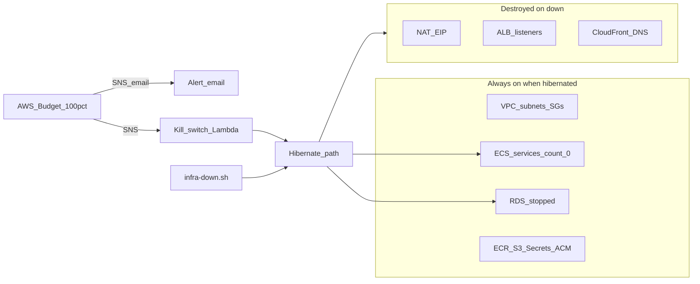

# AWS hibernate up/down + budget kill switch

## Goal

Near-zero burn when idle: keep cheap durable pieces (VPC, ECS cluster/services, RDS data, ECR, S3, secrets, ACM), sleep compute, stop the DB, and destroy the expensive always-on networking/edge resources. A monthly AWS Budget at **100% actual spend** notifies by email and **auto-runs the same hibernation path**.

Hibernated residual cost is roughly **RDS storage + S3/ECR/Secrets/Route53** (a few $/mo), not NAT/ALB/Fargate. Absolute $0 would require destroying RDS too (data loss); you chose stop instead.



## Hibernation source of truth

Add SSM parameter (created once, updated by scripts/Lambda; **not** overwritten by Terraform on every apply):

- Name: `/timemanager-staging/hibernating` (from `project` + `environment`)
- Main stack reads it via `data "aws_ssm_parameter" "hibernating"` and sets `local.hibernating`

When `local.hibernating` is true:

| Action | Resources |
|--------|-----------|
| Keep | VPC, subnets, IGW, SGs, ECS cluster/services/task defs, target groups, RDS, ECR, S3 buckets, Secrets Manager, ACM, IAM, log groups |
| Force | ECS `desired_count = 0` (ignore `var.desired_count`) |
| Destroy / count=0 | NAT + EIP + private default route; ALB + HTTP/HTTPS listeners + rules; both CloudFront distributions + Route53 aliases for auth/api/app/account |

NAT already supports count via [`create_nat_gateway`](infra/aws/network.tf); gate it as `var.create_nat_gateway && !local.hibernating`.

ALB/CloudFront/DNS need the same `count` / `for_each` treatment; ECS `depends_on` must stop pointing at the HTTPS listener (use target groups / RDS only) so services can exist while the ALB is gone. Keep target groups so the ECS `load_balancer` blocks stay valid at desired count 0.

RDS **stop/start stays outside Terraform** (CLI in scripts / boto3 in Lambda). Note: AWS auto-restarts stopped instances after **7 days**; storage still bills while stopped. Document that in [`.ai/deploy-aws.md`](.ai/deploy-aws.md).

## Scripts + Nx (compose-style UX)

New scripts (reuse [`load-local-env.sh`](infra/aws/scripts/load-local-env.sh)):

- [`infra/aws/scripts/infra-down.sh`](infra/aws/scripts/infra-down.sh)
  1. SSM → `true`
  2. `terraform apply -auto-approve` in `infra/aws` (destroys NAT/ALB/CF/DNS, scales ECS via TF)
  3. `aws rds stop-db-instance` (ignore if already stopped)
- [`infra/aws/scripts/infra-up.sh`](infra/aws/scripts/infra-up.sh)
  1. `aws rds start-db-instance` + wait `available`
  2. SSM → `false`
  3. `terraform apply -auto-approve` (recreates NAT/ALB/CF/DNS)
  4. Run [`deploy-apis.sh`](infra/aws/scripts/deploy-apis.sh) (migrate + desired count 1)
  5. Run [`deploy-web.sh`](infra/aws/scripts/deploy-web.sh) so CloudFront origins have current assets

Nx targets on [`infra/aws/project.json`](infra/aws/project.json): `down` / `up`.

## Budget + notify + kill switch

Add to the **main** stack (not gated by hibernation) so one `terraform.tfvars` owns domain + budget:

New vars (in restored [`infra/aws/terraform.tfvars.example`](infra/aws/terraform.tfvars.example) — replace the misnamed `terraform.tfvars copy.example`):

```hcl
monthly_budget_amount = 50        # USD
budget_alert_email    = "you@example.com"
```

Resources (new `budget.tf` or similar):

- `aws_sns_topic` for budget alerts (policy allowing `budgets.amazonaws.com` to publish)
- Email subscription to `budget_alert_email` (must confirm once in inbox)
- `aws_budgets_budget` monthly **COST** budget with notification: **100%**, **ACTUAL**, subscribers = email + SNS topic
- **Kill-switch Lambda** subscribed to that SNS topic that:
  1. Sets SSM hibernating = `true`
  2. Sets both ECS services desired count → 0
  3. Stops the RDS instance
  4. Deletes NAT gateway + EIP + ALB by known names/tags (`local.name_prefix`)
  5. Disables (then deletes if practical) CloudFront distributions for the stack  
  Immediate CLI teardown stops the burn even if a later `terraform apply` is needed to fully reconcile state; with SSM already `true`, the next apply (human `down` or `up` path) will not recreate expensive resources.

IAM: least-privilege role for Lambda (ECS update, RDS stop, ec2 NAT/EIP, elasticloadbalancing delete, cloudfront get/update/delete, SSM put, optional SNS publish for failure logs).

Bootstrap ([`infra/aws/bootstrap/main.tf`](infra/aws/bootstrap/main.tf)) only gains the SSM parameter (default `"false"`) so the flag exists before the main stack’s first data read. Budget stays in main stack.

## Docs

Update [`.ai/deploy-aws.md`](.ai/deploy-aws.md):

- `nx run timemanager-aws:down` / `:up` workflow
- Budget vars + confirm SNS email subscription
- Kill-switch behavior at 100%
- RDS 7-day auto-start caveat
- Fix example filename reference (`terraform.tfvars.example`)

## Tests / verification

No unit tests for shell/Terraform. Manual smoke after implement:

1. `terraform plan` with hibernating SSM true shows NAT/ALB/CF destroy, ECS count 0
2. Run `down`, confirm billable NAT/ALB gone, RDS `stopped`, ECS desired 0
3. Run `up`, hit health script
4. Publish a test message to the budget SNS topic and confirm Lambda hibernates (do not wait for real spend)
