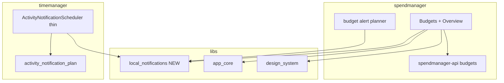

# Budgets, alerts, and shared local notifications

## Decisions locked in

- **Alerts:** in-app progress on Overview + **local push** when spent ≥ alert % of the current period (web: in-session browser notifications, same as timemanager today).
- **Periods:** **rolling from `anchor_date`** (e.g. start Jan 15, every 1 month → Jan 15–Feb 14, then Feb 15–Mar 14…).
- **Notifications infra:** extract a generalized module shared by timemanager + spendmanager — not leave it inside timemanager.

## Architecture

Budget **domain** (schema, period math, GraphQL, forms) stays in spendmanager. **Delivery** (init, permission, schedule list, show-now, cancel, IO/web stubs) lives in the shared lib. Timemanager keeps activity occurrence planning; it only calls the shared scheduler.

---

## 1. Shared package: `libs/local_notifications`

New Flutter package (`scope:shared`, `type:lib`, `runtime:flutter`), path-dep from both apps.

**Public API (domain-agnostic):**

- `ScheduledNotification` — `id`, `title`, `body`, `fireAt` (for time-based reminders)
- `ImmediateNotification` — `id`, `title`, `body` (for threshold alerts fired when detected)
- `LocalNotificationConfig` — Android channel id/name/description + prefs cache key prefix (per app)
- `LocalNotificationService` — `ensureInitialized(config)`, `requestPermission()`, `syncScheduled(List<ScheduledNotification>)`, `showNow(ImmediateNotification)`, `cancelAll()`, `rescheduleFromCache()`

**Platform split** (same pattern as today):

- `*_io.dart` — `flutter_local_notifications` + `timezone` / `flutter_timezone`
- `*_web.dart` — browser `Notification` + short-interval poll for scheduled; `showNow` fires immediately
- `*_stub.dart` — no-ops for tests

Move deps (`flutter_local_notifications`, `timezone`, `flutter_timezone`, `shared_preferences`, `web`) into this package’s `pubspec.yaml`. Wire Nx `project.json` + `analysis_options.yaml` like [`libs/app_core`](libs/app_core).

**Timemanager migration:**

- Replace [`activity_notification_scheduler_*.dart`](apps/timemanager/lib/services/activity_notification_scheduler_io.dart) with a thin [`ActivityNotificationScheduler`](apps/timemanager/lib/services/activity_notification_scheduler.dart) that maps `PlannedNotification` → `ScheduledNotification` and calls `LocalNotificationService`
- Keep [`activity_notification_plan.dart`](apps/timemanager/lib/utils/activity_notification_plan.dart) + its tests in timemanager (activity/occurrence-specific)
- Channel config: `activity_reminders` / existing copy; cache key stays app-specific
- Remove notification packages from timemanager `pubspec.yaml` once the path dep owns them

**Docs:** add row to [`AGENTS.md`](AGENTS.md) and Shared libraries in [`.ai/decisions.md`](.ai/decisions.md).

---

## 2. API: budgets schema + GraphQL (`spendmanager-api`)

New migration (do not edit the init migration): `budgets` table

| Column | Notes |
|--------|--------|
| `user_id` | FK → users, CASCADE; always scope queries |
| `name` | varchar, required (e.g. “Monthly total”, “Groceries”) |
| `category_id` | nullable FK → categories RESTRICT; **null = total budget**, non-null = per-category |
| `amount_cents` | bigint > 0 |
| `currency` | char(3) default `USD` |
| `interval_unit` | `day` \| `week` \| `month` |
| `interval_count` | int ≥ 1 (every X units) |
| `anchor_date` | date — start of period 0 |
| `alert_percent` | int 1–100 (notify when spent ≥ this % of amount) |
| `archived_at` | nullable soft-archive |
| timestamps | `created_at` / `updated_at` |

Indexes: `(user_id)`, `(user_id, category_id)`. No hard uniqueness in v1 (user can have multiple totals/categories with different periods); create/update validate category ownership + active category when set.

**Period helper** (pure TS, unit-tested), e.g. `src/budgets/period.ts`:

- `addInterval(anchor, unit, count)` — days/weeks as day multiples; months via calendar month add (clamp end-of-month)
- `currentPeriod({ anchorDate, intervalUnit, intervalCount, asOf })` → `{ start, endExclusive }` for the rolling window containing `asOf` (if `asOf < anchor`, treat as period 0 or return null — **default: no spend counted before anchor**)

**GraphQL** (mirror existing resolver patterns in [`resolvers.ts`](apps/spendmanager-api/src/graphql/resolvers/resolvers.ts)):

- Queries: `budgets(includeArchived?)`, `budget(id)`, `budgetStatuses(asOf?: Date)`  
  - `budgetStatuses` joins each active budget’s current period with a sum of `expenses.amount_cents` (`spent_on` in `[start, end)`, filter `category_id` when scoped; total = all categories), returns `spentCents`, `amountCents`, `percentUsed`, `alertTriggered`, period bounds
- Mutations: `createBudget`, `updateBudget`, `archiveBudget`
- Validation in [`validation.ts`](apps/spendmanager-api/src/graphql/validation.ts): amount, currency, interval, alert_percent, name; reject archived category

Update [`schema.ts`](apps/spendmanager-api/src/db/types/schema.ts), docs schema, optional seed sample budgets.

---

## 3. Flutter spendmanager: budgets UI + alert sync

**Models / repo**

- `Budget`, `BudgetStatus` models
- `BudgetRepository` — CRUD + `fetchStatuses(asOf?)` (same GraphQL string style as [`expense_repository.dart`](apps/spendmanager/lib/services/expense_repository.dart))

**Navigation / screens**

- Add **Budgets** as 4th shell tab (list + FAB → form), parallel to Categories
- `BudgetFormScreen`: name, total vs category (dropdown of active categories), amount, currency (default USD), interval unit + count, anchor date, alert % (default 80)
- **Overview**: load `budgetStatuses` alongside monthly totals; show progress (spent / amount, %) with warn styling when `alertTriggered`; link/shortcut to Budgets tab
- Wire `AuthController` reload keys + FAB behavior for the new tab

**Alert delivery (spendmanager-specific planner)**

- After login, resume, expense CRUD, and budget CRUD: fetch `budgetStatuses` → for each `alertTriggered`, if not already recorded for `(budgetId, periodStart)` in prefs, call `LocalNotificationService.showNow(...)` and mark fired
- Prefs key namespace under spendmanager’s `LocalNotificationConfig` cache prefix so periods don’t re-spam until the next rolling window
- On sign-out: `cancelAll()` (same as timemanager)
- Init service in `main.dart` like timemanager does today
- Channel: e.g. `budget_alerts` / “Budget alerts”

**l10n:** ARB keys for budgets tab, form fields, overview progress, notification title/body (en + es).

**Deps:** path `local_notifications`; no direct `flutter_local_notifications` in the app.

---

## 4. Tests (high-value)

| Area | What |
|------|------|
| API | `currentPeriod` edge cases (day/week/month, end-of-month anchor, asOf before anchor); createBudget validation; `budgetStatuses` sums scoped correctly |
| Shared lib | Optional thin test for id clamp / no-op stub; skip full plugin tests |
| Timemanager | Existing `activity_notification_plan_test` still passes after scheduler extraction |
| Spendmanager | Budget form validation or status % math if any client helper; repository not required if trivial |

Run via Nx: `nx test spendmanager-api`, `nx test spendmanager`, `nx test timemanager`, and a test target on `local_notifications` if added.

---

## 5. Explicit non-goals (v1)

- Server push / FCM / email
- Multiple alert thresholds per budget (single `alert_percent` only)
- Calendar-aligned periods
- Shared GraphQL codegen
- Persisting alert history on the server (local prefs dedupe is enough)

---

## Implementation order

1. Extract `libs/local_notifications` and migrate timemanager onto it (behavior-preserving)
2. spendmanager-api migration + period helper + GraphQL + tests
3. spendmanager Flutter models/repo/Budgets tab/Overview + alert sync using the shared service
4. Docs (`AGENTS.md`, `decisions.md`) + smoke: create total + category budget → add expenses → Overview progress + local notification when threshold crossed
