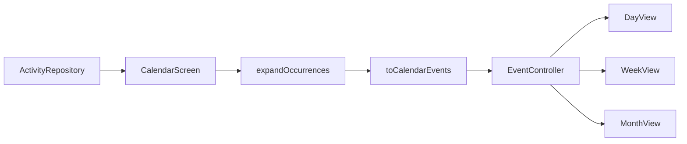

# Calendar view + light theme polish

## Context

[`calendar_screen.dart`](apps/timemanager/lib/screens/calendar_screen.dart) is a Material day list (prev/next + `ListTile`s). [`calendar_view`](https://pub.dev/packages/calendar_view) is not a dependency yet. Data already exists via [`expandOccurrences`](apps/timemanager/lib/utils/occurrence_expander.dart) and [`ActivityOccurrence`](apps/timemanager/lib/models/activity.dart).



## 1. Dependency

Add to [`apps/timemanager/pubspec.yaml`](apps/timemanager/pubspec.yaml), **pinned exact** (package docs warn against `^` on 2.x):

```yaml
calendar_view: 2.0.0
```

Run `nx run timemanager:pub-get`.

## 2. Light theme polish

Add [`apps/timemanager/lib/theme/app_theme.dart`](apps/timemanager/lib/theme/app_theme.dart) and use it from [`main.dart`](apps/timemanager/lib/main.dart):

- `ColorScheme.fromSeed` with a calm teal/slate seed (replace default indigo; avoid purple-gradient AI look).
- Material 3: consistent `AppBarTheme`, `NavigationBarTheme`, `FloatingActionButtonTheme`, card/chip defaults.
- Keep light mode only — no dark theme work.

Calendar chrome (`HeaderStyle`, hour lines, event colors) will pull from `Theme.of(context).colorScheme` so day/week/month match the shell.

## 3. Event mapping

Add [`apps/timemanager/lib/utils/calendar_event_mapper.dart`](apps/timemanager/lib/utils/calendar_event_mapper.dart):

- Input: `List<ActivityOccurrence>`
- Output: `List<CalendarEventData<Activity>>`
- Parse `activity.startTime` / `endTime` (`HH:mm`) onto `occurrence.date` for `startTime` / `endTime`
- `title`, `description` from activity; `event: activity` for tap → edit
- Color: primary for one-offs, secondary/tertiary for recurring (simple, readable distinction)

Unit-test time parsing and date attachment in `test/utils/calendar_event_mapper_test.dart`.

## 4. Rewrite CalendarScreen

Replace the custom header + `ListView` in [`calendar_screen.dart`](apps/timemanager/lib/screens/calendar_screen.dart) with:

- **View mode** enum: `day | week | month`, switcher via `SegmentedButton` above the calendar
- `EventController<Activity>` owned by state; on fetch success, expand a window around the focused date (e.g. ±2 months), map, then `controller.removeAll()` + `addAll(...)`
- Wrap body in `CalendarControllerProvider` (or pass `controller:` into each view)
- **DayView / WeekView / MonthView** with shared styling:
  - `headerStyle` from theme colors
  - Custom `eventTileBuilder` (day/week): title + compact time; recurring hint via color or small icon
  - Month: default cells OK; `onCellTap` / date select jumps to **day** view for that date
- `onEventTap` → existing `_openForm(activity: event.event!)`
- Keep `selectedDate` / `openCreateForSelectedDay()` for HomeScreen FAB; update selected date from page-change and date-tap callbacks
- Preserve loading / error / retry; empty days stay as empty grids (no separate empty list copy)
- Keep `embedded` contract for [`home_screen.dart`](apps/timemanager/lib/screens/home_screen.dart)

Minor HomeScreen tweak: app bar can expose the same view mode only if needed; default is keep switcher inside CalendarScreen so Activities tab stays unchanged.

## 5. Verify

- `nx run timemanager:analyze`
- `nx test timemanager` (expander + new mapper tests)
- Smoke: create one-off and recurring; confirm Day time-grid, Week columns, Month cells; tap event → edit; FAB still prefills focused day; Activities list unchanged visually except shared theme.

## Out of scope

- Package recurrence (`RecurrenceSettings`) — keep client `expandOccurrences`
- Dark theme, Authentik, server-side occurrence APIs
- Restyling Activities form beyond inherited theme tokens
