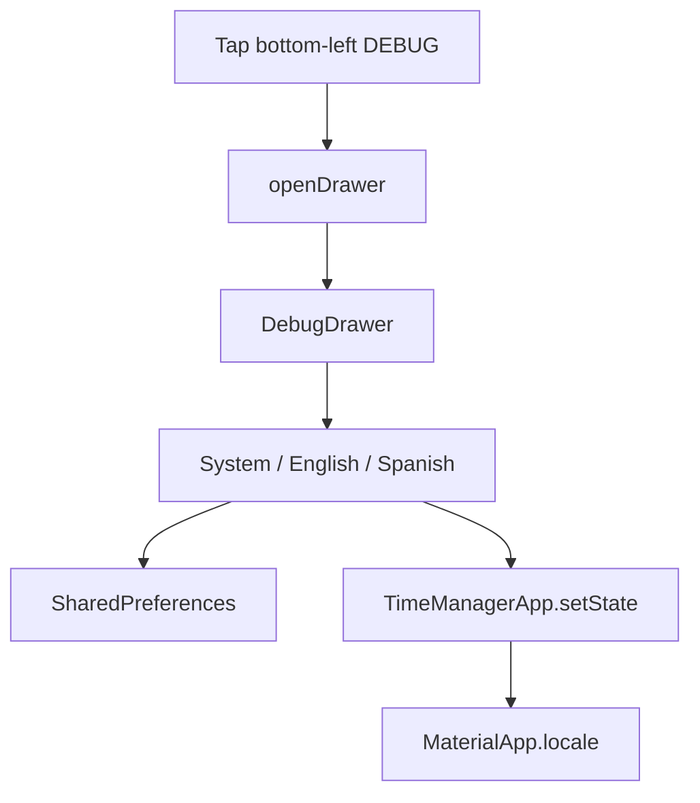

# Debug drawer + locale override

## Context

There is no custom debug UI today — only Flutter’s built-in top-right DEBUG ribbon ([`main.dart`](apps/timemanager/lib/main.dart)), which is **not clickable and cannot be repositioned**. Localization already supports `en` + `es` via gen-l10n; `MaterialApp` follows the device locale with no override. `shared_preferences` is already a dependency (auth-only today).

**Approach:** Hide the stock banner and add a debug-only overlay that looks like the DEBUG ribbon, anchored bottom-left, and opens a Drawer.

## 1. Persist locale preference

Add [`apps/timemanager/lib/services/locale_preference_service.dart`](apps/timemanager/lib/services/locale_preference_service.dart):

- Key e.g. `debug_locale_override`
- Values: `null` / missing = follow system; `"en"` / `"es"` = force that language
- `Future<Locale?> load()` and `Future<void> save(Locale? locale)`

Keep this separate from [`auth_service.dart`](apps/timemanager/lib/services/auth_service.dart).

## 2. Hold locale on the app root

Convert [`TimeManagerApp`](apps/timemanager/lib/main.dart) to a `StatefulWidget`:

- On startup, load the preference before/while building (simple pattern: load in `initState`, then `setState`)
- Pass `locale: _overrideLocale` to `MaterialApp` (`null` = system resolution)
- Set `debugShowCheckedModeBanner: false`
- Use `builder:` to wrap the navigator child with a debug shell (drawer + banner) only when `kDebugMode` is true

Release/profile builds stay unchanged (no banner, no drawer).

## 3. Debug shell: banner + drawer

Add something like [`apps/timemanager/lib/widgets/debug_menu.dart`](apps/timemanager/lib/widgets/debug_menu.dart):

- Outer `Scaffold` with a `GlobalKey<ScaffoldState>` and `drawer:` containing the debug menu
- `body:` is the existing app child (login / home keep their own scaffolds)
- Stack a small rotated “DEBUG” control in the **bottom-left** (visually similar to Flutter’s ribbon) that calls `openDrawer()`
- Drawer contents (English, debug-only — not ARB):
  - Header: “Debug”
  - **Locale** section: radio / list tiles for **System**, **English**, **Spanish**
  - Selecting a locale calls `onLocaleChanged` → persist + update `TimeManagerApp`

Place the FAB on [`HomeScreen`](apps/timemanager/lib/screens/home_screen.dart) with `floatingActionButtonLocation: FloatingActionButtonLocation.endFloat` (or keep default end) so it does not collide with the bottom-left DEBUG control.

## 4. Tests

- Unit test for `LocalePreferenceService` (save/load/clear → `null`) using an in-memory or mockable prefs approach if practical; otherwise a thin pure helper that maps string ↔ `Locale?` plus a small service test.
- Smoke: existing [`widget_test.dart`](apps/timemanager/test/widget_test.dart) still pumps `TimeManagerApp` (may need to tolerate async prefs load — e.g. pump until settled or inject a fake service).

Run `nx test timemanager` and `nx run timemanager:analyze`.

## Out of scope

- Other debug toggles beyond locale (API base URL, etc.) — drawer can grow later
- Shipping the drawer in release builds
- Adding more languages beyond existing `en` / `es`
