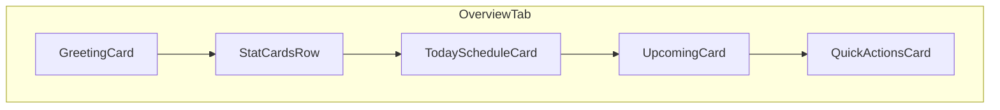

# Time Manager Design System & UI Redesign

## Current state (analysis)

The Flutter client is a functional CRUD + calendar app with a thin Material 3 light theme ([`apps/timemanager/lib/theme/app_theme.dart`](apps/timemanager/lib/theme/app_theme.dart)): seed teal `#0F766E`, no dark theme, no design tokens, almost no shared widgets.

**Screens today:** Login → Home shell (Activities + Calendar) → Activity form. No Overview/dashboard. Card theme exists but is only used on Login; Activities is flat `ListTile` + `Divider`.

**Consistency gaps:** ad-hoc spacing/radii; duplicated `_ErrorState`; weak empty states; hardcoded calendar event text (`Colors.white`); no `inputDecorationTheme` / custom typography; web manifest still `#0175C2`; no responsive shell.

---

## Locked product decisions

- **Dashboard:** Add a new **Overview** tab (today’s schedule, quick stats from existing activity data, upcoming list, quick actions). No new API — derive stats client-side from activities already fetched.
- **Theme control:** Light / Dark / System preference (persist like locale). Debug drawer first for QA; then a production **Settings** entry point (AppBar overflow or profile action) so users can change theme without debug builds.

---

## Design rationale

| Principle | Choice |
|-----------|--------|
| Familiarity + speed | Stay on **Material 3** primitives; wrap with semantic tokens so components never hardcode colors |
| Brand continuity | Keep **calm teal** `#0F766E` as primary seed; derive secondary/surfaces from M3 `ColorScheme.fromSeed` |
| Approachability | Soft surfaces, generous whitespace, rounded cards — not dense admin UI |
| Maintainability | One token layer → light/dark `ThemeData` → shared widgets → screens |
| Scalability | Semantic roles only; new themes = new token maps, not component edits |

---

## Part 1 — Design system (tokens)

### File layout (new)

```
apps/timemanager/lib/theme/
  app_theme.dart          # buildLightTheme / buildDarkTheme (evolve existing)
  tokens/
    app_colors.dart       # semantic seed + role helpers
    app_spacing.dart
    app_radius.dart
    app_elevation.dart
    app_typography.dart
    app_icon_sizes.dart
  theme_mode_preference_service.dart   # or under services/
```

Also document the system in [`.ai/design-system.md`](.ai/design-system.md) so agents and humans share one source of truth (mirrors tokens in prose).

### Color system (semantic)

Map app semantics onto Material 3 `ColorScheme` roles so widgets use `Theme.of(context).colorScheme` / `Theme.of(context).textTheme` only.

| Semantic | Purpose | M3 mapping |
|----------|---------|------------|
| Primary | Brand actions, key highlights, FAB container | `primary` / `onPrimary` / `primaryContainer` |
| Secondary | Supporting accents (e.g. recurring vs one-off) | `secondary` / `tertiary` (calendar: one-off = primary, recurring = tertiary — keep) |
| Background | App canvas behind cards | `surface` |
| Surface | Cards, sheets, dialogs | `surfaceContainerLow` / `surfaceContainer` / `surfaceContainerHigh` |
| Success | Positive confirmation | Custom extension `AppStatusColors.success` (not in stock ColorScheme) |
| Warning | Caution | `AppStatusColors.warning` |
| Error | Destructive / failure | `error` / `onError` / `errorContainer` |
| Info | Neutral informational | `AppStatusColors.info` |
| Text primary / secondary | Body / muted | `onSurface` / `onSurfaceVariant` |
| Border | Dividers, outlines | `outline` / `outlineVariant` |

**Light / dark:** `ColorScheme.fromSeed(seedColor: Color(0xFF0F766E), brightness: …)` for both. Status colors defined per brightness with WCAG AA contrast against their containers.

**ThemeMode:** `ThemeMode.system | light | dark` via preference service + `MaterialApp.theme` / `darkTheme` / `themeMode`. Debug drawer radios; Settings UI for production.

**Rule:** No raw `Color(0x…)` / `Colors.white` in feature UI (debug chrome exempt). Calendar event text uses `onPrimary` / contrast-aware `ColorScheme.on*` for the event fill.

### Typography

- **Family:** Plus Jakarta Sans via `google_fonts` (display + UI); monospace not needed.
- Wire `textTheme` from `GoogleFonts.plusJakartaSansTextTheme(...)` then override roles:

| Role | Size / weight / line height | Use |
|------|----------------------------|-----|
| Display | 32 / w700 / 1.25 | Rare hero (Overview greeting) |
| Headline | 24 / w600 / 1.3 | Screen titles (when not AppBar) |
| Title large | 20 / w600 / 1.3 | Card titles |
| Title medium | 16 / w600 / 1.4 | List primary, section headers |
| Title small | 14 / w600 / 1.4 | Dense section labels |
| Body large | 16 / w400 / 1.5 | Forms, primary body |
| Body medium | 14 / w400 / 1.5 | Default body |
| Body small | 12 / w400 / 1.4 | Captions, helper |
| Label large | 14 / w600 / 1.2 | Buttons |
| Label medium | 12 / w600 / 1.2 | Chips, badges |
| Label small | 11 / w500 / 1.2 | Overlines, meta |

### Spacing scale

| Token | dp |
|-------|-----|
| `xs` | 4 |
| `sm` | 8 |
| `md` | 16 |
| `lg` | 24 |
| `xl` | 32 |
| `xxl` | 48 |

Screen padding default: `lg`. Card internal padding: `md`. Stack gaps: `sm`/`md`. Ban magic numbers in new/migrated code unless documented exception (e.g. calendar `heightPerMinute`).

### Border radius

| Token | dp | Use |
|-------|-----|-----|
| `sm` | 8 | Chips, small inputs, icon buttons |
| `md` | 12 | Cards, text fields, dialogs |
| `lg` | 16 | Bottom sheets, large panels |
| `pill` | 999 | Pills, nav indicators where appropriate |
| `circular` | 50% | Avatars, FAB |

### Elevation

Prefer **tonal surfaces** over heavy shadows (M3):

| Level | Treatment | Use |
|-------|-----------|-----|
| 0 | Flat on background | Lists inside cards |
| 1 | `surfaceContainerLow`, elevation 0–1 | Default cards |
| 2 | `surfaceContainer`, slight shadow or scrolled-under AppBar | Floating menus, sticky bars |
| 3 | Modal scrim + elevated surface | Dialogs, sheets |

### Icons

- **Style:** Material Symbols / Material Icons (filled for selected nav; outlined otherwise).
- **Sizes:** 16 / 20 / 24 / 48 (`AppIconSizes`). Default interactive: 24. Touch targets ≥ 48×48.

### Motion

- Short, subtle: 150–250ms `Curves.easeOutCubic` for fades/size.
- Prefer `AnimatedSwitcher`, theme-driven ink ripples; no decorative loops.

### Accessibility defaults

- Contrast: primary/onPrimary and status pairs meet AA.
- Visible `focusColor` / `Focus` outlines on keyboard (web).
- Min touch target 48dp; IconButtons padded.
- Don’t encode meaning in color alone (icons + text on status).
- Respect `MediaQuery.disableAnimations` / reduce motion where easy.

---

## Part 2 — Component library

Shared widgets under `lib/widgets/` (visual) + theme component themes for stock Material.

| Component | When to use | Implementation |
|-----------|-------------|----------------|
| **Buttons** | Primary = `FilledButton`; secondary = `OutlinedButton`; tertiary = `TextButton`; destructive = filled with error | Theme `filledButtonTheme` etc. |
| **Icon buttons** | Compact chrome actions | Themed `IconButton`; 48dp target |
| **Text fields** | All forms | Global `inputDecorationTheme` (outline, radius md, filled subtle) |
| **Search bar** | Future filter; not required on day 1 of Overview | `SearchBar` themed when needed |
| **AppCard** | Group related content on Overview, settings, login | Thin wrapper: padding md, radius md, elevation 1 |
| **Dialogs / sheets** | Confirm delete; future filters | `dialogTheme` / `bottomSheetTheme` |
| **Navigation** | Phone: `NavigationBar`; wide: `NavigationRail` | Responsive shell in Home |
| **Tabs / segmented** | Calendar Day/Week/Month | Existing `SegmentedButton` + theme |
| **Lists** | Activity rows inside cards or as card-rows | `ActivityListTile` shared widget |
| **Tables** | Defer — no tabular screens yet | Document pattern only |
| **Chips / badges / tags** | Recurring flag, status | Existing chips + theme; badge for counts on Overview |
| **Tooltip / Snackbar** | Affordances + mutation feedback | Theme snackBar; tooltips on icon-only |
| **Progress** | Page load = centered; button busy = inline 20dp | Shared `LoadingView` |
| **EmptyState** | No data + CTA | Icon + title + body + optional button |
| **ErrorState** | Fetch failures + Retry | Extract duplicated `_ErrorState` |
| **StatCard** | Overview KPIs | AppCard + label + large number + optional trend caption |

**Usage rule:** Screens compose these widgets; they do not invent new radii/colors.

---

## Part 3 — Dashboard (Overview) style

New first tab: **Overview**.

Card grid (responsive):



- **Greeting:** date + short welcome (l10n).
- **Stats (client-derived):** e.g. activities today, this week, recurring count — from loaded activities list (share refresh with Activities/Calendar via existing home reload).
- **Today’s schedule:** card with list or empty state CTA.
- **Upcoming:** next N activities.
- **Quick actions:** “Add activity”, “Open calendar” (navigate tabs / push form).

Layout: single column on narrow; 2-column card grid on `≥800` width (`LayoutBuilder`). Cards use spacing `md` between them, screen padding `lg`.

---

## Part 4 — Layout & responsive shell

Update [`home_screen.dart`](apps/timemanager/lib/screens/home_screen.dart):

- 3 destinations: Overview | Activities | Calendar.
- Breakpoint ~800: `NavigationRail` + content; below: `NavigationBar`.
- Keep FAB context-aware (create; on Overview/Calendar use “today” / selected day).
- Settings: AppBar overflow menu → Theme mode + Sign out (moves sign-out out of raw icon-only where possible).
- Remove dead non-`embedded` scaffold branches on Activities/Calendar once Overview lands (body-only children).

---

## Part 5 — Migration strategy

Phased so each phase ships a coherent increment; every change references tokens/components.

### Phase A — Foundation (no visual redesign of flows yet)

1. Add token files + light/dark `ThemeData` (typography, input, dialog, snackBar, listTile, card, etc.).
2. `ThemeModePreferenceService` + wire `MaterialApp`.
3. Debug drawer: Theme radios (alongside locale).
4. Align `web/manifest.json` theme colors to teal.
5. Write [`.ai/design-system.md`](.ai/design-system.md).
6. Tests: theme preference service; smoke that both themes build.

### Phase B — Shared components

1. `EmptyState`, `ErrorState`, `LoadingView`, `AppCard`, `StatCard`, `ActivityListTile`.
2. Extract form `_TimeField` / `_DateField` to shared widgets if reused.
3. Replace duplicated `_ErrorState`; upgrade empty states.

### Phase C — Screen migration (strict DS adherence)

1. **Login** — already card-based; apply tokens, typography, themed inputs.
2. **Activities** — card or card-row list; empty/error shared; density for trailing chip+menu.
3. **Calendar** — semantic event colors/text; view switcher spacing tokens; empty-range hint.
4. **Activity form** — section cards or clear section hierarchy; sticky/primary save pattern via theme; AppBar cancel not required if back is clear.
5. **Home shell** — rail/bar, settings entry, FAB locations.

### Phase D — Overview tab + Settings

1. Overview screen + client-side stats.
2. Theme control in Settings (and keep debug drawer for locale/theme QA).
3. l10n strings for Overview + Settings (en/es ARB).
4. Widget tests for Overview empty/loading and theme preference.

### Phase E — Polish

- Focus/hover on web; motion pass; contrast audit in dark mode; remove remaining magic numbers on migrated screens.

**Non-goals this redesign:** GoRouter, search, charts library, swipe-to-delete, new GraphQL fields, Authentik.

---

## Part 6 — Screen redesign checklist (when executing Phase C–D)

Each screen must:

- Use only semantic colors + spacing/radius tokens
- Use shared empty/error/loading where applicable
- Work in light and dark
- Respect responsive shell
- Keep all copy in ARB

---

## Key files to touch (implementation)

| Area | Paths |
|------|--------|
| Theme | [`lib/theme/app_theme.dart`](apps/timemanager/lib/theme/app_theme.dart), new `lib/theme/tokens/*` |
| App root | [`lib/main.dart`](apps/timemanager/lib/main.dart) |
| Shell | [`lib/screens/home_screen.dart`](apps/timemanager/lib/screens/home_screen.dart) |
| New | `lib/screens/overview_screen.dart`, `lib/widgets/{empty_state,error_state,app_card,stat_card,...}.dart` |
| Prefs | theme preference service + debug drawer + settings UI |
| Deps | `google_fonts` in `pubspec.yaml` |
| Docs | `.ai/design-system.md` |
| Tests | preference + overview + widget smoke |

Run via Nx: `nx test timemanager`, `nx run timemanager:analyze`.
