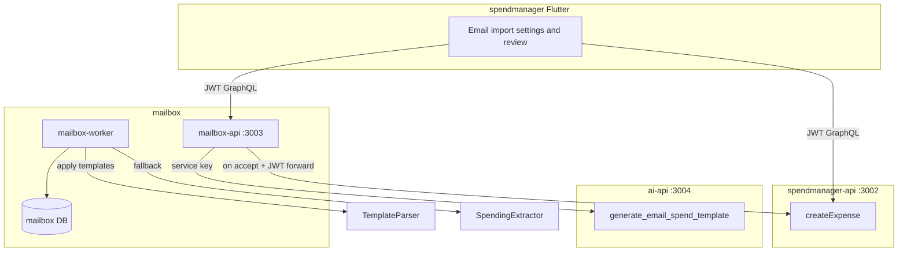

# Email spend extraction bridge

## Locked decisions

- **Review then publish:** candidates stay `pending` until accept/reject; accept publishes into spendmanager.
- **UI:** spendmanager Flutter screens (settings + email import/review). Config is **per user** (mailbox already is user-scoped).
- **AI once per email type:** `ai-api` generates a structured parsing template from a sample message; the worker thereafter applies that template with traditional parsing only. Heuristic `SpendingExtractor` remains fallback when no template matches.
- **Templates are editable:** users can tweak match rules and field extractors after AI generation.
- **Boundaries stay clean:** `mailbox_kit` stays free of spendmanager/ai-api imports; adapters live in apps.

## Architecture



**Steady-state poll path (no AI):** list messages → domain allowlist → pick matching template by sender → deterministic extract → `spending.candidate` → user review.

**One-time AI path:** user picks a sample message (or sync finds an unmatched type) → mailbox-api calls `generate_email_spend_template` → persist template → user may edit → future mail of that type uses the template only.

## 1. Wildcard domain filters

Extend [`libs/mailbox_kit/domain_filter.ts`](libs/mailbox_kit/domain_filter.ts) and mailbox-api validation:

| Pattern | Behavior |
|---------|----------|
| `user@shop.com` | exact address |
| `shop.com` | apex + subdomains (current) |
| `*.shop.com` | subdomains only (not apex) |
| `*@shop.com` | any local-part at that domain |
| `*@*.shop.com` | any local-part at a subdomain of shop.com |

Empty filter list still means allow-all. Update unit tests + [`apps/mailbox-api/src/graphql/validation.ts`](apps/mailbox-api/src/graphql/validation.ts).

## 2. Parsing templates (mailbox DB + kit)

New table `parsing_templates` (user-owned via mailbox):

- `mailbox_id`, `user_id` (denormalized for queries)
- `name`, `enabled`
- `match_from_pattern` — same wildcard grammar as domain filters
- optional `match_subject_regex`
- `extractors` JSONB — deterministic field map, e.g.:

```ts
type FieldExtractor =
  | { source: 'subject' | 'text' | 'html_text'; regex: string; group: number }
  | { source: 'from_domain' } // merchant helper
  | { source: 'constant'; value: string }

type SpendTemplateExtractors = {
  amount: FieldExtractor       // → amountCents (parse money)
  currency?: FieldExtractor    // default USD
  spentOn?: FieldExtractor     // default message.receivedAt
  merchant?: FieldExtractor
  note?: FieldExtractor
}
```

- `source_message_id` nullable (sample used for generation)
- `version`, timestamps

Kit additions in [`libs/mailbox_kit`](libs/mailbox_kit):

- `TemplateParser` / `TemplateSpendingExtractor` implementing `Extractor`: `canHandle` via match patterns; `extract` applies regexes only (no LLM).
- Pipeline order in worker: **templates first** (user templates for that mailbox), then heuristic `SpendingExtractor` if none handled.

GraphQL (mailbox-api): `parsingTemplates`, `createParsingTemplate`, `updateParsingTemplate`, `deleteParsingTemplate`, `generateParsingTemplate(messageId, name?)` (calls ai-api).

## 3. AI use case (generate once)

Add [`apps/ai-api/src/use_cases/generate_email_spend_template.ts`](apps/ai-api/src/use_cases/generate_email_spend_template.ts):

- **Input:** from, subject, text/html (truncated), optional hints
- **Output:** validated JSON matching `SpendTemplateExtractors` + suggested `match_from_pattern` / subject regex
- Prompt instructs: prefer robust regexes; never invent amounts; leave optional fields null if unsure
- Register in [`registry.ts`](apps/ai-api/src/use_cases/registry.ts); fake-provider tests (no live Gemini in CI)

mailbox-api holds `AI_API_BASE_URL` + `AI_SERVICE_KEY`, calls `POST /v1/use-cases/generate_email_spend_template/run`, validates output, inserts template. Worker never calls ai-api during poll.

## 4. Accept → spendmanager sink

- Extend accept mutation: `updateArtifactStatus` (or `acceptSpendingCandidate`) requires `categoryId` when accepting `spending.candidate`.
- Implement `SpendmanagerExpenseSink` in **mailbox-api** (not kit): HTTP GraphQL to spendmanager `createExpense` with **forwarded user Bearer JWT** (same SuperTokens token the Flutter client already sent).
- Env: `SPENDMANAGER_API_BASE_URL` (default `http://localhost:3002`).
- Persist provenance on artifact (e.g. `payload.publishedExpenseId` or column `published_expense_id`) for idempotency; re-accept must not double-create.
- Note in expense: include merchant / source subject when note empty.
- Reject remains mailbox-only.

## 5. Spendmanager Flutter UI

Today spendmanager only points at `:3002` via [`ApiConfig`](apps/spendmanager/lib/config/api_config.dart) / single [`AppEndpoints.apiBaseUrl`](libs/app_core/lib/config/app_endpoints.dart). Add a second mailbox base URL (dart-define `MAILBOX_API_BASE_URL`, local `:3003`) and a thin `MailboxGraphQLClient` / repository—do not force a breaking redesign of `AppEndpoints` for other apps; spendmanager-local config is enough.

Screens (from Settings entry):

1. **Email import setup** — create/enable mailbox (fixture locally; Gmail via existing `connectGmail` with tokens from Google OAuth / sign-in with `gmail.readonly`), edit wildcard domain filters, trigger sync.
2. **Templates** — list per mailbox; “Generate from sample message” → AI; edit match pattern + extractor regexes; enable/disable.
3. **Review queue** — pending `spending.candidate`s; accept (pick category from existing category repo) / reject; accepted rows show linked expense when published.

Gmail connect v1: Flutter obtains OAuth tokens (Google Sign-In / AppAuth) and calls `connectGmail`—no new browser OAuth dance on mailbox-api in this pass.

## 6. Docs / glue

Update [`.ai/mailbox.md`](.ai/mailbox.md), [`.ai/ai-api.md`](.ai/ai-api.md), [`.ai/workflows.md`](.ai/workflows.md), spendmanager README / `.env.example` as needed; note AI is for template generation only.

## Testing

- `mailbox_kit`: wildcard filter matrix; template extract on fixture emails; pipeline prefers template over heuristic.
- `ai-api`: `generate_email_spend_template` parse/validate with fake provider.
- `mailbox-api`: template CRUD scoping; generate mutation mocks ai-api; accept publishes once (mock spendmanager).
- Flutter: repository/widget tests for accept-with-category and template edit where high value; skip brittle OAuth UI tests.

## Explicit non-goals

- LLM extraction on every poll
- Auto-publish without review
- Microsoft Graph / inbound SES
- Shared GraphQL codegen
- Full mailbox Flutter app (feature lives inside spendmanager)
