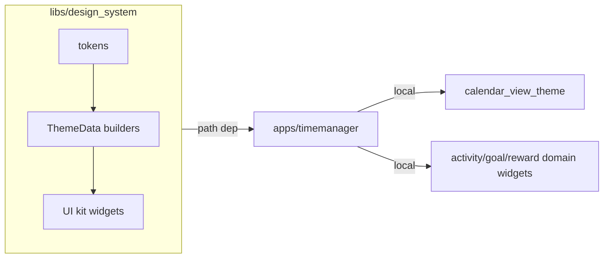

# Extract Flutter design system library

## Decisions (locked)

- **Scope:** Full UI kit — tokens + `ThemeData` + reusable primitives **and** higher-level composed patterns that are not domain-model-coupled.
- **Consumers:** Flutter-first (`timemanager` now). Document a web-token mirror path; do **not** implement React/CSS tokens yet.
- **Package:** [`libs/design_system`](libs/design_system) — flat under `libs/`, `publish_to: none`, Flutter/`pubspec.yaml` only (not pnpm).
- **Brand:** Keep the current teal seed (`#0F766E`) and Plus Jakarta Sans as the shared default look.
- **Nx:** New `type:lib` + `runtime:flutter` + `scope:shared` project with `nx:run-commands` targets (`analyze`, `test`, `pub-get`), matching [`apps/timemanager/project.json`](apps/timemanager/project.json).



## Package layout

```
libs/design_system/
  pubspec.yaml          # flutter + google_fonts; publish_to: none
  project.json
  analysis_options.yaml # mirror flutter_lints from the app
  lib/
    design_system.dart  # barrel export
    theme/
      app_theme.dart
      tokens/             # colors, typography, spacing, radius, elevation, icons, breakpoints, group_palette
    widgets/
      ...
  test/
```

App depends via:

```yaml
# apps/timemanager/pubspec.yaml
dependencies:
  design_system:
    path: ../../libs/design_system
```

## What moves into the library

| Layer | Move |
|-------|------|
| Tokens | All of [`lib/theme/tokens/`](apps/timemanager/lib/theme/tokens/) including `group_palette.dart` |
| Theme | [`app_theme.dart`](apps/timemanager/lib/theme/app_theme.dart) **without** `calendar_view` extensions |
| Primitives | `AppCard`, `EmptyState`, `LoadingView`, `StatCard` |
| Composed | `ErrorState`, `AdvancedFormSection`, `RewardCard` (visual API only), plus promote `ThemeModeRadioGroup`, shared `ColorSwatch`, `AppTimeField` / `AppDateField` from screens |

### Decoupling rules (required for a shared kit)

- **No `AppLocalizations`.** `ErrorState` and `AdvancedFormSection` take required/optional string params (`title`, `retryLabel`, section title/badge) — callers pass l10n from the app.
- **No domain models.** `RewardCard` keeps the generic constructor (`name`, `color`, `icon`, …); move `fromInventory` / `fromDefinition` factories into thin app wrappers (e.g. stay in app `widgets/reward_card.dart` or model extensions that return the kit widget).
- **No `calendar_view`.** Split theme: library builds base `ThemeData` + `AppStatusColors`; app merges calendar extensions in a thin local helper (today’s logic from [`calendar_view_theme.dart`](apps/timemanager/lib/theme/calendar_view_theme.dart)).

## What stays in the app

- [`calendar_view_theme.dart`](apps/timemanager/lib/theme/calendar_view_theme.dart) + theme-merge helper used from [`main.dart`](apps/timemanager/lib/main.dart)
- Domain widgets: `activity_list_tile`, `goal_progress_card`, `reward_rules_section`, `debug_menu`
- [`ThemeModePreferenceService`](apps/timemanager/lib/services/theme_mode_preference_service.dart) (persistence stays app-owned; UI radios move to the kit)

## App migration steps

1. Create package + Nx project; add path dependency; `flutter pub get` in both.
2. Move/copy theme + kit widgets; add barrel `package:design_system/design_system.dart`.
3. Refactor library APIs for string injection / no models (as above).
4. Update all app imports (`../theme/...`, `../widgets/...` → `package:design_system/...`) across screens/widgets/tests (~30 files with theme/widget imports).
5. Delete moved sources from `apps/timemanager/lib/theme/` and `lib/widgets/` (keep domain + calendar leftovers).
6. Wire themes in `main.dart`: `theme: withCalendarTheme(buildLightTheme())` (or equivalent merge).

## Docs / decisions updates

- [`.ai/design-system.md`](.ai/design-system.md) — source of truth becomes `libs/design_system`; note Flutter-only today; add a short **Future: web tokens** section (e.g. export semantic tokens to CSS variables / a JSON scale for `user-manager-web` later — no implementation).
- [`.ai/decisions.md`](.ai/decisions.md) — remove “extracting shared libs” from out-of-scope; record `libs/design_system` as the first shared Flutter lib.
- [`.ai/conventions.md`](.ai/conventions.md) — add `type:lib`, `scope:shared`, and “Flutter libs use path deps, not pnpm”.
- [`AGENTS.md`](AGENTS.md) + overview rule — update `libs/` from empty to include `design_system`.

## Verification

- `nx run design_system:analyze` and `nx run design_system:test` (smoke: `buildLightTheme`/`buildDarkTheme` produce M3 themes; primitive widget smoke tests as needed).
- `nx run timemanager:analyze` and `nx test timemanager` — fix broken imports / updated `ErrorState` & `AdvancedFormSection` call sites and any moved widget tests.

## Out of scope (this work)

- React/`user-manager-web` token implementation
- Melos / publishing to pub.dev
- Moving GraphQL codegen, l10n, or domain models into `libs/`
- Extracting `ActivityListTile` / `GoalProgressCard` (stay domain-coupled)