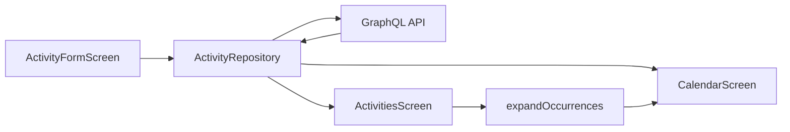

# Flutter activity scheduling (form + list + calendar)

## Context

Backend now requires `date` for one-off activities and `recurrencePattern` for recurring ones (`weekly` | `monthly` | `every_x_days`). The Flutter app still hardcodes `isRecurring: false` and never reads/writes schedule fields. There is no server-side occurrence expansion — the client must compute calendar instances locally.

Authoritative API shapes live in [apps/timemanager-api/.pylon/schema.graphql](apps/timemanager-api/.pylon/schema.graphql). Mutation inputs use camelCase (`startTime`, `isRecurring`, `recurrenceType`); responses and config use snake_case (`start_time`, `days_of_week`, `recurrence_type`).



## 1. Models

Extend [apps/timemanager/lib/models/activity.dart](apps/timemanager/lib/models/activity.dart):

- Add nullable `date` (`String?`, `YYYY-MM-DD`) and nullable `recurrencePattern`.
- Add `RecurrencePattern` (`recurrenceType`, `config`) and `RecurrenceConfig` matching the API:
  - `start_date` (required), optional `end_date`
  - weekly: `days_of_week` (`0`–`6`, Sun=`0`)
  - monthly: `days_of_month` (`1`–`31`) and/or `is_last_day_of_month`
  - every_x_days: `interval_days` (≥ 1)
- Add a small `ActivityOccurrence` value type (`activity`, `date`) used by the calendar — not a GraphQL type.

Keep parsing helpers colocated; map mixed naming carefully in `fromJson` / `toInputMap`.

## 2. Repository GraphQL surface

Update [apps/timemanager/lib/services/activity_repository.dart](apps/timemanager/lib/services/activity_repository.dart):

- Expand `_activityFields` with `date` and nested `recurrencePattern { id activity_id recurrence_type config { days_of_week days_of_month is_last_day_of_month interval_days start_date end_date } created_at updated_at }`.
- `createActivity` / `updateActivity`: accept `isRecurring`, optional `date`, optional `recurrencePattern`; stop hardcoding `isRecurring: false`.
- Select the same activity fields on mutation responses (backend now returns `Activities!`, not opaque `Object!` — remove the outdated comment).

## 3. Occurrence expansion (pure, testable)

Add [apps/timemanager/lib/utils/occurrence_expander.dart](apps/timemanager/lib/utils/occurrence_expander.dart):

```dart
List<ActivityOccurrence> expandOccurrences({
  required List<Activity> activities,
  required DateTime from, // inclusive, date-only
  required DateTime to,   // inclusive, date-only
});
```

Rules:

- Non-recurring: include if `date` falls in `[from, to]`.
- Weekly: each day in range whose weekday is in `days_of_week`, and ≥ `start_date`, ≤ optional `end_date`.
- Monthly: each day whose day-of-month is in `days_of_month`, or last day of month when `is_last_day_of_month`, within the window.
- Every X days: dates `start_date + n * interval_days` within the window (and ≤ `end_date` if set).

Unit-test this thoroughly in `test/utils/occurrence_expander_test.dart` (one-off, each recurrence type, end_date clipping, empty range). This is the highest-value regression coverage for the feature.

## 4. Create / edit form

Extend [apps/timemanager/lib/screens/activity_form_screen.dart](apps/timemanager/lib/screens/activity_form_screen.dart):

- Keep title, description, start/end time.
- Add schedule mode: **One-time** vs **Recurring** (`SwitchListTile` or segmented control).
- One-time: required date field via `showDatePicker`; default today (edit: existing `date`).
- Recurring:
  - Type dropdown: Weekly / Monthly / Every X days
  - Shared: start date (required), optional end date
  - Weekly: multi-select day-of-week chips (Sun–Sat)
  - Monthly: multi-select day-of-month chips (or compact multi-picker) + “Last day of month” checkbox
  - Every X days: integer stepper / field for interval (≥ 1)
- Client validation mirrors API rules before save; show snackbars for schedule errors returned from GraphQL.
- Prefill all schedule fields when editing a recurring activity.

Stay Material-only — no new packages.

## 5. Activities list

Update [apps/timemanager/lib/screens/activities_screen.dart](apps/timemanager/lib/screens/activities_screen.dart):

- Subtitle: one-off shows `date` + time range; recurring shows a short human summary (e.g. `Weekly · Mon, Wed, Fri` / `Every 3 days` / `Monthly · 1, 15`) + time range.
- Replace the generic “Recurring” chip with that summary (or keep a compact type chip plus the subtitle).
- Add a small helper (e.g. `formatRecurrenceSummary`) next to the models or in `lib/utils/` so list and calendar can share it.

## 6. Calendar screen + shell navigation

Add [apps/timemanager/lib/screens/calendar_screen.dart](apps/timemanager/lib/screens/calendar_screen.dart):

- Day-focused agenda: selected date (default today), prev/next day controls, and a “pick date” button (`showDatePicker`).
- Fetch all activities once (same repository call as the list); call `expandOccurrences` for the selected day (range = that day).
- List occurrences sorted by `startTime`; tap opens edit form for the parent activity; empty state when none.
- Recurring rows can show a small “recurring” indicator so one-offs and series are distinguishable.

Wire navigation in a thin shell (new `HomeScreen` or equivalent) with a bottom nav: **Activities** | **Calendar**. Move FAB / create onto the Activities tab (calendar can offer “add for this day” that opens the form with that date prefilled as one-off — include this convenience).

Auth gate continues to land on the shell after login ([apps/timemanager/lib/widgets/auth_gate.dart](apps/timemanager/lib/widgets/auth_gate.dart)).

## 7. Tests and verify

- Add `test/utils/occurrence_expander_test.dart` as above.
- Optionally add a focused widget/form test only if cheap; skip broad golden UI tests.
- Run `nx test timemanager` and `nx run timemanager:analyze`.
- Manual smoke: create one-off with date; create each of the 3 recurrence types; edit recurring → one-off (and reverse); confirm calendar day shows expanded instances and list summaries look right.

## Out of scope

- Server-side occurrence queries / `activity_completions`
- Edit-single-occurrence vs edit-series (no exceptions API yet — edit always updates the whole activity)
- Third-party calendar packages (`table_calendar`, etc.)
