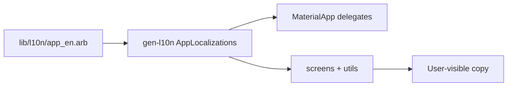

# Flutter intl full-pass localization

## Decisions

- **Approach:** Flutter official `gen-l10n` (ARB templates + `intl` under the hood) — not hand-rolled `Intl.message`.
- **Locales:** English only (`app_en.arb`). Adding another language later is a second ARB file + translations.
- **Scope:** Full string migration across screens, display helpers, and user-facing service/auth messages shown in the UI.

## 1. Enable gen-l10n

Update [`apps/timemanager/pubspec.yaml`](apps/timemanager/pubspec.yaml):

```yaml
dependencies:
  flutter:
    sdk: flutter
  flutter_localizations:
    sdk: flutter
  intl: any  # resolved to flutter_localizations-compatible version

flutter:
  generate: true
  uses-material-design: true
```

Add [`apps/timemanager/l10n.yaml`](apps/timemanager/l10n.yaml):

```yaml
arb-dir: lib/l10n
template-arb-file: app_en.arb
output-localization-file: app_localizations.dart
```

Create [`apps/timemanager/lib/l10n/app_en.arb`](apps/timemanager/lib/l10n/app_en.arb) with camelCase keys for all UI strings (placeholders for interpolated values, e.g. `{title}`, `{count}`).

Run `nx run timemanager:pub-get` so codegen produces `AppLocalizations` (generated under `.dart_tool` / `flutter_gen`; do not hand-edit).

## 2. Wire `MaterialApp`

In [`apps/timemanager/lib/main.dart`](apps/timemanager/lib/main.dart):

```dart
import 'package:flutter_gen/gen_l10n/app_localizations.dart';
// or package:timemanager/l10n/app_localizations.dart depending on Flutter output

MaterialApp(
  onGenerateTitle: (context) => AppLocalizations.of(context)!.appTitle,
  localizationsDelegates: AppLocalizations.localizationsDelegates,
  supportedLocales: AppLocalizations.supportedLocales,
  theme: buildAppTheme(),
  home: const AuthGate(),
);
```

This also localizes Material widgets (date/time pickers, etc.).

**Access pattern in widgets:** `final l10n = AppLocalizations.of(context)!;` then `l10n.someKey`.

## 3. Migrate all user-facing strings

Replace hardcoded English in these files (roughly ~100+ strings):

| Area | Files |
|------|--------|
| Shell / nav | [`home_screen.dart`](apps/timemanager/lib/screens/home_screen.dart), [`main.dart`](apps/timemanager/lib/main.dart) |
| Auth UI | [`login_screen.dart`](apps/timemanager/lib/screens/login_screen.dart) |
| Activities | [`activities_screen.dart`](apps/timemanager/lib/screens/activities_screen.dart) |
| Calendar | [`calendar_screen.dart`](apps/timemanager/lib/screens/calendar_screen.dart) |
| Form (largest) | [`activity_form_screen.dart`](apps/timemanager/lib/screens/activity_form_screen.dart) |
| Schedule copy | [`recurrence_summary.dart`](apps/timemanager/lib/utils/recurrence_summary.dart) |
| Domain UI labels | [`activity.dart`](apps/timemanager/lib/models/activity.dart) `RecurrenceType.label` |
| Auth/API UX errors | [`auth_service.dart`](apps/timemanager/lib/services/auth_service.dart), [`graphql_client.dart`](apps/timemanager/lib/services/graphql_client.dart) — only messages shown to users |

**Concrete refactors:**

- **`formatActivitySchedule` / `formatRecurrenceSummary`:** take `AppLocalizations` (or `BuildContext`) so weekday names and phrases (`Weekly · …`, `Every {n} days`, `last day`) come from ARB with placeholders.
- **`RecurrenceType.label`:** remove English from the model; resolve labels in UI via `l10n` (switch on enum → `l10n.recurrenceWeekly`, etc.).
- **Date display in the form:** replace hardcoded month abbreviations with `intl` `DateFormat` (e.g. `DateFormat.yMMMd()` / `MMM`) using the app locale from context.
- **Dialogs with interpolation:** e.g. delete confirm → ARB `"Remove \"{title}\"?"` with `{ "title": {} }`.
- **Leave non-UI strings alone:** `FormatException` / API parse errors in mappers, `apiValue` / `fromApi`, activity titles from the server.



## 4. Tests and docs touch-ups

- Update [`test/widget_test.dart`](apps/timemanager/test/widget_test.dart) if needed so `TimeManagerApp` still pumps with localization delegates (should work once wired in `MaterialApp`).
- If any unit test asserts schedule English from `formatActivitySchedule`, pass a test `AppLocalizations` or pump with delegates.
- Mention `lib/l10n/` in [`.cursor/rules/timemanager-flutter.mdc`](.cursor/rules/timemanager-flutter.mdc) so future work uses ARB instead of new literals.
- Verify with `nx run timemanager:analyze` and `nx test timemanager`.

## Out of scope

- Second language / in-app language picker
- Localizing server-returned activity titles/descriptions
- Extracting shared l10n into `libs/`
