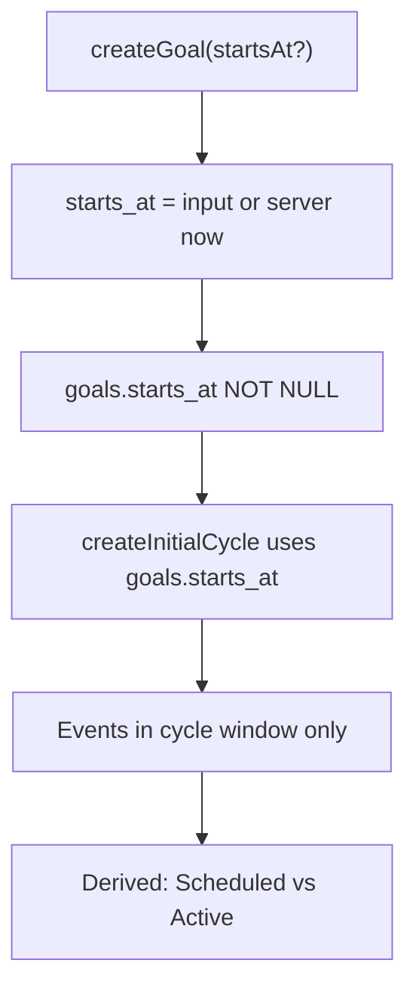
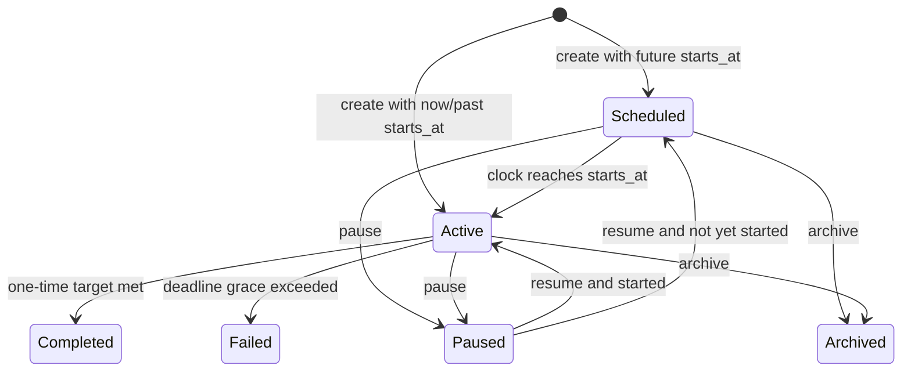
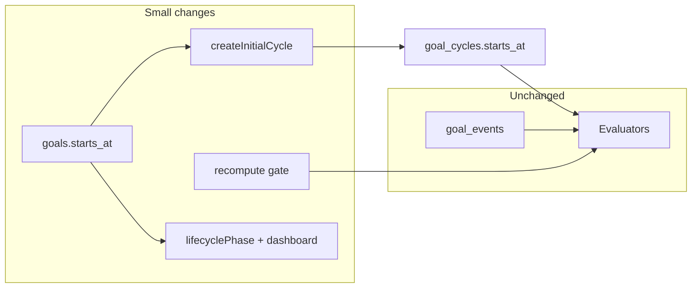

# Goal Start Dates — Design Revision

> Revision to [Goals System Design](.cursor/plans/goals_system_design_a7714a7a.plan.md). Design only — no implementation in this pass.
>
> **Core decision:** Add required `goals.starts_at` (server-defaulted when omitted). Seed `goal_cycles.starts_at` from it. Do **not** add a stored `scheduled` status — derive scheduled from `status === 'active' && starts_at > now`. Evaluators stay unchanged; the existing `[starts_at, ends_at)` event window already enforces “no accrual before start.”

---

## 1. Feature overview

Every goal has an **effective start timestamp**.

| Perspective | Rule |
|-------------|------|
| User | Start date is optional. Omitting it means “start now.” |
| System | `goals.starts_at` is always set (`NOT NULL`). There is never a goal without an effective start. |

**Why this fits the current architecture**

Progress already evaluates events in `[cycle.starts_at, cycle.ends_at)` ([`evaluators/index.ts`](apps/timemanager-api/src/goals/evaluators/index.ts), [`progress.ts`](apps/timemanager-api/src/goals/progress.ts)). Today [`createInitialCycle`](apps/timemanager-api/src/goals/cycles.ts) sets `starts_at = now`. Extending that to accept a future/past timestamp gives start-date behavior with almost no evaluator changes.

**Challenge to “Draft” / new statuses:** Draft is unnecessary — create persists immediately. A future start is still a real goal (`status: active`), just not yet accruing. Adding `scheduled`/`cancelled` to the stored enum would duplicate cycle timing and complicate pause/archive transitions. Prefer **derived lifecycle phase** for UI.



---

## 2. Functional requirements

### Create

| Case | Behavior |
|------|----------|
| No start date | Server sets `starts_at = now()` (authoritative clock). |
| Future start | Persist that timestamp; initial cycle uses it; goal remains `active`; UI shows **Scheduled**. Progress stays 0 until `now >= starts_at` (event window empty / recompute gated). |
| Past start | Allowed. After create, `recomputeCycle` includes historical `goal_events` in the window — supports backdating and imports. |

### Edit start date

| Case | Allowed? | Behavior |
|------|----------|----------|
| Before start (`now < starts_at`, cycle `current_value == 0`, no succeeded cycle) | **Yes, freely** | Update `goals.starts_at`; rewrite active cycle `starts_at` / `ends_at` / `deadline_at` from recurrence + deadline config; recompute. |
| After progress begun (`current_value > 0` or any non-active closed cycle) | **Restricted** | Moving **earlier**: allowed (may add historical events; recompute). Moving **later**: requires explicit client confirmation; server accepts only with `confirmStartsAtChange: true` (or equivalent). Later start shrinks the window and can drop progress — never silent. |
| After completed / failed | **No** | Terminal goals freeze timing. User must create a new goal (or unarchive + reset is out of scope). |
| While paused | Same rules as active, using stored `starts_at` vs progress. Pause does not clear start. |
| Archived scheduled | Archive allowed; archived goals do not activate, nudge, or appear on dashboard. Restoring to active later respects the original `starts_at` (if still future → still scheduled). |

### Recurring goals

- `goals.starts_at` = start of **cycle 0** only. Later cycles keep chaining from previous `ends_at` (existing roll-over).
- Editing start **before first cycle has begun**: shift cycle 0 window (and relative deadline / cycle end).
- Editing start **after cycle 0 closed**: disallowed (progress-begun rule). Change recurrence for future cycles only — existing gap (deadline/recurrence edits don’t refresh the active cycle) should be fixed for start/deadline/ends together when editing an **unstarted** active cycle.
- Future-dated recurring goal: cycle 0 sits with future `starts_at`/`ends_at`; roll-over must not run until `now >= ends_at` (already true) and should not “miss” cycles that never started — see Edge cases.

### Deadlines

- Absolute deadline: reject if `deadline_at < starts_at` (deadline before start).
- Relative deadline: still `starts_at + days_after_cycle_start` — remains valid.
- Do not run deadline failure / overdue nudges while scheduled (`now < starts_at`).

### Parent / child / composites

- **No hard ordering** that children start after parents. Dependencies already express “locked until prerequisite met” via `block_until_unlocked` / `isLocked`.
- Soft UX warning if child `starts_at` &lt; parent `starts_at`, or parent starts after child — allowed.
- Composite parent that is scheduled: **do not accrue / succeed** until started (gate recompute when `now < cycle.starts_at`), even if children already succeeded. Prevents “completed before it started.”

### Activity / group links

- No schema change. Pre-start completions still write `goal_events`; they simply fall outside the cycle window unless the user backdates `starts_at`.
- Deleting a linked activity before the goal starts: same dangling-link behavior as today; no special start-date rule.

### Confirmation matrix (summary)

- Freely allowed: create omit/future/past; edit start before any progress; move start earlier after progress.
- Confirm required: move start later after progress.
- Rejected: edit start on completed/failed; deadline before start; (optional product) extreme future start beyond a sanity cap (e.g. 5 years) — soft validate with clear error.

---

## 3. Goal lifecycle changes

Keep stored `goals.status`: `active | paused | completed | archived | failed`.

Add a **derived** client/API field (recommended name: `lifecyclePhase`):

| Phase | Definition |
|-------|------------|
| `scheduled` | `status === 'active' && starts_at > now` |
| `active` | `status === 'active' && starts_at <= now` and not terminal |
| `paused` | `status === 'paused'` |
| `completed` / `failed` / `archived` | mirror stored status |

**Transitions involving start**



No automatic status flip at activation time — crossing `starts_at` is pure time. Lazy reads already call `rollOverUserGoals`; activation is implicit on next query/recompute.

**Rejected from the request’s list:** Draft (not persisted-as-draft), Cancelled (use archive/delete).

---

## 4. Dashboard behavior

| Question | Decision |
|----------|----------|
| Separate scheduled? | Yes on Goals list: filter/section **Scheduled** (or chip). On Overview: optional compact “Starting soon” (max 2–3) with days-until-start; **not** mixed into the active progress strip. |
| Contribute to metrics? | **No.** Active-goals strip, behind-pace, deadline urgency, and “active count” exclude `lifecyclePhase === scheduled`. |
| Countdown? | Yes on scheduled cards: “Starts in N days” / start date chip. |
| Daily progress? | Unchanged — daily progress is occurrence-based, independent of goals. Scheduled goals do not affect it. |

Nudges ([`nudges.ts`](apps/timemanager-api/src/goals/nudges.ts)): skip behind_pace / deadline for `now < starts_at`; add `goal_starting_soon` (e.g. within 3 days).

---

## 5. Progress behavior

**Decision: no accrual before start; history inside the window counts.**

| Question | Answer |
|----------|--------|
| Accumulate before start? | No. |
| Linked activity before start count? | No (outside window). |
| Historical activity when start is past / backdated? | Yes, via normal recompute. |
| Differ by goal type? | No for event-based rules. Composite: also blocked until parent cycle has started (recompute gate), so child completion cannot complete a scheduled parent early. |

**Justification:** One rule for all types; matches existing window semantics; future start means “begin fresh”; past start is the explicit escape hatch for catch-up/import. Avoid a second “include prior activity” flag — it splits product semantics and complicates evaluators.

**Implementation gate (minimal special case):** In `recomputeAffectedCycles` / `recomputeCycle` callers, skip when `now < cycle.starts_at` (leave `current_value` at 0, never auto-succeed). Evaluators themselves stay pure and window-based.

---

## 6. Data model changes

### Schema

Add to `goals`:

```sql
starts_at timestamp NOT NULL DEFAULT now()
```

- Index not required for correctness; optional `(user_id, starts_at)` if filtering scheduled lists server-side later.
- Do **not** add a DB check against deadline JSON (validated in app code).
- Cycle table unchanged: `goal_cycles.starts_at` remains the evaluation window start.

### Invariant

- `goals.starts_at` is source of truth for “when this goal becomes effective.”
- For cycle 0 while it is the only/unstarted cycle: `goal_cycles.starts_at === goals.starts_at`.
- After roll-over: `goals.starts_at` stays at the original goal start; later cycles diverge (by design).

### Validation rules

- `startsAt` ISO-8601 datetime (store UTC, same as other timestamps).
- Absolute deadline end ≥ `starts_at`.
- Update later-start after progress requires confirmation flag.
- Reject start edits on `completed` / `failed`.

### `recurrence.anchor`

Leave unused for this feature. `goals.starts_at` is the product concept; `anchor` remains reserved for future calendar alignment (e.g. “weeks start Monday”). Do not overload anchor as start date.

---

## 7. API considerations

Extend types in [`types.ts`](apps/timemanager-api/src/graphql/types.ts) / resolvers:

- `CreateGoalInput.startsAt?: string | null` — omit/null → server `now`
- `UpdateGoalInput.startsAt?: string | null`
- `UpdateGoalInput.confirmStartsAtChange?: boolean` — required when moving start later after progress
- `Goal.startsAt: string!`
- `Goal.lifecyclePhase: string!` (or `isScheduled: boolean!` — prefer `lifecyclePhase` for list filtering)

`createGoal`: persist `starts_at`, pass into `createInitialCycle(db, goal, startsAt)` instead of always `now`.

`updateGoal`: if `startsAt` changes and cycle is editable, recompute cycle bounds (`computeCycleEnd`, `computeDeadlineAt`) then `recomputeCycle`.

Flutter: [`goal.dart`](apps/timemanager/lib/models/goal.dart), [`goal_repository.dart`](apps/timemanager/lib/services/goal_repository.dart), [`goal_form_screen.dart`](apps/timemanager/lib/screens/goal_form_screen.dart) — optional date picker; default empty = now. List/detail/dashboard respect `lifecyclePhase`.

---

## 8. Edge cases

| Case | Solution |
|------|----------|
| Time zones | Store UTC. UI: date picker interprets as **start of selected local day → UTC** (document in form helper). Display in local tz. |
| DST | Use absolute timestamps; period math already uses UTC day/month helpers in [`cycles.ts`](apps/timemanager-api/src/goals/cycles.ts). Accept minor DST length skew for weekly goals (same as today). |
| Clock drift / manual clock | Server clock owns default `now` and `lifecyclePhase`. Client-supplied explicit `startsAt` is intentional. |
| Offline create then sync | If user picked “now”, omit `startsAt` so server sets sync-time now. If user picked a calendar date, send that explicit value. |
| Historical import | Create with past `startsAt` + existing events → recompute fills progress. |
| Future recurring | Cycle 0 future window; no miss-backfill for windows entirely before first real start. Roll-over only after cycle 0 has started and `ends_at` passed. |
| Change recurrence after start | Existing policy: apply to current+future; do not rewrite `goals.starts_at`. |
| Edit start with partial progress | Confirm on shrink (later); free expand (earlier); always recompute. |
| Deadline before start | Validation error. |
| Child before parent / parent after child | Allowed; dependency lock separate; optional UI warning. |
| Archived scheduled | No activation, no nudges, hidden from dashboard strips. |
| Deleted linked activity before start | Dangling link; still 0 progress until start + new events. |
| Multi-device concurrent edit | Last write wins on `updated_at`; confirmation flag is per-request. No CRDT. |
| Pause across activation instant | Remains paused; `starts_at` in the past; resume → active (already started). |
| One-time goal, start in past, deadline already failed | On create/recompute/roll-over path, may immediately fail — acceptable; validate and warn in UI if absolute deadline already past grace at create. |

---

## 9. Migration strategy

1. New migration under [`apps/timemanager-api/src/db/migrations/`](apps/timemanager-api/src/db/migrations/): `ADD COLUMN starts_at timestamp NOT NULL DEFAULT now()`.
2. Backfill: set each goal’s `starts_at` from cycle 0’s `starts_at` (fallback `created_at`) so existing goals keep current behavior.
3. Update [`schema.ts`](apps/timemanager-api/src/db/types/schema.ts) Kysely types.
4. API + Flutter in the same change set so clients always receive `startsAt`.
5. Backward compatible: old clients omitting `startsAt` keep “start immediately.” Generated `.pylon` schema regenerates on serve/build — do not hand-edit.

---

## 10. Architecture integration

Minimize churn:

1. **Data:** one column on `goals`.
2. **Cycle creation:** `createInitialCycle` takes `startsAt` from goal (not wall clock).
3. **Evaluators:** unchanged.
4. **Recompute gate:** skip when `now < cycle.starts_at` (covers composite early-complete).
5. **Nudges / dashboard filters:** exclude or specialize scheduled.
6. **Update path:** shared helper `rescheduleActiveCycle(goal, startsAt)` for ends/deadline rewrite — also a place to fix the existing “edit deadline doesn’t refresh `deadline_at`” gap for unstarted/active cycles.

Avoid: stored `scheduled` status, per-rule start flags, dual progress modes, or teaching evaluators about “activation.”



---

## 11. Risks

- **Silent progress loss** if later start edits lack confirmation — mitigate with required flag + Flutter dialog.
- **Composite surprise** if recompute isn’t gated — mitigate with start gate before evaluate.
- **TZ date-only UX** vs UTC storage — document “local midnight” convention; add tests around day boundaries.
- **Missed-cycle backfill** interacting with long-delayed first start — ensure roll-over never fabricates cycles before cycle 0 actually started.
- **Scope creep** into fixing all recurrence/deadline edit refresh bugs — limit to reschedule helper for start (and deadline when start changes); track broader edit-refresh as follow-up if needed.

---

## 12. Recommended implementation plan

1. **Migration + types** — `goals.starts_at`, backfill from cycle 0, Kysely types.
2. **API core** — `createInitialCycle(goal.starts_at)`; create/update validation; `lifecyclePhase`; confirm flag; recompute gate; nudge skip + `goal_starting_soon`.
3. **Tests** — unit tests: create default/future/past; edit before/after progress; deadline-before-start rejection; composite not succeeding while scheduled; roll-over with future cycle 0; nudge exclusion. (`cycles.test.ts`, `validation.test.ts`, evaluator/progress as needed.)
4. **Flutter** — model + repository fields; form optional start date; list Scheduled filter; detail chip; dashboard exclude from active strip + optional starting-soon; confirm dialog on shrinking start.
5. **i18n** — `app_en.arb` / `app_es.arb` strings for scheduled, countdown, confirm copy.
6. **Docs** — amend Goals design plan note: start dates; mark `recurrence.anchor` still deferred.

**Intentionally out of scope:** push notifications for start, soft-delete, making `block_until_unlocked` enforce non-accrual (separate from start dates), full recurrence.anchor implementation.