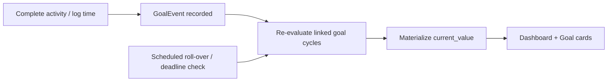
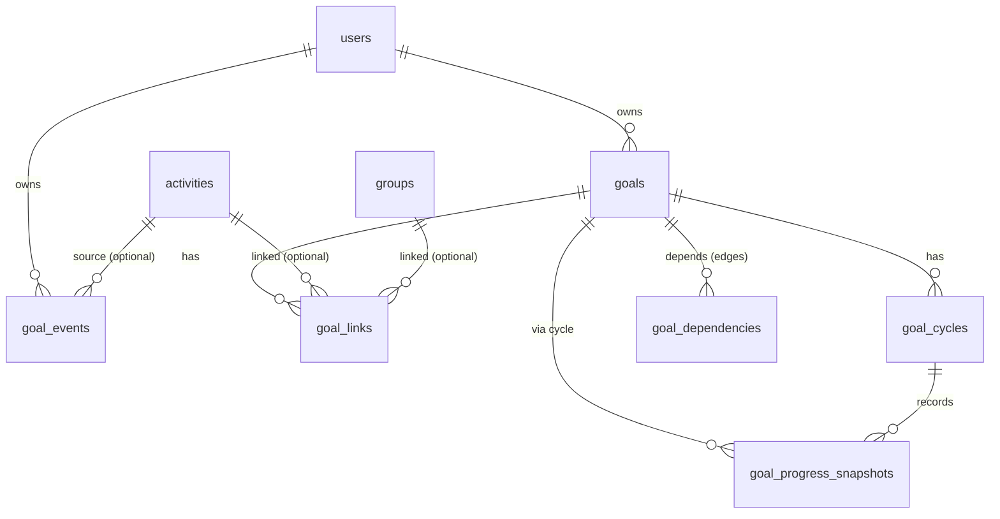

# Goals System — Product & Technical Design

> Design document only. No code changes. Serves as the implementation roadmap.
>
> **Revision — Goal start dates:** See [Goal Start Dates design](goal_start_dates_26c66c91.plan.md). Every goal has required `goals.starts_at` (optional in the UI; server defaults to now). Initial cycle seeds from it. Scheduled is a derived `lifecyclePhase`, not a stored status. `recurrence.anchor` remains deferred.

## 0. The pivotal constraint (read first)

The app currently models **planned schedules**, not **outcomes**:
- `activity_completions` exists in Postgres (`activity_id`, `completed_at`, `metadata.duration?`) but has **no GraphQL resolvers and no Flutter usage** — it is schema-only.
- There is **no** time-entry/session table. `activities.start_time`/`end_time` are scheduled `HH:mm` slots, not logged time.
- Occurrence expansion of recurring activities happens **client-side** (`lib/utils/occurrence_expander.dart`), not in the API.

Consequence: Goals cannot "auto-progress from completion and tracked time" until a **capture layer** exists. This design treats that as **Phase 0** (a `GoalEvent`/completion substrate) and builds Goals on top. This is the single biggest scope driver and the main assumption to confirm.

---

## 1. Product overview

Goals let a user define measurable objectives that progress automatically from what they actually do (completing activities, logging time). Goals can be one-time or recurring, carry optional deadlines, be composed into milestones/dependencies, and are surfaced both at-a-glance (Dashboard) and in depth (Goals page).

Design pillars:
- **Rule-based, not hardcoded**: a small set of orthogonal primitives (metric x scope x rule) expressed as a strategy, so new goal types are new evaluators + JSON config, not new schema.
- **Cycle-uniform**: every goal — one-time or recurring — is evaluated over a `goal_cycle`. One-time goals have exactly one cycle. This removes special-casing across progress, deadlines, and history.
- **Source-of-truth + cache**: progress is always *recomputable* from raw events, but a materialized `current_value` per cycle keeps the dashboard fast.

---

## 2. UX flows

- **Create goal**: pick a template (Count / Time / Streak / Group / Composite) -> name + color/icon -> link activities and/or groups -> set target -> optional recurrence -> optional deadline -> optional dependencies -> save.
- **Track (passive)**: user completes an activity / logs time -> a `GoalEvent` is recorded -> affected goal cycles re-evaluate -> dashboard + goal cards update on next load.
- **Review**: Dashboard shows active goals, today's progress; Goals page for detail, history, filtering.
- **Recur**: cycle ends -> system closes it (succeeded/failed/missed), snapshots history, opens next cycle, applies carry-over.
- **Complete/fail**: target reached -> goal (or cycle) marked complete; deadline passed without target -> failed/overdue.



---

## 3. User stories

- As a user I can create a goal "Complete Workout 50 times" and watch it fill as I complete workouts.
- As a user I can create "Spend 20 hours reading" and have logged reading time accumulate.
- As a user I can target an entire group ("Spend 50 hours exercising") so any activity in the group counts.
- As a user I can make a goal recur ("Read 10 hours every week") and see past weeks' results.
- As a user I can set a deadline (absolute for one-time, relative for recurring) and get warned as it approaches.
- As a user I can require Goal A before Goal B (milestones), and build a composite goal from children.
- As a user I can pause, resume, archive, delete, sort, and filter goals.
- As a user I can see today's progress (completed vs planned, time spent, streak) independent of long-term goals.

---

## 4. Functional requirements

- CRUD for goals; pause/resume; archive; soft-delete; view completed.
- Link a goal to **many** activities and/or **many** groups; the **same activity can feed many goals** (M:N).
- Progress types (MVP): completion count (activity), time on one activity, time on one group.
- Additional types (phased): group completion count, "complete any from group N times", streaks, "complete all in group", multi-activity total time, time-of-day-bounded completion, weekly/monthly/quarterly targets, recurring goals, milestones, weighted progress, composite (all/any/weighted) goals.
- Recurrence with automatic cycle roll-over, history, carry-over policy, missed-cycle handling.
- Deadlines with grace period, overdue + failure states.
- Dependency graph with cycle prevention; composite aggregation.
- Dashboard summary + dedicated Goals page + goal detail with history.

---

## 5. Non-functional requirements

- **User-scoped**: every table has `user_id`; every resolver filters via `requireUserId()` (never trust client-supplied ids) — matches existing `resolvers.ts` pattern.
- **Extensible**: new goal types/recurrence/deadline/dependency rules without schema migrations (JSON `config` + strategy registry).
- **Performant**: dashboard reads served from materialized `current_value`; O(number of active goals) not O(all history). Indexed event lookups.
- **Correct + recoverable**: full recompute path from raw events; incremental path for speed. The two must agree (repair job).
- **Testable**: rule evaluators are pure functions over (events, links, window) -> value, colocated `*.test.ts`; Flutter logic in pure `utils/` per `testing.mdc`.
- **i18n**: all copy in `app_en.arb`/`app_es.arb`.

---

## 6. Data model

Add to Kysely `Database` in [`apps/timemanager-api/src/db/types/schema.ts`](apps/timemanager-api/src/db/types/schema.ts), one migration per phase under [`apps/timemanager-api/src/db/migrations/`](apps/timemanager-api/src/db/migrations/) (timestamped `YYYY-MM-DDThh:mm:ss_*.ts`), then hand-update schema types.



**Phase 0 — capture substrate**
- Promote/extend `activity_completions` and add a unified `goal_events` feed. Recommendation: keep `activity_completions` as the domain record of "an occurrence was done", and add columns it needs to be query-efficient and time-aware:
  - `user_id integer NOT NULL FK` (denormalize for direct scoping/indexing).
  - `occurrence_date date` (which recurring occurrence this satisfies; prevents double counting).
  - `duration_minutes integer` (promote from `metadata.duration` to a real column for time goals; keep `metadata` jsonb for extras).
  - Indexes: `(user_id, completed_at)`, `(activity_id, occurrence_date)` unique-ish to dedupe.
- `goal_events` (append-only progress feed; decouples goals from *how* progress was produced):
  - `id`, `user_id`, `source_type` ('completion' | 'time_log' | 'manual'), `activity_id?`, `group_id?` (denormalized snapshot of activity's group at event time), `occurred_at timestamp`, `metric` ('count' | 'duration'), `amount numeric` (1 for a completion, minutes for time), `metadata jsonb`.
  - Index `(user_id, occurred_at)`, `(activity_id)`, `(group_id)`.
  - Rationale: goals evaluate against `goal_events`, not directly against completions, so future sources (imported time, manual adjustments) plug in without touching evaluators.

**Goals core**
- `goals`: `id`, `user_id`, `title`, `description?`, `color` (palette hex), `icon?`, `rule_type varchar`, `metric` ('count'|'duration'), `target_value numeric`, `config jsonb` (rule-specific), `status` ('active'|'paused'|'completed'|'archived'|'failed'), `starts_at timestamp NOT NULL` (effective start; seeds cycle 0; UI-optional → server `now`), `recurrence jsonb?` (null = one-time), `deadline jsonb?`, `priority int`, `sort_order int`, timestamps. Index `(user_id, status)`.
  - Derived `lifecyclePhase`: `scheduled` when `status === 'active' && starts_at > now`; otherwise mirrors status / active.
  - Keep `rule_type` as an open string (not a DB enum) so new strategies need no migration; validate against a registry in code.
- `goal_links` (M:N to activities/groups): `id`, `goal_id`, `link_type` ('activity'|'group'), `activity_id?`, `group_id?`, `weight numeric default 1`. Enables same-activity-to-many-goals and goal-to-many-targets. `ON DELETE`: if an activity/group is deleted, keep the link but mark it dangling (see Edge cases).
- `goal_cycles` (uniform evaluation window + history): `id`, `goal_id`, `cycle_index int`, `starts_at`, `ends_at?`, `deadline_at?`, `target_value numeric` (snapshot), `current_value numeric default 0` (materialized cache), `status` ('active'|'succeeded'|'failed'|'missed'), `carry_over numeric default 0`, timestamps. Index `(goal_id, status)`.
- `goal_dependencies` (DAG edges): `id`, `goal_id` (dependent), `depends_on_goal_id`, `requirement` ('complete'|'progress'), `threshold numeric?`, `weight numeric default 1`. Cycle-detection enforced in code on insert.
- `goal_progress_snapshots` (history charts): `id`, `goal_cycle_id`, `as_of date`, `value numeric`. One row/day/active-cycle (written by roll-over/daily job). Optional in MVP.

Composite goals: a goal with `rule_type = 'composite'` has no `goal_links`; its progress derives from `goal_dependencies` children plus `config.composite_mode` ('all'|'any'|'weighted') and `config.count_required` (for "any N of M").

---

## 7. Goal evaluation architecture (strategy)

A registry of pure evaluators keyed by `rule_type`. Location: new `apps/timemanager-api/src/goals/evaluators/` with an `index.ts` registry.

```ts
interface GoalEvaluator {
  ruleType: string;
  // Given a cycle window + links + relevant events, return progress value.
  evaluate(ctx: {
    goal: Goal; cycle: GoalCycle; links: GoalLink[];
    events: GoalEvent[]; childCycles?: GoalCycle[];
  }): { currentValue: number; done: boolean };
}
```

- Evaluators: `activity_count`, `activity_duration`, `group_duration`, `group_count`, `group_any_count`, `group_all_complete`, `multi_activity_duration`, `streak`, `time_of_day_count`, `composite`.
- Adding a goal type = add one evaluator + register + (optional) a UI template. **No schema change** (params live in `goals.config`).
- Triggering:
  - Event-driven (fast path): on `goal_event` create/update/delete, find affected active cycles (via `goal_links`), recompute just those, update `current_value`.
  - Scheduled (cron/lazy): cycle roll-over, deadline transitions, streak/day-boundary checks, snapshot writes, and a periodic **full recompute repair** that must match the incremental value.
- Since occurrence expansion is client-side today, any evaluator needing "planned" counts (e.g. group_all_complete, streaks) needs a **shared, server-usable occurrence expander** — port `occurrence_expander` logic to the API or move it to a shared lib. Flag as a dependency.

---

## 8. Progress calculation strategy (stored vs derived)

**Hybrid, recommended:**
- **Source of truth**: `goal_events` (append-only). Progress is always fully recomputable.
- **Materialized cache**: `goal_cycles.current_value` updated incrementally on each event; this is what the dashboard/list reads.
- **History**: `goal_progress_snapshots` for trend charts (daily).
- **Consistency**: nightly/full recompute compares and repairs `current_value`.
- Percent = `min(current_value / target_value, 1)`; remaining = `max(target - current, 0)`.
- Weighted goals: `current_value = sum(event.amount * link.weight)`; composite: weighted mean/all/any of child cycle completion.
- Dedupe: an event carries `(activity_id, occurrence_date)`; evaluators dedupe per occurrence to avoid double counting when a goal links both an activity and its group.

---

## 9. Dashboard design (recommendations)

Extend [`apps/timemanager/lib/screens/overview_screen.dart`](apps/timemanager/lib/screens/overview_screen.dart), reusing `StatCard`, `AppCard`, `FutureBuilder`.

At-a-glance (belongs on dashboard):
- **Today card**: daily completion % (completed vs planned occurrences), time spent today, current daily streak.
- **Active goals strip**: top N goals by priority/nearest deadline — compact progress rings/bars, % and remaining.
- **Upcoming deadlines**: goals with deadlines in next 7 days, color-coded by urgency.
- **This-cycle nudges**: recurring goals behind pace ("2h of 10h this week").

Deep detail (belongs on Goals page, not dashboard): full history, all links, dependency graph, completed/archived goals, filters.

## 10. Goals page design (recommendations)

New primary surface. **Recommendation: add a 4th bottom-nav tab `/goals`** (the Groups plan deliberately kept Groups off the nav as a management screen; Goals is a primary daily surface and deserves a tab). Wire into `StatefulShellRoute` in [`apps/timemanager/lib/router/app_routes.dart`](apps/timemanager/lib/router/app_routes.dart) and add a `GlobalKey<GoalsScreenState>` reload in [`apps/timemanager/lib/router/auth_controller.dart`](apps/timemanager/lib/router/auth_controller.dart).

- **List**: sectioned (Active / Paused / Completed / Archived), each a card with progress bar, %, deadline chip, recurrence chip, group color accent (reuse `ActivityListTile` accent pattern).
- **Sort/filter**: by status, deadline, progress, group, rule type.
- **Detail**: header (title, status, recurrence, deadline), big progress ring, linked activities/groups list, history chart (from snapshots/cycles), dependency mini-graph, cycle timeline, action menu (edit/pause/archive/delete).
- **Create/edit**: template picker -> form (name, color, links, target, recurrence, deadline, dependencies). Full-screen `MaterialPageRoute` returning `true` to trigger reload (matches `ActivityFormScreen`).

Client additions mirror existing patterns: `lib/models/goal.dart` (+ cycle/progress), `lib/services/goal_repository.dart` (inline GraphQL strings), no new state-management package.

## 11. Recurring goals design

- `goals.recurrence` jsonb reuses the activity recurrence vocabulary plus period presets: `{ period: 'weekly'|'monthly'|'quarterly'|'every_x_days', interval, anchor, carry_over: 'none'|'overflow', reset: 'hard' }`.
- Roll-over job: when `now >= cycle.ends_at`, set cycle status (`succeeded` if target met, else `failed`/`missed`), write final snapshot, create next cycle with fresh `current_value`, snapshot `target_value`, apply carry-over (excess above target flows into next cycle's starting value only if `carry_over='overflow'`).
- Missed recurrences: if the app was offline across multiple boundaries, the job back-fills intermediate cycles as `missed` so history has no gaps.
- Notifications (future): cycle-start, behind-pace mid-cycle, cycle-complete summary; `goal_starting_soon` for scheduled goals within 3 days (in-app nudges).

## 12. Deadline handling

- `goals.deadline` jsonb: one-time -> `{ kind: 'absolute', date }`; recurring -> `{ kind: 'relative', days_after_cycle_start }` -> materialized into each cycle's `deadline_at`.
- Absolute deadlines must be on or after `goals.starts_at` (validation error otherwise).
- Deadline failure / overdue nudges do not run while `now < starts_at`.
- States: on-track -> approaching (within warn window) -> overdue (past deadline, within grace) -> failed (past grace, target unmet).
- `grace_days` optional in config. UI: color escalation on deadline chip; dashboard "Upcoming deadlines"; reminders (future).

## 13. Goal dependency architecture

- Directed acyclic graph via `goal_dependencies`. Two edge semantics: `complete` (child cycle succeeded) or `progress` (child >= threshold).
- **Cycle prevention**: on adding an edge, run DFS from `depends_on_goal_id`; reject if it reaches `goal_id`. Return a validation error (extend [`apps/timemanager-api/src/graphql/validation.ts`](apps/timemanager-api/src/graphql/validation.ts)).
- Composite goals: parent aggregates children per `composite_mode` (all / any-N / weighted). Mixed criteria (activities + child goals) supported by allowing a goal to have both `goal_links` and `goal_dependencies`, combined via config weights.
- Locked goals: a goal whose dependencies are unmet renders "locked" and does not accrue progress until unlocked (config toggle: block vs. accrue-but-locked).
- Visualization: simple layered graph on detail screen (nodes = goals, edges = dependencies), read-only in MVP.

## 14. Edge cases

- **Activity deleted**: `goal_events` are immutable history (progress already earned stays). `goal_links` to it become dangling -> shown as "removed activity"; future progress stops. Do not cascade-delete events.
- **Group membership changes**: `goal_events` snapshot `group_id` at event time, so past progress is stable; future events reflect new membership.
- **Archived/dangling links**: goal still valid; if a goal has zero live links, flag "no active sources" and stop accrual.
- **Editing history / tracked time / undo completion**: deleting/editing a completion emits a compensating `goal_event` (or recompute the cycle); `current_value` never goes below 0.
- **Recurring activity feeding a goal**: dedupe per `(activity_id, occurrence_date)`.
- **Goal linked to both an activity and its group**: dedupe by occurrence so it counts once.
- **Duplicate/overlapping goals**: allowed; same event legitimately advances multiple goals.
- **Deadline/recurrence rule changed**: applies to current+future cycles; past cycles keep snapshotted target/deadline.
- **Cyclic dependency**: rejected at write time.
- **Large datasets**: read from `current_value`; index events by `(user_id, occurred_at)`; snapshots keep history queries bounded.

## 15. Open questions

- `recurrence.anchor` remains deferred (calendar alignment); do not overload as goal start — use `goals.starts_at`.
- Confirm **Phase 0 scope**: build the completion + time-logging capture layer as part of Goals, or is a separate tracking feature planned first? (Everything depends on this.)
- Time capture UX: manual "log N minutes", start/stop timer, or derive from scheduled slot on completion? Determines `duration` source.
- Server-side occurrence expansion: port `occurrence_expander` to API/shared lib now, or keep goal evaluators event-only (no "planned" awareness) in MVP?
- Roll-over/deadline job runtime: Deno cron in `timemanager-api`, external scheduler, or lazy-on-read? (No scheduler exists today.)
- Notifications channel (in-app only vs push/email) and timing.
- Goals nav placement: confirm 4th bottom tab vs. dashboard section + pushed screen.

## 16. Risks

- **Foundation risk**: Goals value is gated on Phase 0; underestimating it stalls the feature.
- **Consistency risk**: incremental vs full-recompute divergence -> mandatory repair job + tests.
- **Complexity creep**: composite/weighted/streak/time-of-day can overwhelm UX -> ship MVP rule types first, gate advanced types behind templates.
- **Client-side occurrence logic** duplicated on server -> drift; mitigate by sharing/porting deliberately.
- **No scheduler today** -> roll-over/deadlines need infra decision.
- **Schema churn** if `rule_type`/recurrence encoded rigidly -> mitigated by open string + jsonb config.

## 17. Suggested implementation phases

- **Phase 0 — Capture foundation**: extend `activity_completions` (`user_id`, `occurrence_date`, `duration_minutes`); add `goal_events`; GraphQL to create/list/undo completions and log time; Flutter "mark done" + "log time" UI on occurrences (Overview/Calendar). Deliver daily progress (completion %, time today, streak) on the dashboard — valuable on its own.
- **Phase 1 — Goals MVP**: `goals`, `goal_links`, `goal_cycles` (single cycle); evaluators `activity_count`, `activity_duration`, `group_duration`; CRUD + pause/resume/archive/delete; Goals tab + list + detail + create/edit; dashboard active-goals strip. Materialized `current_value` + full-recompute.
- **Phase 2 — Recurrence & deadlines**: `recurrence`/`deadline` config, multi-cycle roll-over, carry-over, missed handling, snapshots + history chart, deadline states + urgency UI, scheduler decision.
- **Phase 3 — Advanced rule types**: `group_count`, `group_any_count`, `group_all_complete`, `multi_activity_duration`, `streak`, `time_of_day_count`; weighted links.
- **Phase 4 — Dependencies & composites**: `goal_dependencies`, cycle prevention, composite (all/any/weighted), dependency visualization, locked goals.
- **Phase 5 — Notifications & polish**: cycle/deadline reminders, behind-pace nudges, richer analytics.