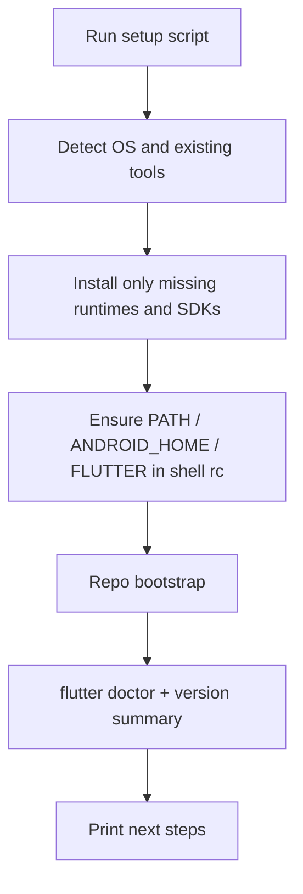

# Local device setup docs and scripts

## Scope

**In:** install/verify local full-stack deps + Flutter native targets (macOS: iOS + Android; Linux: Android only), then bootstrap the repo so `pnpm timemanager` + Flutter can run.

**Out:** AWS/Terraform, Authentik, self-hosted SuperTokens Core, Linux desktop GTK tooling, Windows.

## Deliverables

| Path | Role |
|------|------|
| [`scripts/setup-macos.sh`](scripts/setup-macos.sh) | Install missing tools on macOS |
| [`scripts/setup-linux.sh`](scripts/setup-linux.sh) | Install missing tools on Linux (Ubuntu-first, portable installers elsewhere) |
| [`scripts/lib/setup-common.sh`](scripts/lib/setup-common.sh) | Shared checks, PATH helpers, repo bootstrap, final verification |
| [`.ai/local-setup.md`](.ai/local-setup.md) | Human/agent handbook: prerequisites, how to run scripts, env files, first run, platform notes |
| Small link updates in [`AGENTS.md`](AGENTS.md), [`.ai/README.md`](.ai/README.md), [`.ai/workflows.md`](.ai/workflows.md) | Point to the new setup doc |

## What the scripts install

Shared (both OS):

- **Git** (if missing)
- **Node.js 20** (matches [`.nvmrc`](.nvmrc)) via **nvm** (portable; avoids distro Node skew)
- **pnpm** via Corepack (`corepack enable && corepack prepare pnpm@latest --activate`)
- **Deno** via official installer (`curl -fsSL https://deno.land/install.sh | sh`)
- **Flutter stable** (git clone into `~/development/flutter` or existing `FLUTTER_HOME`; add to shell profile)
- **Docker Engine + Compose** (required for Postgres in [`infra/timemanager-db`](infra/timemanager-db))
- **JDK 11** (Android / Gradle; matches `JavaVersion.VERSION_11` in [`apps/timemanager/android/app/build.gradle.kts`](apps/timemanager/android/app/build.gradle.kts))
- **Android SDK cmdline-tools** + `platform-tools`, `platforms;android-<api>`, build-tools; set `ANDROID_HOME` / `ANDROID_SDK_ROOT`; `sdkmanager --licenses`
- **Chrome/Chromium** (default Flutter web target on `:4444`)

macOS only ([`scripts/setup-macos.sh`](scripts/setup-macos.sh)):

- **Homebrew** if missing (used for Docker Desktop/Colima, OpenJDK 11, Chrome, CocoaPods where apt-equivalent isn’t available)
- **Xcode** — cannot fully silent-install; script checks `xcode-select` / `xcodebuild`, prompts to install from App Store / run `xcode-select --install`, then `sudo xcodebuild -license accept` when possible
- **CocoaPods** (`gem` or `brew install cocoapods`) for iOS (`apps/timemanager/ios`)
- After Flutter is ready: `cd apps/timemanager/ios && pod install` (idempotent)

Linux only ([`scripts/setup-linux.sh`](scripts/setup-linux.sh)):

- Package manager detection: prefer **apt** on Debian/Ubuntu for `curl`, `git`, `unzip`, `xz-utils`, `libglu1-mesa`, OpenJDK 11, Chrome/Chromium deps; on other distros use the same **official installers** for Node/Deno/Flutter/Docker and print a short package list for the local PM
- **Docker** via Docker’s official convenience/repo install (not distro-random packages when avoidable)
- **Android**: same cmdline-tools flow; document KVM (`kvm-ok`) for emulators
- **No iOS/Xcode** path

## Script behavior

Idempotent “install if missing” pattern:

Repo bootstrap (in [`scripts/lib/setup-common.sh`](scripts/lib/setup-common.sh), run from repo root):

1. Copy env examples only when `.env` is absent:
   - `apps/user-manager-api/.env.example` → `.env` (recommended)
   - `apps/timemanager-api/.env.example` → `.env` (optional but convenient)
   - `apps/user-manager-web/.env.example` → `.env` (optional)
2. `pnpm install`
3. `cd apps/timemanager && flutter pub get`
4. Print smoke-check commands (do **not** start long-running servers from the setup script)

Flags (both scripts):

- `--check` — verify only, no installs
- `--skip-android` / `--skip-ios` (macOS) — useful when someone only wants web + APIs
- Default: install everything in scope for that OS

Safety: refuse to run as root (except where `sudo` is needed for apt/docker groups); append PATH lines to `~/.zshrc` / `~/.bashrc` only if not already present; never commit `.env` or write secrets.

## Documentation ([`.ai/local-setup.md`](.ai/local-setup.md))

Concise handbook sections:

1. **Prerequisites overview** — table of tools + version pins (Node 20, Dart `^3.7.2`, Postgres via Docker 15, Deno current stable). This table is the **human-readable inventory**; scripts must match it.
2. **Run the script** — `./scripts/setup-macos.sh` / `./scripts/setup-linux.sh`, plus `--check`
3. **Manual steps the script cannot finish** — Xcode App Store; Docker Desktop first launch / Linux docker group + re-login; create an Android AVD (or use a physical device); accept any remaining `flutter doctor` prompts
4. **First run** — align with [`.ai/workflows.md`](.ai/workflows.md):
   - `pnpm timemanager` → GraphQL `:3000` + auth `:3001` + Postgres
   - Flutter: IDE launch **timemanager** (Chrome `:4444`), or `-d ios` / `-d android`
   - Android emulator host note: auth/API use `10.0.2.2` (already in app config)
5. **Optional stacks** — `pnpm user-manager`; Authentik/AWS linked out, not required
6. **Troubleshooting** — port `:3000` clash (Vite vs GraphQL), Docker not running, `flutter doctor` Android licenses, CocoaPods
7. **Maintaining these scripts** — checklist below (also linked from AGENTS / conventions)

Link this doc from [`AGENTS.md`](AGENTS.md) Reference docs, [`.ai/README.md`](.ai/README.md) contents, and a short “New machine” blurb at the top of [`.ai/workflows.md`](.ai/workflows.md).

## Keeping scripts in sync when tools change

Treat local-setup as part of the monorepo’s dependency surface — same class of update as `.env.example` or `AGENTS.md` when a runtime is added.

**Single inventory:** the prerequisites table in [`.ai/local-setup.md`](.ai/local-setup.md) is the source of truth for *what* a new machine needs. Both OS scripts implement that list (shared bits in `setup-common.sh`, OS-specific installers in the platform scripts).

**When a change lands that adds/changes a local-dev tool**, update in the same PR/change set:

1. Prerequisites table in `.ai/local-setup.md` (name, version pin, why, which platforms)
2. Install + `--check` logic in `scripts/lib/setup-common.sh` and/or the affected OS script
3. Any new `.env.example` copy step in the bootstrap helper
4. Version pin sources if applicable (`.nvmrc`, `pubspec.yaml` Dart SDK, JDK in Gradle, etc.)

**Wire the reminder into agent guidance** so this isn’t tribal knowledge:

- Short note in [`AGENTS.md`](AGENTS.md) under golden rules or reference docs: *new local runtime/CLI → update setup scripts + `.ai/local-setup.md`*
- One bullet in [`.ai/conventions.md`](.ai/conventions.md) (package-managers / tooling section)
- Optional thin [`.cursor/rules`](.cursor/rules) addition (e.g. extend `00-project-overview.mdc` or a small always-on line) pointing agents at that checklist — keep it one sentence; depth stays in `.ai/local-setup.md`

**What counts as “extra tool” (must update scripts):**

- New runtime or package manager (e.g. Bun for local serve, FVM, Poetry)
- New required CLI (e.g. `terraform` if local docs start requiring it — today AWS stays excluded)
- New mandatory system package for Flutter/native builds
- New required env file that must exist before first run

**What does not:** app npm/pub/Deno library deps (`pnpm install` / `flutter pub get` / Deno lock already cover those); optional Authentik/AWS unless local-setup scope expands.

**Script structure to make updates cheap:** one function per tool (`ensure_node`, `ensure_deno`, …) with a shared `REQUIRED_TOOLS` checklist used by `--check` and the final summary, so adding a tool is “add one function + one checklist entry + one doc row,” not a rewrite.

## Defaults locked from your answers

- Scripts **install** missing tools (not check-only by default).
- Native: **macOS → iOS + Android**; **Linux → Android only**.
- Canonical API path remains Deno + Docker Postgres + SuperTokens playground; AWS stays in [`.ai/deploy-aws.md`](.ai/deploy-aws.md) only.
- Setup scripts and `.ai/local-setup.md` stay **co-owned** with any new local-dev tool.
