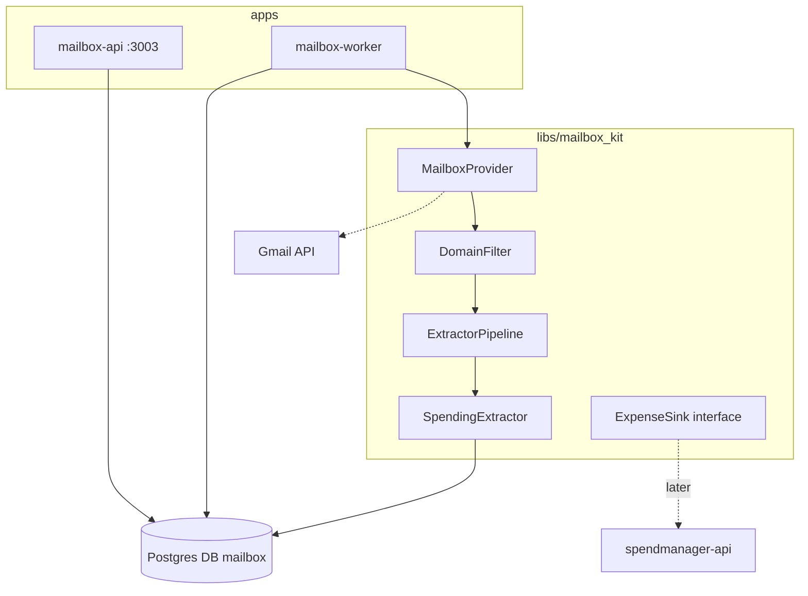

# Mailbox email ingest development plan

## Locked decisions

- **Product scope:** new area `mailbox`, independent of spendmanager (separate DB + API). No Flutter client in this plan.
- **Ingestion:** poll-first via a dedicated worker; push/watch stays a future `MailboxProvider` capability.
- **First real provider (Phase 3):** Gmail API with OAuth. Phases 0–2 use a **fixture provider** so pipeline work does not block on Google credentials.
- **Spending flow:** extract → store `spending.candidate` artifacts with status `pending` | `accepted` | `rejected`. No auto-create into spendmanager.
- **Future bridge:** define `ExpenseSink` in `mailbox_kit` now; implement against spendmanager `createExpense` only in a later phase (out of this plan’s delivery, but interface is shipped).

## Architecture

**Pipeline contract (in `libs/mailbox_kit`):**

- `MailboxProvider` — `listMessages(cursor, filter)`, `getMessage(id)`
- `EmailMessage` — normalized id, Message-ID, from, subject, receivedAt, text/html bodies
- `DomainFilter` — optional allowlist of sender domains/addresses; empty = no filter
- `Extractor` — `kind`, `canHandle(msg)`, `extract(msg) → Artifact[]`
- `SpendingExtractor` — emits `kind: "spending.candidate"` (amountCents, currency, spentOn, merchant, confidence, raw refs)
- `ExpenseSink` — `publish(userId, candidate)` stub interface only (no spendmanager import)

## Monorepo layout

| Path | Tags | Role |
|------|------|------|
| [`libs/mailbox_kit`](libs/mailbox_kit) | `scope:shared`, `type:lib`, `runtime:deno` | Providers, filter, pipeline, extractors, artifact types, `ExpenseSink` |
| [`apps/mailbox-api`](apps/mailbox-api) | `scope:mailbox`, `type:api`, `runtime:deno` | GraphQL + migrations; port **`:3003`** |
| [`apps/mailbox-worker`](apps/mailbox-worker) | `scope:mailbox`, `type:api`, `runtime:deno` | Poll loop; imports `mailbox_kit` |

Follow the Deno product pattern from [`.ai/new-product-app.md`](.ai/new-product-app.md) and mirror [`apps/spendmanager-api`](apps/spendmanager-api): `deno_api_kit` import map + tsconfig paths, JWKS auth, `ensureDatabase`, Kysely migrate.

**Infra / docs glue:**

- Add [`infra/timemanager-db/init/03-mailbox.sql`](infra/timemanager-db/init/03-mailbox.sql) → `CREATE DATABASE mailbox;`
- Root `pnpm mailbox` → serve API (and optionally worker)
- Update [`AGENTS.md`](AGENTS.md), [`.ai/architecture.md`](.ai/architecture.md), [`.ai/workflows.md`](.ai/workflows.md)

## Data model (`mailbox` DB)

- `users` — same SuperTokens local-user pattern as other product APIs (`auth_user_id`, email)
- `mailboxes` — user_id, provider (`fixture` | `gmail`), credentials ref / OAuth tokens (encrypted or env-backed for local), sync cursor, enabled
- `domain_filters` — mailbox_id, pattern (domain or full address); zero rows = process all
- `messages` — mailbox_id, provider_message_id, rfc_message_id (unique), from_address, subject, received_at, body hashes; idempotency key = rfc_message_id
- `extraction_artifacts` — message_id, kind, payload JSONB, confidence, status, created_at
- `sync_runs` — mailbox_id, started/finished, fetched/extracted counts, error text

## GraphQL surface (`mailbox-api`)

Authenticated, user-scoped:

- Mutations: `createMailbox`, `deleteMailbox`, `setDomainFilters`, `triggerSync` (enqueue/flag for worker), `updateArtifactStatus` (accept/reject)
- Queries: `mailboxes`, `domainFilters`, `messages`, `extractionArtifacts`, `syncRuns`

No spendmanager types in the schema.

## Worker behavior

1. Load enabled mailboxes due for poll (interval from env, default 5–15 min).
2. For each: `provider.listMessages` since cursor → apply domain filter → persist new `messages` → run registered extractors → insert artifacts → advance cursor → write `sync_runs`.
3. Extractors registered in worker bootstrap (SpendingExtractor only for now); adding another extractor is a registration line, not a pipeline rewrite.

Local: `nx serve mailbox-worker` (dependsOn migrate). Fixture provider returns canned receipt emails for deterministic tests.

## Phased delivery

### Phase 0 — Contracts (`mailbox_kit`)

- Interfaces + `EmailMessage` / artifact types
- `DomainFilter` pure functions + unit tests
- `ExtractorPipeline` + `FixtureMailboxProvider` (2–3 sample receipt emails)
- `SpendingExtractor` heuristics (amount/currency/date/merchant from subject/body) + tests
- `ExpenseSink` interface exported; no implementation

### Phase 1 — Product skeleton

- DB init + migrations + `mailbox-api` GraphQL CRUD for mailboxes / domain filters / artifacts
- `mailbox-worker` poll loop against fixture provider
- Seed: demo user + fixture mailbox + sample domain filters
- Nx targets: migrate, serve, seed, test; `pnpm mailbox`

### Phase 2 — Spending review path

- Harden SpendingExtractor; store candidates as `pending`
- GraphQL accept/reject; accepted artifacts remain in mailbox DB only (no Sink call yet)
- Sync run audit visible via API

### Phase 3 — Gmail provider

- OAuth connect flow (tokens stored on `mailboxes`; document Google Cloud OAuth setup in `.ai` or app README)
- `GmailMailboxProvider` implementing the same interface
- Cursor = Gmail historyId / query timestamp; Message-ID idempotency
- Keep fixture provider for tests and local demos without Google

### Later (not in this delivery)

- `SpendmanagerExpenseSink` calling spendmanager `createExpense` for `accepted` candidates (category mapping TBD)
- Optional Flutter mailbox UI or spendmanager “import from email” screen
- Push/watch (Gmail Pub/Sub) as alternate trigger

## Testing

- `mailbox_kit`: domain filter, pipeline routing, SpendingExtractor on fixture messages (`deno test`)
- `mailbox-api`: validation + user scoping for filters/artifacts
- `mailbox-worker`: one integration-style test with fixture provider → messages + artifacts persisted
- Run via Nx targets from repo root

## Explicit non-goals (this plan)

- Flutter mailbox app
- Writing to `spendmanager.expenses`
- Inbound email (SES) or Microsoft Graph
- LLM-based extraction (heuristics first; LLM can wrap the same `Extractor` later)
