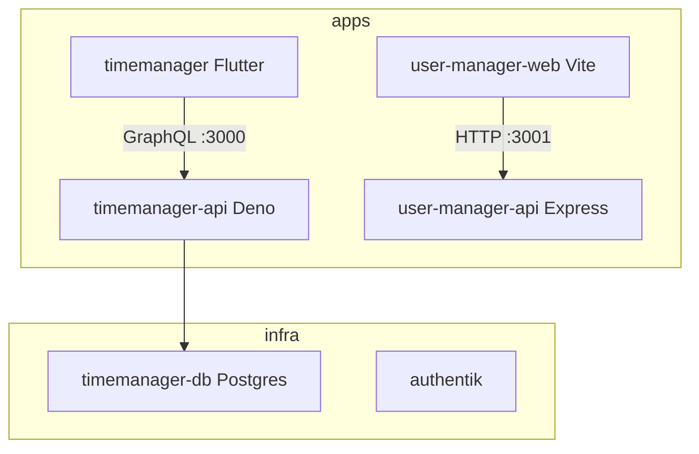

# Nx Monorepo Migration Plan

## Target structure

```
flutter/                          # workspace root = monorepo root
├── apps/
│   ├── timemanager/              # Flutter (from ./timemanager)
│   ├── timemanager-api/          # Deno GraphQL (from ./timemanager-be, minus docker)
│   ├── user-manager-web/         # React/Vite (from ./user-manager/frontend)
│   └── user-manager-api/         # Express (from ./user-manager/backend)
├── libs/                         # placeholder for future shared code
├── infra/
│   ├── timemanager-db/           # from timemanager-be/.docker
│   └── authentik/                # from timemanager-be/.docker-users
├── package.json
├── pnpm-workspace.yaml
├── nx.json
├── tsconfig.base.json
└── .gitignore
```



## Decisions locked in

- **Package manager:** pnpm at root for Node apps only (`user-manager-web`, `user-manager-api`). Deno keeps `deno.json`/`deno.lock`; Flutter keeps `pubspec.yaml`.
- **Deno:** `nx:run-commands` wrapping `deno task` (do not use deprecated `@nx/deno`).
- **Flutter:** `nx:run-commands` wrapping `flutter` CLI (avoids third-party plugin version coupling for this migration).
- **Git:** Init a new repo at workspace root. Remove nested [`timemanager-be/.git`](timemanager-be) after the move (local-only history, no remote). Do not commit until you ask.

## Phase 1 — Scaffold monorepo root

1. Create `apps/`, `libs/`, `infra/` directories.
2. Add root files:
   - [`package.json`](package.json) — `private: true`, name `@timemanager/source`, Nx + pnpm scripts (`timemanager`, `user-manager` convenience `run-many` scripts).
   - [`pnpm-workspace.yaml`](pnpm-workspace.yaml) — only `apps/user-manager-web` and `apps/user-manager-api`.
   - [`nx.json`](nx.json) — `defaultBase: main`, named inputs, `targetDefaults` for `build`/`test`/`lint` with caching.
   - [`tsconfig.base.json`](tsconfig.base.json) — base paths for future libs.
   - [`.gitignore`](.gitignore) — merge ignores for Node, Deno, Flutter, Docker volumes, `.env`, `node_modules`, build outputs.
3. Install Nx at root: `pnpm add -Dw nx @nx/js`.

## Phase 2 — Move projects (preserve paths carefully)

Move with filesystem `mv` (no root git yet for most trees):

| From | To |
|------|----|
| `timemanager/` | `apps/timemanager/` |
| `timemanager-be/` (app code + configs) | `apps/timemanager-api/` |
| `timemanager-be/.docker/` | `infra/timemanager-db/` |
| `timemanager-be/.docker-users/` | `infra/authentik/` |
| `user-manager/frontend/` | `apps/user-manager-web/` |
| `user-manager/backend/` | `apps/user-manager-api/` |

Cleanup after moves:
- Delete empty `user-manager/` orchestrator ([`user-manager/package.json`](user-manager/package.json) with `npm-run-all` only).
- Delete leftover empty `timemanager-be/` if anything remains.
- Remove `apps/timemanager-api/.git` (nested repo).
- Remove `apps/timemanager-api/bun.lock` and unused npm-only duplication where Deno is source of truth; keep [`deno.json`](timemanager-be/deno.json) tasks as the API entrypoint. Keep a minimal `package.json` only if Pylon still requires it for `pylon` CLI.
- Rename package names in Node apps to `@timemanager/user-manager-web` and `@timemanager/user-manager-api`.

## Phase 3 — Fix Docker under `infra/`

**[`infra/timemanager-db/docker-compose.yml`](timemanager-be/.docker/docker-compose.yml):**
- Fix volume paths to `./data/postgres` and `./data/pgadmin` (replace nested `.docker/.postgres-data` quirk).
- Add `data/` to that project’s `.gitignore`.
- Do not migrate existing nested volume data; fresh local DB is fine (re-seed via API seed task).

**[`infra/authentik/docker-compose.yml`](timemanager-be/.docker-users/docker-compose.yml):**
- Keep as-is functionally; ensure `.env` stays gitignored; add `.env.example` from current env keys (`PG_PASS`, `AUTHENTIK_SECRET_KEY`).
- Create empty `media/`, `certs/`, `custom-templates/` dirs if compose expects them.

## Phase 4 — Add Nx `project.json` for every project

### `apps/timemanager-api`
Tags: `scope:timemanager`, `type:api`, `runtime:deno`

Targets:
- `serve` → `deno task dev` (cwd project root)
- `build` → `deno task build`
- `seed` → `deno task seed`
- `serve` `dependsOn`: `["timemanager-db:up"]`

### `apps/timemanager`
Tags: `scope:timemanager`, `type:app`, `runtime:flutter`

Targets via `nx:run-commands`:
- `serve` → `flutter run`
- `test` → `flutter test`
- `analyze` → `flutter analyze`
- `pub-get` → `flutter pub get`

### `apps/user-manager-web`
Tags: `scope:user-manager`, `type:app`, `runtime:node`

Targets:
- `serve` → `pnpm exec vite` (or existing `start` script)
- `build` → existing build script
- `lint` → existing lint script

### `apps/user-manager-api`
Tags: `scope:user-manager`, `type:api`, `runtime:node`

Targets:
- `serve` → `pnpm exec vite-node ./index.ts`
- `build` → `tsc`
- `lint` → existing lint

### `infra/timemanager-db` and `infra/authentik`
Tags: `type:infra`

Targets: `up` / `down` / `logs` wrapping `docker compose` with correct `cwd`.

## Phase 5 — Install and verify

1. From root: `pnpm install` (Node workspace only).
2. In `apps/timemanager`: `flutter pub get`.
3. In `apps/timemanager-api`: ensure Deno deps resolve (`deno task` / cache).
4. Smoke checks:
   - `nx run timemanager-db:up`
   - `nx serve timemanager-api`
   - `nx serve timemanager`
   - `nx serve user-manager-api` and `nx serve user-manager-web`
   - `nx run authentik:up` (optional; independent stack)
5. Confirm Flutter still hits GraphQL at `localhost:3000` ([`apps/timemanager/lib/config/api_config.dart`](timemanager/lib/config/api_config.dart) — no URL change expected).
6. Init git at monorepo root when ready (`git init`); leave commit for your explicit request.

## Phase 6 — Root DX scripts

In root `package.json`:

```json
{
  "scripts": {
    "timemanager": "nx run-many -t serve -p timemanager,timemanager-api",
    "user-manager": "nx run-many -t serve -p user-manager-web,user-manager-api",
    "db:up": "nx run timemanager-db:up",
    "db:down": "nx run timemanager-db:down"
  }
}
```

## Out of scope

- Extracting shared libs / GraphQL codegen
- Wiring Authentik into SuperTokens or Flutter auth
- CI pipelines / Nx Cloud
- Renaming the workspace folder away from `flutter`
