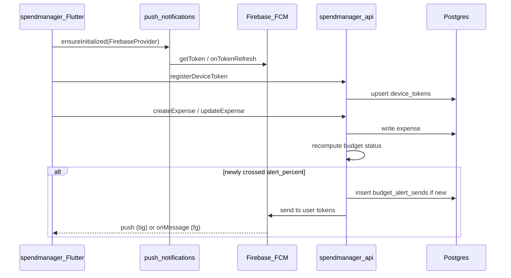

# Push notifications (provider-agnostic + Firebase, full stack)

## Locked decisions

- **Keep** [`libs/local_notifications`](libs/local_notifications) for local/OS + in-session web delivery. Do not fold FCM into it.
- **Add sibling** [`libs/push_notifications`](libs/push_notifications): provider interface + **Firebase** implementation.
- **First server send:** spendmanager budget threshold on expense write (synchronous; no cron). Activity reminders stay client-local for now.
- **Token storage:** per-product DB (`spendmanager.device_tokens`), scoped by local `user_id` like all other GraphQL data.
- **Graceful degrade:** if Firebase env is missing, registration still stores tokens but send is a no-op (logged), so local/dev without Firebase keeps working.



## 1. Flutter: `libs/push_notifications`

New shared package (mirror Nx layout of `local_notifications`: `project.json`, `pubspec.yaml`, `analysis_options.yaml`, barrel export).

**Public API (provider-agnostic):**

- `PushNotificationConfig` — app id string (e.g. `spendmanager`), optional Android channel for foreground display bridge
- `PushProvider` abstract interface:
  - `Future<void> initialize()`
  - `Future<bool> requestPermission()`
  - `Future<String?> getToken()`
  - `Stream<String> onTokenRefresh`
  - `Stream<PushMessage> onForegroundMessage`
  - `Stream<PushMessage> onMessageOpenedApp` (cold/background tap)
- `PushNotificationService` facade (singleton, same style as [`LocalNotificationService`](libs/local_notifications/lib/src/local_notification_service.dart)): `ensureInitialized(config, provider)`, permission, token accessors, message streams
- `PushMessage` — `title`, `body`, `data` map

**Firebase provider:** `FirebasePushProvider` using `firebase_core` + `firebase_messaging`. Platform stubs for tests (no Firebase).

**Apps keep domain policy** (when to register, how to map payload → UI), matching the local_notifications pattern in [`.ai/decisions.md`](.ai/decisions.md).

Deps: `firebase_core`, `firebase_messaging` (path dep from apps).

## 2. Deno: shared send helper

Add thin push module under [`libs/deno_api_kit`](libs/deno_api_kit) (e.g. `push/types.ts`, `push/firebase_sender.ts`, `push/mod.ts`) so product APIs stay thin:

- `PushSender` interface: `sendToTokens(tokens, payload) → { successCount, invalidTokens }`
- `FirebasePushSender` via `npm:firebase-admin` (same `npm:` import pattern as existing Deno deps)
- Factory from env: `FIREBASE_SERVICE_ACCOUNT_JSON` (raw JSON string) or `FIREBASE_SERVICE_ACCOUNT_PATH`; return no-op sender when unset
- Delete invalid tokens reported by FCM (caller passes callback or returns list for API to delete)

Wire `firebase-admin` into [`apps/spendmanager-api/deno.json`](apps/spendmanager-api/deno.json) imports only (not timemanager-api yet).

## 3. spendmanager-api: schema + GraphQL + send hook

**Migration** (naming: `YYYY-MM-DDTHH:MM:SS_…` under [`apps/spendmanager-api/src/db/migrations/`](apps/spendmanager-api/src/db/migrations/)):

```sql
device_tokens (
  id, user_id FK users, token TEXT UNIQUE,
  platform TEXT,  -- ios | android | web
  updated_at
)

budget_alert_sends (
  budget_id FK, period_start DATE,
  sent_at,
  UNIQUE(budget_id, period_start)
)
```

**GraphQL** (in [`resolvers.ts`](apps/spendmanager-api/src/graphql/resolvers/resolvers.ts) / schema):

- `registerDeviceToken(token, platform)` — upsert by token, bind to `requireUserId()`
- `unregisterDeviceToken(token)` — delete if owned by user

**Send path:** after successful `createExpense` / `updateExpense` / `deleteExpense` (and budget updates that change `alert_percent` if relevant), recompute affected budget statuses (reuse logic from `budgetStatuses`). For each budget where `alert_triggered` is newly true for the current period:

1. Try insert into `budget_alert_sends` (unique constraint = dedupe)
2. On insert success, load user’s `device_tokens`, call `PushSender`, prune invalid tokens

Extract shared “compute status for user/asOf” helper so query and mutation paths do not diverge.

**Env:** update [`apps/spendmanager-api/.env.example`](apps/spendmanager-api/.env.example) with Firebase service-account vars.

## 4. spendmanager Flutter wiring

- Path-dep `push_notifications`; add Firebase platform files as needed (`google-services` Gradle, iOS plist placeholders documented — secrets stay gitignored; commit `.example` / setup notes only).
- On login / session restore: init push → permission → `getToken` → GraphQL `registerDeviceToken`; subscribe to `onTokenRefresh`.
- On sign-out: `unregisterDeviceToken` + clear local token handle.
- Foreground FCM: bridge to existing [`LocalNotificationService.showNow`](libs/local_notifications) / budget channel so alerts appear while app is open.
- Adjust [`BudgetAlertSync`](apps/spendmanager/lib/services/budget_alert_sync.dart): stop client-only `showNow` for thresholds when push is configured (server is source of truth), **or** keep local as fallback only when no FCM token — prefer **server-authoritative** with local display only via FCM foreground handler to avoid double alerts.

## 5. Docs + monorepo glue

- [`.ai/decisions.md`](.ai/decisions.md): document `libs/push_notifications` + Firebase provider + per-product tokens; first send = spendmanager budget alerts.
- [`AGENTS.md`](AGENTS.md) / [`.ai/new-product-app.md`](.ai/new-product-app.md): list the new Flutter lib; note push is opt-in per product API.
- Short setup note in [`.ai/local-setup.md`](.ai/local-setup.md) or workflows: create Firebase project, download service account + client configs, set env vars (no committed secrets).

## 6. Tests

- **Deno:** unit tests for “newly crossed threshold + dedupe insert” (and no send when already sent / not triggered); mock `PushSender`.
- **Flutter:** model / facade tests with a fake `PushProvider` (no Firebase in CI).
- Run via `nx test spendmanager-api` / `nx test push_notifications` (add Nx targets like `local_notifications`).

## Out of scope (this pass)

- Timemanager activity reminder server scheduling / cron
- user-manager as token registry
- OneSignal or non-Firebase providers (interface ready; only Firebase implemented)
- Renaming `local_notifications`
