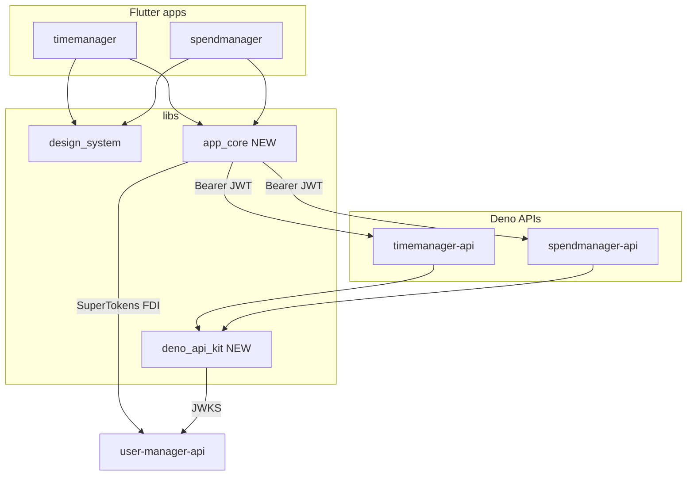

# Reusable patterns across timemanager and spendmanager

## Verdict

Spendmanager was scaffolded by mirroring timemanager’s product pairing. That worked, but it left **two copies of the same product infra**: Flutter auth/session/GraphQL/prefs, and Deno JWKS/DB pool/user upsert/Pylon auth middleware. Domain (models, repos, screens, GraphQL schema) correctly differs and should stay per-app.

Today the only shared package is [`libs/design_system`](libs/design_system). GraphQL codegen into `libs/` stays deferred per [`.ai/decisions.md`](.ai/decisions.md).



## What is duplicated vs product-specific

| Layer | Copy-pasted (extract) | Stay app-local |
|-------|----------------------|----------------|
| Flutter | AuthService, token/session stores, idle monitor, GraphQL client, locale/theme prefs, ApiConfig shape, login/settings adapters, go_router auth redirect | Models, repos, screens, shell tabs, AuthController domain wiring, ARB domain strings |
| Deno API | JWKS/CORS (`verify.ts`), SSL helpers, Kysely pool factory, `resolveLocalUser`, health + GraphQL auth middleware, migrate runner core | Schema types, migrations, seed data, GraphQL resolvers/validation, assets REST (TM only) |
| UI kit | Already in `design_system` | Domain widgets; TM calendar/notifications |

Strongest Flutter candidates (near byte-identical): `lib/services/auth_service.dart`, `auth_token_store.dart`, `session_token_store*.dart`, `idle_session_monitor.dart`, `graphql_client.dart`, `locale_preference_service.dart`, `theme_mode_preference_service.dart`.

Strongest Deno candidates: `src/auth/verify.ts`, `src/db/ssl.ts`, `src/db/database.ts` (factory), `src/db/users.ts`, shared slice of `src/index.ts` middleware.

## Target package layout

### 1. `libs/app_core` (Flutter, path dep)

Tags: `scope:shared`, `type:lib`, `runtime:flutter`.

- Move auth + token/session stores + idle monitor + GraphQL client + preference services
- Parameterize endpoints: `AppEndpoints(authBaseUrl, apiBaseUrl, oauthRedirectUri, idleTimeout)` — replace per-app static `ApiConfig` duplication
- Break l10n coupling: `AuthException` / `GraphQLException` expose stable error codes; apps map via their `AppLocalizations` (or a small callback interface). Do **not** put generated `AppLocalizations` in the lib
- Move TM’s existing auth/idle/prefs tests into the lib; SM stops carrying untested copies
- Keep thin app adapters: `LoginScreen` / `SettingsScreen` / `AuthController` compose `app_core` + domain repos

### 2. `libs/deno_api_kit` (Deno, import-map / relative path)

Tags: `scope:shared`, `type:lib`, `runtime:deno`.

```
libs/deno_api_kit/
  auth/          # JWKS verify, CORS, unauthorized
  db/            # ssl, createKysely(defaultDatabase), resolveLocalUser, migrateToLatest, ensureDatabaseExists
  pylon/         # health + requireAuth middleware helpers
```

- Apps keep thin `index.ts` that wires kit middleware + exports domain resolvers
- Pull `ensureDatabaseExists` into the kit (SM has it; TM migrate should use it too for shared Postgres volumes)
- Move SSL tests with the kit; add Nx `test` target on both APIs for consistency (TM currently lacks one)

### 3. Small `design_system` follow-ups (not a new package)

- Shared hex color parse next to `kGroupColorPalette` (replace `parseGroupColor` / `parseCategoryColor`)
- Rename palette toward neutral naming when convenient (`entityColorPalette` or keep alias)
- SM list screens adopt `LoadingView` / `ErrorState` like TM

### 4. Practices + scaffold (docs, not generators yet)

Add [`.ai/new-product-app.md`](.ai/new-product-app.md) checklist:

1. New DB on shared Postgres + migrate bootstrap
2. `apps/<name>-api` using `deno_api_kit` + domain schema/GraphQL
3. `apps/<name>` using `design_system` + `app_core` + domain screens
4. Ports, `ALLOWED_ORIGINS`, Nx tags, root script, launch.json, `.env.example`
5. Smoke: migrate → serve → login → CRUD

Update setup scripts so `flutter pub get` / `.env` bootstrap cover spendmanager + new libs. Defer Nx generators until a third product proves the checklist is painful.

Also update [`.ai/decisions.md`](.ai/decisions.md) Shared libraries section and stale consumer notes in [`.ai/design-system.md`](.ai/design-system.md).

## Hardening while extracting (fix drift)

When migrating SM onto shared libs, align with TM practices that already exist but weren’t copied cleanly:

- App-wide idle activity tracking in `MaterialApp.builder` (pointer + keyboard), not only on `HomeScreen`
- Consistent sign-out / settings l10n keys; either wire language UI or drop unused `settingsLanguage*` keys
- Prefer design_system loading/error widgets in list screens

## Explicit non-goals

- GraphQL codegen into `libs/` (deferred in decisions)
- Shared React/CSS tokens
- Extracting full `AuthController` or full go_router trees
- Shared domain repositories or models
- Melos / pub.dev publishing

## Implementation order

1. **`libs/deno_api_kit`** — smaller surface, no l10n issues; both APIs thin down immediately
2. **`libs/app_core`** — extract Flutter infra + tests; both apps path-dep it
3. **Design-system polish + SM UI consistency**
4. **Docs + setup script parity + decisions update**
5. **Only later:** Nx/template generator if a third app is planned

## Success criteria

- Auth or JWKS bug fixed once in a shared lib, both products pick it up
- New product app = domain schema + screens + thin wiring, not re-copying ~9 Flutter service files and auth/DB bootstrap
- Conventions documented so agents don’t re-fork infra by default
