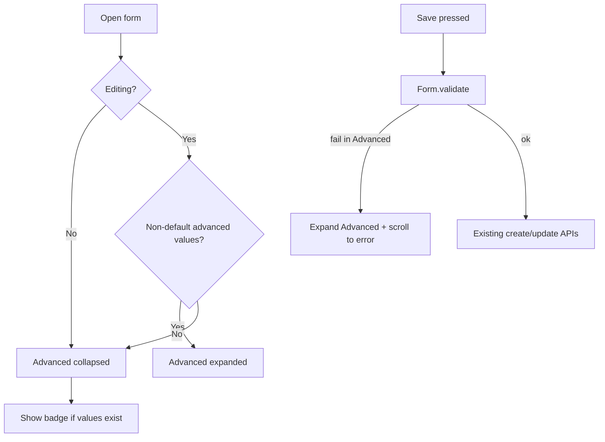

# Simplify Activity / Goal / Reward Forms

## Decisions locked for this plan

- **Shared chrome:** new [`AdvancedFormSection`](apps/timemanager/lib/widgets/advanced_form_section.dart) wrapping `AppCard` + Material `ExpansionTile` (no existing accordion pattern in the app).
- **Edit open behavior:** auto-expand Advanced when any non-default advanced value is present; otherwise start collapsed (create always collapsed).
- **Collapsed hint:** small trailing badge/chip when collapsed and advanced values exist (e.g. “On” / count)—not a full field summary.
- **`RewardRulesSection`:** move inside Advanced on activity/goal edit (still edit-only; still its own inner content, avoid double-`AppCard` nesting by passing a flag or extracting the list UI).
- **Phasing:** Rewards → Activities → Goals.

If you prefer always-collapsed-on-edit or keeping reward rules as a separate card, say so before implementation—those are the only two decisions that materially change layout.

---

## Shared UX pattern



**Interaction**

| Concern | Behavior |
|---------|----------|
| Default create | Advanced collapsed |
| Default edit | Expanded iff `_hasAdvancedValues` helper is true |
| Toggle | User can collapse/expand freely; no persistence of expand state |
| Validation | Keep Advanced children mounted (`ExpansionTile` maintains children). On `FormState.validate()` failure inside Advanced, set expanded and ensure the error field is reachable (scroll via existing `ListView` / `Scrollable.ensureVisible` if needed) |
| Accessibility | ExpansionTile header is a proper focusable control; section title via l10n; badge is decorative/`Semantics` label on the tile |
| Keyboard | No change to field order beyond reordering widgets; hidden fields remain in tree so tab order may include them when expanded only (acceptable) |

**Widget API (sketch)**

```dart
// lib/widgets/advanced_form_section.dart
class AdvancedFormSection extends StatefulWidget {
  const AdvancedFormSection({
    required this.initiallyExpanded,
    required this.hasConfiguredValues, // drives badge when collapsed
    required this.children,
  });
}
```

- Outer: `AppCard` for parity with activity/reward sections.
- Inner: `ExpansionTile` with dense title `formAdvanced` / subtitle optional.
- Goal form today is flat `ListView`—use the same `AdvancedFormSection` there so all three look consistent; do **not** fully AppCard-ize the whole goal form in this pass (minimal churn).

**l10n** (add to `app_en.arb` + other locale ARBs that exist):

- `formAdvanced` — “Advanced”
- `formAdvancedConfigured` — “Configured” (badge when collapsed + has values)
- Optionally `formAdvancedHint` — short subtitle (“Notifications, group, …”) per-entity only if one generic hint feels wrong; prefer one shared string first.

---

## 1. Essential vs Advanced field split

### Activity ([`activity_form_screen.dart`](apps/timemanager/lib/screens/activity_form_screen.dart))

| Essential (always visible) | Advanced (collapsed by default) |
|----------------------------|----------------------------------|
| Title | Description |
| Start time / End time | Group |
| Recurring toggle | Recurrence **end** date |
| One-off date **or** (when recurring) type + start date + type-specific days/interval | Last day of month (monthly only—still only rendered when monthly) |
| | Entire Notifications card (presets + custom) |
| | `RewardRulesSection` (edit only) |

**Justification:** Quick create needs “what / when.” Group, copy, notify-before, and open-ended recurrence are secondary. Type-specific day chips stay essential when recurring because save fails without them—hiding them behind Advanced would trap users.

**`_hasAdvancedValues` (edit):** non-empty description, `groupId != null`, recurrence end set, `isLastDayOfMonth`, any notification offsets, or attached reward rules (async—treat “rules loaded && non-empty” or expand after first load).

**Edge cases**

- Calendar `initialDate` create: still essential one-off date; Advanced stays collapsed.
- Editing weekly activity with only essentials: Advanced stays collapsed.
- Editing activity with notifications: Advanced auto-expands so offsets aren’t “lost.”
- Monthly “last day” lives in Advanced but remains conditional on monthly type.

---

### Goal ([`goal_form_screen.dart`](apps/timemanager/lib/screens/goal_form_screen.dart))

| Essential | Advanced |
|-----------|----------|
| Title | Description |
| Rule type | Color |
| Target (count/minutes) | Dependencies **when not composite** |
| Type-required links: activities **or** groups | Block until unlocked |
| **If composite:** composite mode + dependency checkboxes (required to save) | Custom start date |
| | Recurrence period + interval |
| | Deadline kind + absolute/relative fields |
| | `RewardRulesSection` (edit only) |

**Justification:** The rule type *is* the goal; target + links are the minimum to mean anything. Scheduling (start/recurrence/deadline), cosmetics, and optional dependency gating are power-user. For composite, deps/mode stay essential because validation requires them—type complexity does not push the whole form into Advanced.

**`_hasAdvancedValues`:** description, non-default color (if create default is palette first—compare to hydrated value), any deps on non-composite, `blockUntilUnlocked`, custom start, any recurrence, any deadline, reward rules.

**Edge cases / risks (call out, don’t fix unless in scope)**

- Model fields with **no UI** (`beforeTime`/`afterTime`, `countRequired` editor, weights, warn/grace)—existing save already can drop or hardcode these. This refactor must **not** worsen that; keep current save payload builders unchanged.
- Changing rule type on edit still leaves stale link checkboxes in state (pre-existing). Out of scope unless it blocks Essential layout.
- Absolute deadline with null date can still “look set”—unchanged.

---

### Reward ([`reward_form_screen.dart`](apps/timemanager/lib/screens/reward_form_screen.dart))

| Essential | Advanced |
|-----------|----------|
| Name | Notes |
| Description | Category |
| Color | Tags |
| Image (pick/clear/recent)—keep as second essential card or first-card trailing | Icon |
| | Stackable |

**Justification:** Definition identity = name + optional blurb + visual (color/image). Metadata and stack policy are secondary. No `RewardRulesSection` on this screen (rules attach from activity/goal).

**`_hasAdvancedValues`:** notes/category/tags/icon non-empty, or `stackable == false` (non-default).

---

## 2. Implementation approach

**Minimal churn:** refactor layout inside the three existing screens; same constructors, same save/`_submit` paths, same validators.

| File | Change |
|------|--------|
| [`lib/widgets/advanced_form_section.dart`](apps/timemanager/lib/widgets/advanced_form_section.dart) | **New** shared chrome |
| [`lib/widgets/reward_rules_section.dart`](apps/timemanager/lib/widgets/reward_rules_section.dart) | Add `wrapInCard` (default `true`) so parent Advanced can host it without nested cards |
| [`lib/screens/reward_form_screen.dart`](apps/timemanager/lib/screens/reward_form_screen.dart) | Split fields; wire Advanced + `_hasAdvancedValues` |
| [`lib/screens/activity_form_screen.dart`](apps/timemanager/lib/screens/activity_form_screen.dart) | Move description/group/end-date/last-day/notifications/rewards into Advanced; keep schedule essentials in main card(s) |
| [`lib/screens/goal_form_screen.dart`](apps/timemanager/lib/screens/goal_form_screen.dart) | Keep rule core essential; wrap schedule/deps/cosmetics/rewards in Advanced; special-case composite deps |
| [`lib/l10n/app_en.arb`](apps/timemanager/lib/l10n/app_en.arb) (+ other `app_*.arb`) | New Advanced strings |
| Tests under `apps/timemanager/test/widgets/` | See below |

**Activity card structure after change**

1. Essentials `AppCard` — title, times, schedule essentials  
2. `AdvancedFormSection` — description, group, optional recurrence extras, notifications, rewards  
3. Save button  

**Reward:** essentials card (+ image card) → Advanced → save.

**Goal:** flat essentials → Advanced → save (rewards inside Advanced).

No GraphQL/model changes.

---

## 3. Risks

| Risk | Mitigation |
|------|------------|
| Users editing old entities don’t see notifications/deadlines | Auto-expand when `_hasAdvancedValues` |
| Validation fails on collapsed field; user sees generic failure | Force-expand Advanced on validate failure in that subtree |
| Goal composite: deps wrongly moved to Advanced | Keep composite mode + deps essential |
| Double `AppCard` around rewards | `wrapInCard: false` |
| Goal form feels inconsistent (flat vs cards) | Accept for v1; Advanced still uses `AppCard` |
| Silent loss of time-of-day windows on save | Pre-existing; do not alter config builders in this PR |
| Mental model: “where did Group go?” | Badge + auto-expand on edit; optional one-line Advanced subtitle |

---

## 4. Test plan

**Automated (few, high-value)** — `nx test timemanager`:

1. **`advanced_form_section_test.dart`** — collapsed by default when `initiallyExpanded: false`; shows configured badge when `hasConfiguredValues`; expands on tap.
2. **One screen smoke (Rewards first):** pump `RewardFormScreen` with a fake/minimal repository (or extract `_hasAdvancedValues` pure helper and unit-test that). Prefer testing the pure helper(s) for activity/goal/reward “has advanced?” logic over full screen GraphQL pumps.
3. Skip full GoalForm widget test unless helpers are trivial—rule branching makes pumps brittle.

**Manual smoke**

For each entity (create + edit):

- [ ] Create with only essentials → saves; Advanced stayed collapsed  
- [ ] Create, open Advanced, set one advanced field → saves and persists  
- [ ] Edit entity with only defaults → Advanced collapsed  
- [ ] Edit entity with advanced data → Advanced auto-expanded; values visible; save unchanged  
- [ ] Collapse Advanced, trigger validation error in Advanced (e.g. empty required nested case if any) → expands  
- [ ] Activity: recurring weekly still requires weekday chips on essentials  
- [ ] Goal: composite still shows deps essential; simple `activityCount` hides deps in Advanced  
- [ ] Activity/Goal edit: attach/detach reward rule still works inside Advanced  
- [ ] Reward: stackable off → edit auto-expands Advanced  

---

## 5. Phasing

| Phase | Scope | Ship criterion |
|-------|--------|----------------|
| **1 – Rewards** | Shared `AdvancedFormSection` + l10n + reward form split + widget test | Create feels short; edit with tags/notes expands |
| **2 – Activities** | Field move + notifications into Advanced + rewards placement | One-time create = title/times/date; notify-only edit expands |
| **3 – Goals** | Essential vs Advanced + composite exception | Simple count goal create is short; deadline edit expands |

Each phase is independently mergeable.

---

## Open questions (need your call before coding)

1. **Edit expand policy** — Plan assumes auto-expand when advanced values exist. Prefer always-collapsed + badge only, or always-expand on any edit?
2. **Reward rules placement** — Plan assumes inside Advanced. Prefer keeping a separate card below/above Advanced for discoverability?
3. **Reward image** — Keep essential (recommended) or move image into Advanced?
4. **Goal color** — Advanced (recommended) or essential (always visible chips)?
5. **Activity group** — Advanced (recommended) or essential?

Items 1–2 change structure; 3–5 are product preference only and can stay as recommended defaults if you don’t reply.
