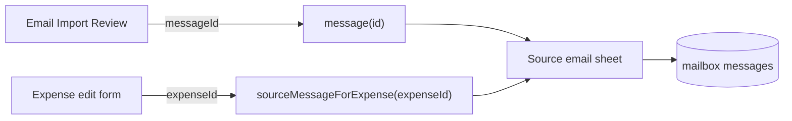

# Source email viewer for expense validation

## Approach

Keep linkage in mailbox (`extraction_artifacts.message_id` + `published_expense_id`). Do **not** add columns on spendmanager expenses. Add mailbox GraphQL lookups and a shared Flutter sheet used from both Review and the expense edit form.

## Backend (mailbox-api)

Add two user-scoped queries in [`apps/mailbox-api/src/graphql/resolvers/resolvers.ts`](apps/mailbox-api/src/graphql/resolvers/resolvers.ts) (mirror in [`schema.ts`](apps/mailbox-api/src/graphql/schema.ts) / types):

- `message(id: Int!): Message` — join `messages` → `mailboxes` where `mailboxes.user_id = current user`; throw/return null if not owned.
- `sourceMessageForExpense(expenseId: Int!): Message` — find `extraction_artifacts` with `published_expense_id = expenseId` and `status = 'accepted'`, scoped via mailbox ownership; return the linked message or null.

Existing list queries already expose `text_body` / `html_body`; reuse `mapMessage`.

Tests: colocated resolver/query tests covering ownership, happy path, and missing artifact.

## Flutter UI

**Shared viewer** (new widget under `apps/spendmanager/lib/widgets/` or similar): bottom sheet / full-height modal with subject, from, received date, and a scrollable body. Prefer `textBody`; if empty, show a simple tag-stripped `htmlBody` as plain text (no WebView). Empty-state copy when both bodies are null (pre-body ingest rows).

**Review tab** in [`email_import_screen.dart`](apps/spendmanager/lib/screens/email_import_screen.dart): add a “View email” action on each pending candidate; resolve message from already-loaded `_messages` by `artifact.messageId`, else `MailboxRepository.fetchMessage(id)`.

**Accepted expenses** in [`expense_form_screen.dart`](apps/spendmanager/lib/screens/expense_form_screen.dart): when editing, show “View source email” (AppBar action or text button). Call `MailboxRepository.fetchSourceMessageForExpense(expense.id)`; only show the control when a message is returned (or show and snackbar if null). Wire `MailboxRepository` through from [`expenses_screen.dart`](apps/spendmanager/lib/screens/expenses_screen.dart) / [`app_router.dart`](apps/spendmanager/lib/router/app_router.dart) the same way other repos are passed.

**Repository** ([`mailbox_repository.dart`](apps/spendmanager/lib/services/mailbox_repository.dart)): `fetchMessage(int id)` and `fetchSourceMessageForExpense(int expenseId)`.

**l10n:** strings in `app_en.arb` / `app_es.arb` for view action, sheet title, and missing-body empty state.

## Docs / tests

- Brief note in [`.ai/mailbox.md`](.ai/mailbox.md) that Review and expense edit can open source email via mailbox queries.
- Tests: mailbox-api query coverage; Flutter repository parsing test and/or widget test for the viewer body preference (text over HTML).

## Out of scope

- Backfilling null bodies on old messages (re-sync still skips existing `rfc_message_id`s).
- HTML rendering / attachments.
- Storing mailbox refs on spendmanager expenses.
