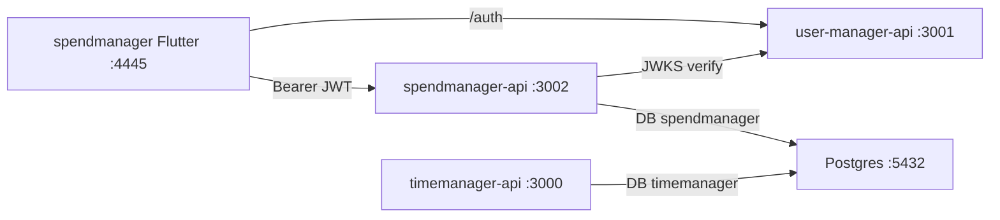

# Spendmanager App Scaffold

## Stack and placement

Mirror timemanager’s product pairing, not user-manager:

| Piece | Path | Stack |
|-------|------|--------|
| Flutter client | [`apps/spendmanager`](apps/spendmanager) | Flutter/Dart, `libs/design_system`, go_router, SuperTokens FDI |
| GraphQL API | [`apps/spendmanager-api`](apps/spendmanager-api) | Deno + Pylon + Kysely + `pg` |
| DB | same compose as [`infra/timemanager-db`](infra/timemanager-db) | Postgres DB name `spendmanager` (not a new infra project) |
| Auth | existing [`apps/user-manager-api`](apps/user-manager-api) | Shared SSO; local `users.auth_user_id` per DB |

Nx tags: `scope:spendmanager`, `type:app|api`, `runtime:flutter|deno`.



**Ports (avoid clashes):** GraphQL `:3002`, Flutter web `:4445`. Auth stays `:3001`.

## Database: same instance, new database

Keep [`infra/timemanager-db`](infra/timemanager-db) as the single local Postgres.

1. Add an init script under `infra/timemanager-db/init/` (mounted to `/docker-entrypoint-initdb.d`) that runs `CREATE DATABASE spendmanager;` on **fresh** volumes.
2. In `spendmanager-api` migrate bootstrap: connect to the default `postgres` DB and `CREATE DATABASE spendmanager` if missing (covers existing volumes that already have only `timemanager`).
3. Defaults: `PGDATABASE=spendmanager`, same host/user/password as timemanager (`postgres` / `test1234` / `:5432`).

No new docker-compose project; `pnpm db:up` / `timemanager-db:up` remains the shared DB bring-up. Add `nx run spendmanager-api:migrate` (dependsOn `timemanager-db:up`) and a root convenience script `pnpm spendmanager`.

## Domain model (v1 + analytics-ready)

Three tables only — designed so future charts/rollups are simple SQL, not schema rewrites.

- **`users`** — local row linked to SuperTokens via `auth_user_id` (same pattern as [`apps/timemanager-api/src/db/users.ts`](apps/timemanager-api/src/db/users.ts)); no local passwords.
- **`categories`** — user-scoped taxonomy: `name`, optional `color`, `archived_at` (nullable). Soft-archive so historical expenses stay category-joined for analysis. Unique `(user_id, lower(name))` among active rows.
- **`expenses`** — the fact table:
  - `amount_cents` `bigint` (integer minor units — avoids float money bugs)
  - `currency` `char(3)` default `USD`
  - `spent_on` `date` (calendar day of the spend — primary time axis for charts)
  - `category_id` FK → categories (`ON DELETE RESTRICT` so categories with expenses can’t be hard-deleted)
  - `note` text nullable
  - `user_id` FK (always scope queries by this; never trust client user ids)
  - Indexes: `(user_id, spent_on)`, `(user_id, category_id)`, `(user_id, spent_on, category_id)`

Out of v1 (schema leaves room later): income, budgets, recurring bills, multi-currency FX, charts UI.

## Backend (`apps/spendmanager-api`)

Scaffold as a slim copy of timemanager-api patterns (not a fork of goals/rewards/assets):

- `deno.json`, `project.json` (`serve` / `migrate` / `seed` / `build`), `.env.example`
- Auth middleware + JWKS verify (reuse the approach in [`apps/timemanager-api/src/auth/verify.ts`](apps/timemanager-api/src/auth/verify.ts))
- GraphQL CRUD:
  - Categories: list / create / update / archive
  - Expenses: list (filter by date range + category) / create / update / delete
  - Optional lightweight `expenseTotals(from, to)` aggregate (sum by category) — cheap now, useful for a simple overview and proves analytics shape
- Seed: a few categories + sample expenses for the linked user
- Tests: auth scoping + category archive / expense amount validation (few high-value Deno tests)

Serve on **`:3002`**. `dependsOn`: `migrate` → `timemanager-db:up`, and `user-manager-api:serve` (continuous), matching timemanager-api.

## Frontend (`apps/spendmanager`)

New Flutter app (not a copy of all timemanager screens):

- Depend on `libs/design_system` via `path:`
- Auth: port the proven FDI + Bearer pattern from timemanager (`AuthService`, `AuthController`, login screen) pointed at `:3001`
- Config: `ApiConfig` with GraphQL `:3002`, auth `:3001`; web port **4445**
- Screens: login, expenses list + form, categories list + form, thin overview (totals)
- l10n via ARB (en + es to match monorepo habit)
- Nx targets: `serve`, `test`, `analyze`, `pub-get`
- Tests: auth redirect / repository or form validation smoke where behavior is non-trivial

Register Flutter web origin in [`apps/user-manager-api/.env.example`](apps/user-manager-api/.env.example): add `http://localhost:4445` to `ALLOWED_ORIGINS`.

## Docs and monorepo wiring

Update in the same change:

- [`AGENTS.md`](AGENTS.md) — table row + ports
- [`.ai/architecture.md`](.ai/architecture.md) — diagram + component bullets
- [`.ai/conventions.md`](.ai/conventions.md) — package-manager row + `scope:spendmanager`
- [`.ai/workflows.md`](.ai/workflows.md) — `pnpm spendmanager`, migrate/seed, smoke checks
- Root [`package.json`](package.json) — `"spendmanager": "nx serve spendmanager-api"`
- Optional: IDE launch config for spendmanager (Chrome `:4445`) beside timemanager

**Explicitly defer:** AWS/Terraform hostnames, shared GraphQL codegen libs, charting UI, copying timemanager’s goals/rewards/assets stack.

## Implementation order

1. DB init + `spendmanager-api` skeleton (auth, migrate, users, categories, expenses, GraphQL)
2. Flutter scaffold (auth + config + design_system) + category/expense UI
3. Nx/scripts/docs + CORS origin + smoke test path
4. High-value tests on API scoping and Flutter auth/config

## Smoke checks (when implementing)

```bash
nx run timemanager-db:up
nx run spendmanager-api:migrate
nx serve spendmanager-api   # :3002 + auth
# IDE or: nx serve spendmanager  # Chrome :4445
# Sign in via SuperTokens → create category → add expense → list/filter
```
