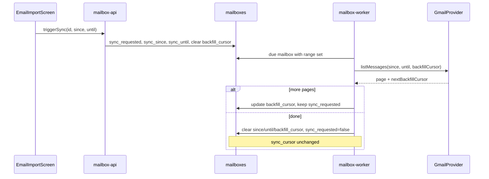

# Email sync date range + Review pagination

## Decisions (locked)

- **Sync:** One-shot backfill — `since`/`until` fetch that window once across worker pages, then clear the range and leave `sync_cursor` unchanged.
- **Review UI:** Numbered pagination (prev/next + page numbers), not load-more/infinite scroll.
- **Page size:** `20` pending items per page.



---

## 1. One-shot date-range sync

### DB migration ([apps/mailbox-api/src/db/migrations/](apps/mailbox-api/src/db/migrations/))

Add nullable columns on `mailboxes`:

- `sync_since` (`timestamptz`)
- `sync_until` (`timestamptz`)
- `sync_backfill_cursor` (`text`) — Gmail page token for the backfill job only

Update [schema.ts](apps/mailbox-api/src/db/types/schema.ts) and Mailbox GraphQL type to expose `sync_since` / `sync_until` (optional; useful for UI “backfill queued” state). Do **not** expose the backfill cursor.

### mailbox_kit

- Extend [`ListMessagesOptions`](libs/mailbox_kit/provider.ts) with optional `since?: Date` / `until?: Date`.
- [`GmailMailboxProvider.listMessages`](libs/mailbox_kit/providers/gmail_provider.ts): when `since`/`until` are set, build Gmail `q` with `after:` / `before:` (unix seconds) and use `cursor` only as a page token for that range — **ignore** the incremental `done:<unix>` watermark for this call.
- [`FixtureMailboxProvider`](libs/mailbox_kit/providers/fixture_provider.ts): filter fixtures by `receivedAt` when range is set.
- Add focused unit tests for query construction / fixture filtering.

### mailbox-api GraphQL

Change mutation in [schema.ts](apps/mailbox-api/src/graphql/schema.ts) / [resolvers.ts](apps/mailbox-api/src/graphql/resolvers/resolvers.ts):

```graphql
triggerSync(mailboxId: Int!, since: String, until: String): Mailbox!
```

- Validate ISO dates; require `since <= until` when both set; at least one of `since`/`until` may be omitted (omit both = today’s incremental “sync now”).
- Persist: `sync_requested=true`, set `sync_since`/`sync_until` (null when omitted), clear `sync_backfill_cursor`.

### mailbox-worker ([sync.ts](apps/mailbox-worker/src/sync.ts))

In `syncMailbox`:

- If `sync_since` or `sync_until` is set → **backfill mode**:
  - Call `listMessages({ cursor: sync_backfill_cursor, since, until, limit: 50 })`.
  - Insert/extract as today (dedupe by `rfc_message_id`).
  - If `nextCursor` has more pages → save `sync_backfill_cursor`, **keep** `sync_requested=true`, do **not** touch `sync_cursor`.
  - If exhausted → clear `sync_since`, `sync_until`, `sync_backfill_cursor`, set `sync_requested=false`; leave `sync_cursor` as-is; update `last_synced_at`.
- Else → existing incremental path (unchanged).

Keep one page per tick so runs stay bounded; due-mailbox selection already re-picks `sync_requested` mailboxes.

### Flutter UI ([email_import_screen.dart](apps/spendmanager/lib/screens/email_import_screen.dart))

On Setup tab next to Sync now:

- Two date fields (From / To) using existing `showDatePicker` pattern from expense/budget forms.
- Defaults: From = 30 days ago, To = today (editable; either can be cleared for open-ended).
- `_sync()` → `MailboxRepository.triggerSync(mailboxId, since:, until:)` with ISO date strings.
- l10n EN/ES for From/To labels (edit [app_en.arb](apps/spendmanager/lib/l10n/app_en.arb) / [app_es.arb](apps/spendmanager/lib/l10n/app_es.arb), regenerate).

---

## 2. Review list numbered pagination

### mailbox-api

Replace unbounded list with a page result (breaking for this query only; only spendmanager uses it):

```graphql
type ExtractionArtifactPage {
  items: [ExtractionArtifact!]!
  totalCount: Int!
  page: Int!
  pageSize: Int!
}

extractionArtifacts(mailboxId: Int, status: String, page: Int, pageSize: Int): ExtractionArtifactPage!
```

Resolver:

- `page` default `1`, `pageSize` default `20`, clamp `pageSize` to max `100`.
- Same ownership/filter joins as today; `orderBy id desc`.
- Parallel (or sequential) count query + `limit`/`offset` select.
- Return `{ items, totalCount, page, pageSize }`.

Add a small resolver/unit test covering page math and totalCount.

### Flutter

- Update [`MailboxRepository.fetchArtifacts`](apps/spendmanager/lib/services/mailbox_repository.dart) to take `page` / `pageSize` and return a small result type (`items` + `totalCount` + echoed page).
- Review tab state: `_reviewPage`, `_reviewTotalCount`, `_pending`.
- Load page on `_reload` / page change; after accept/reject, reload **current page** (if empty and page > 1, go to previous page).
- Pagination bar under the list: Previous, numbered page buttons (window of ~5 around current), Next; show “Page X of Y” via l10n.
- Keep UI simple Material row — no new design-system component unless one already fits.

---

## 3. Tests

- mailbox_kit: Gmail `q` includes `after`/`before` when range set; fixture filters by date.
- mailbox-worker: backfill keeps `sync_cursor` stable and clears range when done (extend [sync.test.ts](apps/mailbox-worker/src/sync.test.ts) with a fake provider).
- mailbox-api: `extractionArtifacts` page/totalCount; `triggerSync` persists since/until.
- Skip Flutter widget tests unless a thin repository-level test is easy; behavior is mostly wiring.

Run via Nx: `nx test mailbox_kit`, `nx test mailbox-worker`, `nx test mailbox-api` (and migrate mailbox-api for local verify).

---

## Out of scope

- Paginating the Setup “recent messages” list.
- Relay-style cursors.
- Changing automatic poll interval / incremental sync behavior when no dates are chosen.